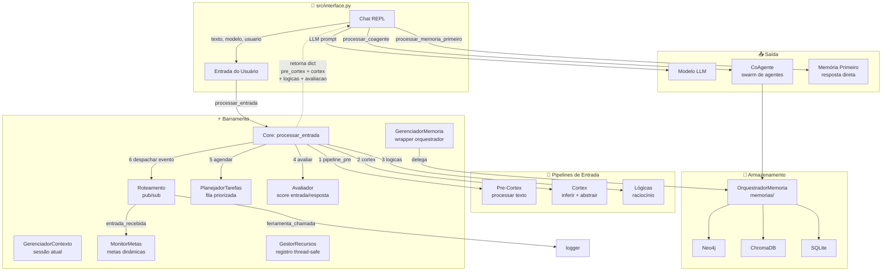
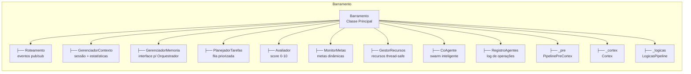
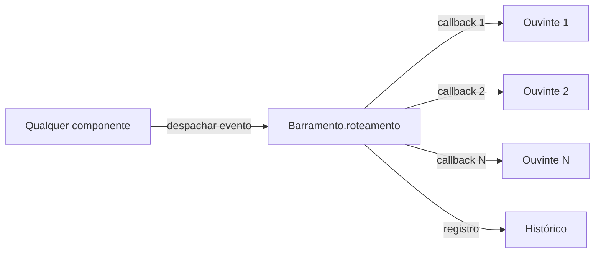
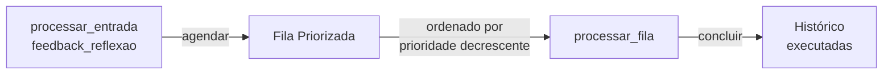
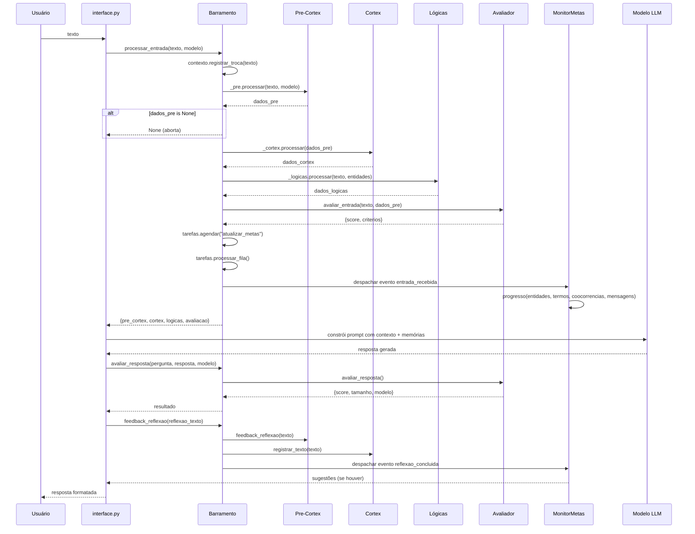
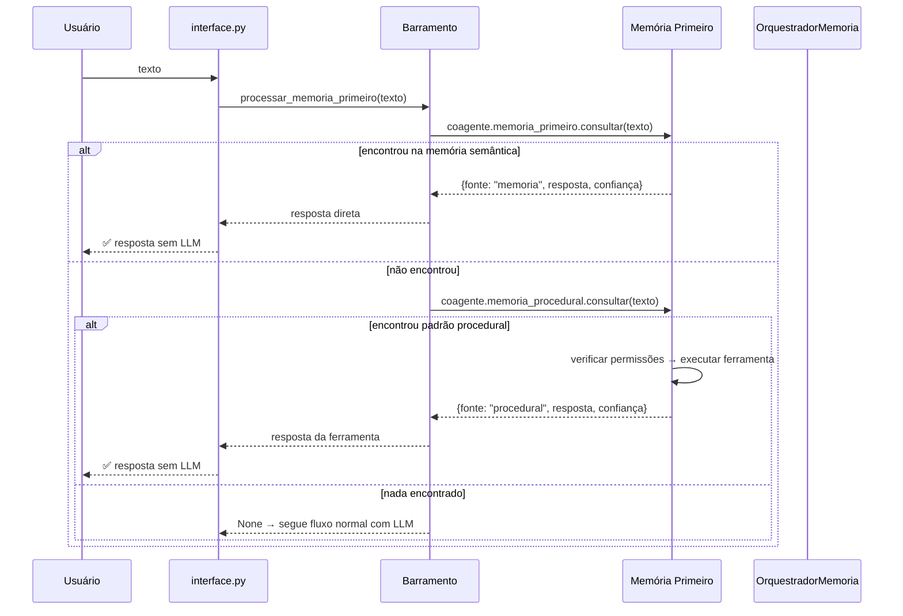
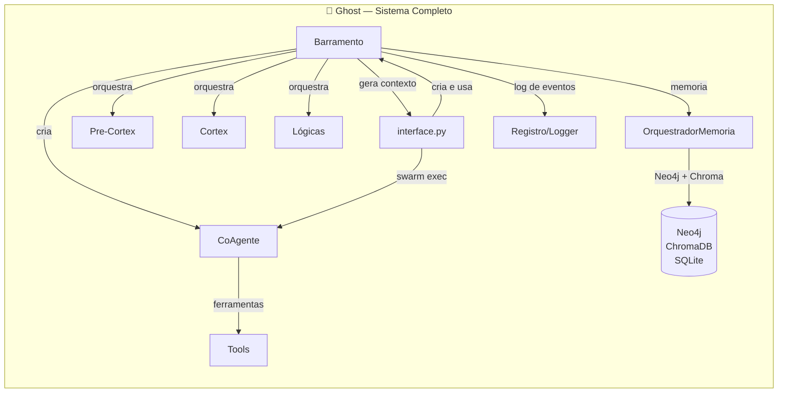

# Barramento — Sistema Nervoso Central do Ghost

> **Propósito:** Orquestrador central que conecta todos os subsistemas do Ghost. É o único componente que conhece e coordena todos os pipelines, contextos, agentes, recursos e metas simultaneamente.

---

## Arquitetura Geral

---

## Organograma do Barramento

---

## Arquivos e Responsabilidades

### `__init__.py` — Classe `Barramento` (215 linhas)

**Responsabilidade:** Orquestrador central. Coordena a ordem de processamento, conecta pipelines, gerencia eventos e expõe API unificada.

| Método | Função |
|---|---|
| `__init__(pipeline_pre, cortex_pipeline, logicas_pipeline, orquestrador, modelo)` | Cria todos os subcomponentes, registra recursos, configura rotas de eventos |
| `processar_entrada(texto, modelo, usuario)` | **Método principal**: executa Pre-Cortex → Cortex → Lógicas → Avaliação → Eventos |
| `avaliar_resposta(pergunta, resposta, modelo)` | Avalia qualidade da resposta e despacha evento |
| `processar_memoria_primeiro(texto)` | Tenta responder sem LLM (memória semântica ou procedural) |
| `processar_coagente(texto, contexto, usuario)` | Detecta intenções e delega para swarm de agentes |
| `feedback_reflexao(texto, console)` | Processa reflexão pós-resposta, retroalimenta pipelines |
| `resumo_completo()` | Coleta estatísticas de todos os subsistemas para diagnóstico |

**Eventos pub/sub registrados:**

| Evento | Callback | Gatilho |
|---|---|---|
| `entrada_recebida` | `_on_entrada()` → atualiza metas + log | Toda entrada do usuário |
| `reflexao_concluida` | `_on_reflexao()` → atualiza metas + sugestões | Após reflexão |
| `resposta_gerada` | `_on_resposta()` → placeholder | Após resposta do LLM |
| `ferramenta_chamada` | `_on_ferramenta()` → log | Quando ferramenta executada |

---

### `roteamento.py` — Classe `Roteamento` (32 linhas)

**Responsabilidade:** Sistema de eventos pub/sup para comunicação interna.

- `inscrever(evento, callback)` — Registra ouvinte para um evento
- `despachar(evento, dados)` — Notifica todos os ouvintes, captura exceções individualmente
- `eventos_disponiveis()` — Lista eventos com ouvintes
- `historico_recente(n)` — Últimos N eventos despachados

**Diagrama:**

---

### `gerenciador_contexto.py` — Classe `GerenciadorContexto` (44 linhas)

**Responsabilidade:** Unifica o acesso aos contextos do Pre-Cortex e Cortex, mantém estado da sessão atual.

- `registrar_troca(texto)` — Incrementa contador da sessão
- `estatisticas_combined()` — Métricas combinadas de Pre-Cortex (mensagens, entidades, stopwords) e Cortex (termos, coocorrências, análises)
- `resumo_sessao()` — Sessão atual (início, total de trocas, último assunto)

---

### `gerenciador_memoria.py` — Classe `GerenciadorMemoria` (31 linhas)

**Responsabilidade:** Fachada (Facade) para o `OrquestradorMemoria`. Abstrai toda a complexidade do sistema de memórias por trás de uma interface simples.

- `salvar_mensagem(papel, conteudo, modelo, usuario)` → `OrquestradorMemoria.processar_mensagem()`
- `buscar_contexto(consulta, n)` → `OrquestradorMemoria.buscar_contexto_memoria()`
- `refletir(msg_usuario, msg_assistente, modelo)` → `OrquestradorMemoria.refletir()`
- `estatisticas()` → `OrquestradorMemoria.estatisticas()`
- `encerrar(merges)` → `OrquestradorMemoria.encerrar()`
- `orquestrador` (property) → Acesso direto ao orquestrador subjacente

---

### `planejador_tarefas.py` — Classe `PlanejadorTarefas` (56 linhas)

**Responsabilidade:** Fila de tarefas internas com priorização. Ordena por prioridade decrescente.

- `agendar(nome, prioridade, dados)` — Adiciona tarefa com ID único e timestamp
- `executar_proxima()` — Remove e retorna tarefa de maior prioridade
- `concluir(id, resultado)` — Marca tarefa como concluída
- `processar_fila(limite)` — Executa N tarefas em lote
- `ultimas_executadas(n)` — Histórico das últimas N execuções

**Diagrama:**

---

### `avaliador.py` — Classe `Avaliador` (78 linhas)

**Responsabilidade:** Avalia qualidade de entradas e respostas com scores de 0 a 10.

| Método | Critérios |
|---|---|
| `avaliar_entrada(texto, dados_pre)` | Importância média dos tokens (peso 0.3) + score do Pre-Cortex (peso 0.2) |
| `avaliar_resposta(pergunta, resposta, modelo)` | Média histórica (baseline) + bônus por tamanho adequado / penalidade por resposta muito curta |

**Fatores de ajuste na resposta:**
- > 2× o tamanho esperado → +1 (detalhada)
- < 0.3× o tamanho esperado → −2 (muito curta)
- Sem histórico → compara com tamanho da pergunta

---

### `monitor_metas.py` — Classe `MonitorMetas` (80 linhas)

**Responsabilidade:** Define e monitora metas de aprendizado, sugere ações ao usuário.

| Critério | Métrica | Exemplo de meta |
|---|---|---|
| `entidades` | `len(PreCortex.entidades_conhecidas)` | Aprender 8 entidades novas |
| `termos_cortex` | `len(Cortex.freq_termos)` | Acumular 50 termos no vocabulário |
| `mensagens` | `PreCortex.total_mensagens` | 20 mensagens trocadas |
| `coocorrencias` | Total em `Cortex.coocorrencias` | 30 pares de coocorrência |

**Sugestões automáticas** (ativadas após 4+ mensagens):
- Poucas entidades → "fale sobre seus interesses"
- Vocabulário baixo → "use palavras mais variadas"

**Metas dinâmicas:** Se `valor_alvo` não for definido, calcula automaticamente como `base + 5` onde `base = max(3, atual // 3)`.

---

### `gestor_recursos.py` — Classe `GestorRecursos` (36 linhas)

**Responsabilidade:** Registro centralizado e thread-safe de recursos do sistema.

| Nome do Recurso | Objeto | Tipo |
|---|---|---|
| `pre_cortex` | `PipelinePreCortex` | `pipeline` |
| `cortex` | `Cortex` | `pipeline` |
| `logicas` | `LogicasPipeline` | `pipeline` |
| `orquestrador` | `GerenciadorMemoria` | `memoria` |
| `coagente` | `CoAgente` | `orquestracao` |

- `registrar(nome, recurso, tipo)` — Adiciona com timestamp
- `obter(nome)` — Retorna o recurso, atualiza `ultimo_uso`
- `liberar(nome)` — Remove e retorna sucesso
- Thread-safe via `threading.Lock`

---

## Fluxo de Dados Completo

---

## Fluxo Alternativo: Memória Primeiro

---

## Integrações com Outros Subsistemas

### Mapa de Conexões

| Componente | Como se Conecta ao Barramento |
|---|---|
| **interface.py** | Cria `Barramento(...)` com os 3 pipelines + orquestrador. Chama `processar_entrada()`, `processar_memoria_primeiro()`, `processar_coagente()`, `avaliar_resposta()`, `feedback_reflexao()` |
| **Pre-Cortex** | Passado como `pipeline_pre` no construtor. Usa `_pre.processar()` e `_pre.feedback_reflexao()`. Seu `_ctx` alimenta `Avaliador` e `MonitorMetas` |
| **Cortex** | Passado como `cortex_pipeline`. Usa `_cortex.processar()`. Seu `_ctx` alimenta `GerenciadorContexto` e `MonitorMetas` |
| **Lógicas** | Passado como `logicas_pipeline`. Usa `_logicas.processar()`. Recebe a `consciência` do CoAgente via `logicas_pipeline.set_consciencia()` |
| **CoAgente** | Criado internamente com `CoAgente(modelo, orquestrador_memoria)`. Exposto como `self.coagente` |
| **OrquestradorMemoria** | Envolto em `GerenciadorMemoria`. Passado para CoAgente. Conecta a Neo4j, ChromaDB, SQLite |
| **Tools** | Acessadas indiretamente via CoAgente e `processar_memoria_primeiro()` |
| **Registro/Logger** | Importado e usado para log de eventos de entrada, ferramentas e reflexão |

---

## Padrões de Design Presentes

| Padrão | Implementação |
|---|---|
| **Facade** | `GerenciadorMemoria` abstrai toda a complexidade do `OrquestradorMemoria` |
| **Observer/Pub-Sub** | `Roteamento` com `inscrever()` e `despachar()` |
| **Mediator** | `Barramento` media a comunicação entre todos os subsistemas |
| **Fila Prioritizada** | `PlanejadorTarefas` ordena tarefas por prioridade |
| **Singleton indireto** | Um único `Barramento` por sessão do Ghost |
| **Adapter** | `GerenciadorContexto` unifica interfaces de `PreCortex._ctx` e `Cortex._ctx` |
| **Registry** | `GestorRecursos` mantém catálogo centralizado de recursos |

---

## Resumo

> **O Barramento é o cérebro operacional do Ghost.** Cada entrada do usuário passa por ele em 6 etapas sequenciais: contexto → Pre-Cortex → Cortex → Lógicas → Avaliação → Eventos. Ele não gera a resposta final (o LLM faz isso), mas prepara todo o terreno: analisa a entrada, extrai entidades, infere conceitos, avalia qualidade, gerencia metas, e alimenta o CoAgente com inteligência distribuída. Sem o Barramento, os pipelines seriam ilhas isoladas — ele é o sistema nervoso que os unifica.
