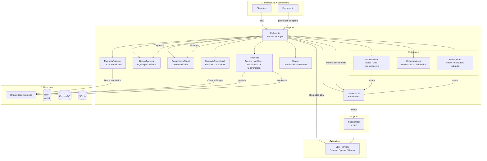
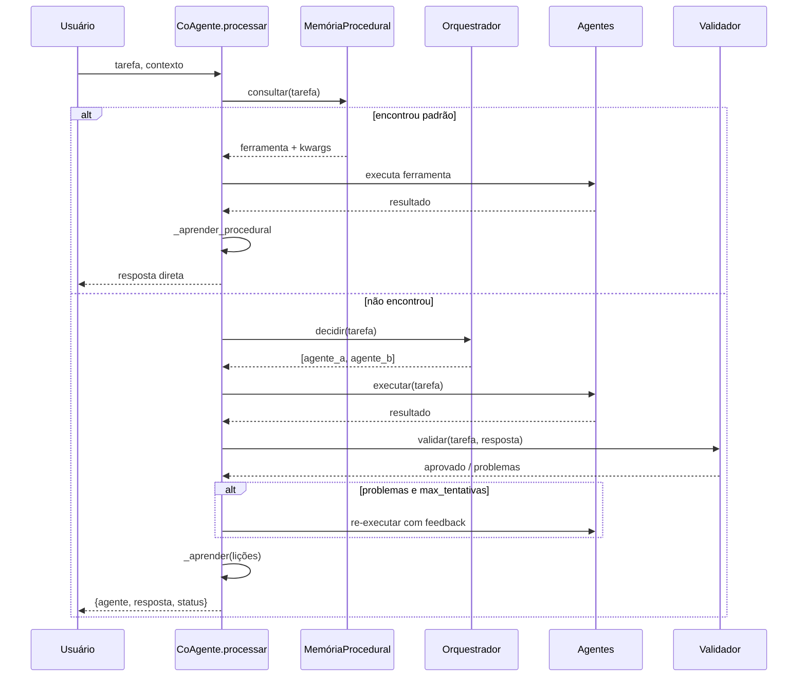
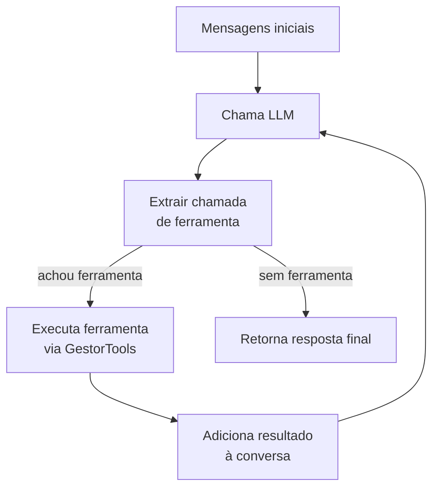
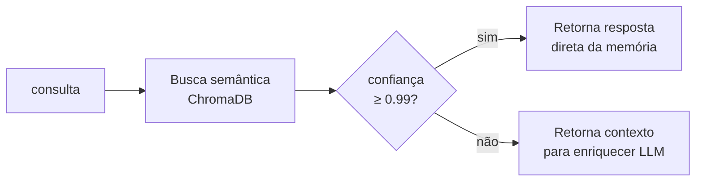
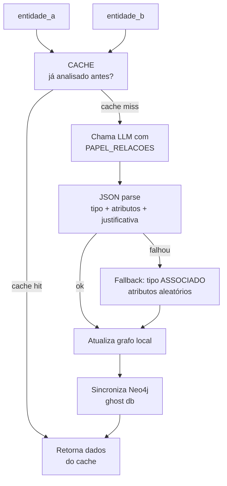
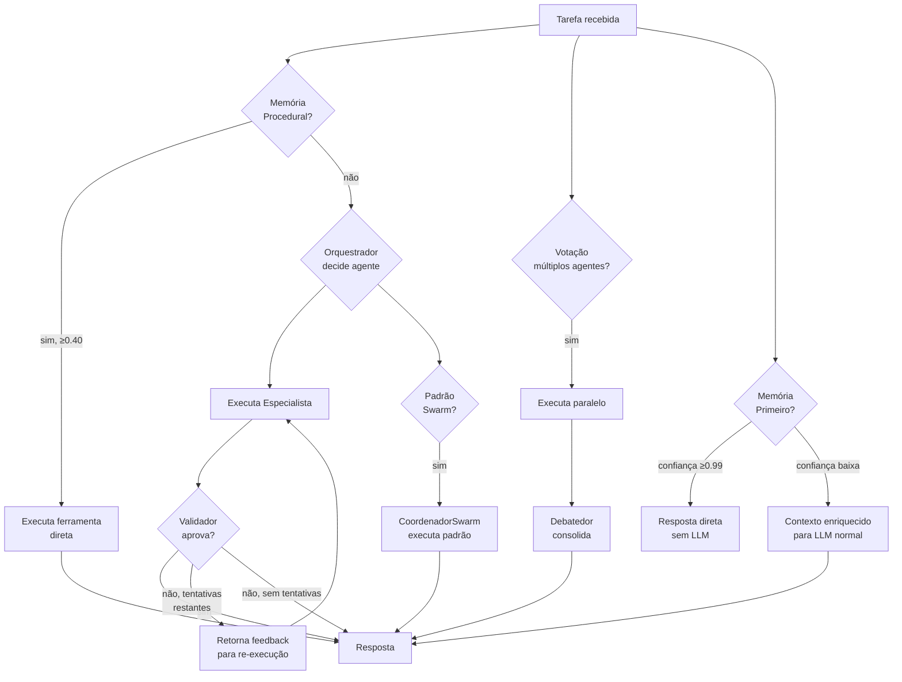
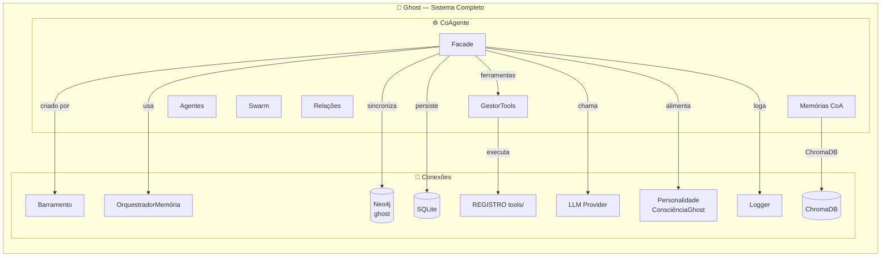

# CoAgente — Inteligência Distribuída do Ghost

> **Propósito:** Ecossistema de agentes inteligentes que colaboram, debatem, votam e executam tarefas especializadas. É o cérebro multifacetado do Ghost — cada agente com personalidade, objetivos e ferramentas próprias.

---

## Arquitetura Geral

---

## Organograma do CoAgente

```mermaid
graph LR
    subgraph CoAgente["CoAgente"]
        direction TB
        COA[CoAgente<br/>Facade Principal]

        COA --> GT[├── GestorTools<br/>permissoes + execução]
        COA --> BA[├── BancoAgentes<br/>SQLite agentes.db]
        COA --> CG[├── ConsciênciaGhost<br/>personalidade + traços]
        COA --> MP[├── MemóriaPrimeiro<br/>cache semântico ≥0.99]
        COA --> MPR[├── MemóriaProcedural<br/>padrões ChromaDB ≥0.40]

        COA --> SW[├── Swarm<br/>paralelo / sequencial / votação]
        SW --> SWP[│   └── SwarmPattern<br/>4 padrões pré-configurados]
        SW --> SWC[│   └── CoordenadorSwarm<br/>ThreadPoolExecutor]

        COA --> ESP[├── Especialistas]
        ESP --> E1[│   ├── especialista_codigo<br/>CodeAgent]
        ESP --> E2[│   ├── especialista_web<br/>WebAgent]
        ESP --> E3[│   └── especialista_conhecimento<br/>KnowledgeAgent]

        COA --> COL[├── Colaboradores]
        COL --> C1[│   ├── orquestrador<br/>decide qual agente chamar]
        COL --> C2[│   └── debatedor<br/>consolida respostas múltiplas]

        COA --> SUB[├── Sub-Agentes]
        SUB --> S1[│   ├── criador<br/>cria novas ferramentas]
        SUB --> S2[│   ├── executor<br/>executa tarefas objetivas]
        SUB --> S3[│   └── validador<br/>valida resultados]

        COA --> REL[├── Relações]
        REL --> R1[│   ├── AgenteRelacoes<br/>análise LLM de pares]
        REL --> R2[│   ├── AnalisadorRelacoes<br/>pesos, clusters, propagação]
        REL --> R3[│   ├── Decaimento<br/>decay exponencial + reforço]
        REL --> R4[│   └── SincronizadorNeo4j<br/>ponte para ghost db]

        COA --> RG[├── RegistroAgentes<br/>SQLite registro_agentes.db]
    end
```

---

## Arquivos e Responsabilidades

### `__init__.py` — Classe `CoAgente` (464 linhas)

**Responsabilidade:** Fachada principal. Orquestra todos os agentes, especialistas, colaboradores, sub-agentes, memórias, ferramentas, swarms, sincronizador e consciência.

| Método | Função |
|---|---|
| `__init__(modelo, orquestrador_memoria)` | Inicializa todo o ecossistema: gestor, swarm, memórias, banco, sincronizador, consciência, agentes, permissões, padrões |
| `processar(tarefa, contexto, usuario)` | Pipeline principal: verifica memória procedural → orquestra → executa agentes → valida → aprende |
| `processar_com_memoria(tarefa, contexto, forcar_llm)` | Tenta memória-primeiro antes de chamar LLM |
| `processar_com_validacao(tarefa, contexto, max_tentativas, usuario)` | Processa com re-tentativas baseadas em validação |
| `swarm_exec(padrao, tarefa, usuario)` | Executa padrão de swarm pré-definido |
| `votar(tarefa, nomes_agentes, min_votos)` | Executa votação entre agentes |
| `sincronizar_agora()` | Força sincronização imediata do decay |
| `resumo()` | Estado completo: objetivos, personalidade, agentes, tarefas, memórias |

**Fluxo de `processar()`:**

---

### `base.py` — Classe `Agente` (189 linhas)

**Responsabilidade:** Classe base para **todos** os agentes. Fornece infraestrutura de prompt, execução com ferramentas (loop LLM → ferramenta → LLM), aprendizado contínuo.

| Método | Parâmetros | Retorno | Descrição |
|---|---|---|---|
| `__init__` | nome, papel, descrição, modelo, temperatura, objetivos, personalidade, estratégias, ações | — | Identidade completa do agente |
| `vincular_gestor` | gestor | — | Vincula `GestorTools` para acesso a ferramentas |
| `executar` | tarefa, contexto | `dict` | Monta mensagens, chama LLM com ferramentas, retorna `{agente, resposta, status}` |
| `_rodar_com_ferramentas` | mensagens, max_chamadas | `dict` | Loop: LLM → extrai chamada → executa ferramenta → retroalimenta |
| `aprender` | tarefa, resultado | — | Adiciona lição (máx 50) |

**Fluxo de `_rodar_com_ferramentas()`:**

---

### `gestor_tools.py` — Classe `GestorTools` (44 linhas)

**Responsabilidade:** Controla **permissões** de ferramentas por agente. Delega execução para o `REGISTRO` global.

| Método | Descrição |
|---|---|
| `permitir(agente_nome, nomes_ferramentas)` | Define conjunto de ferramentas permitidas para um agente |
| `pode_usar(agente_nome, ferramenta_nome)` | Verifica permissão |
| `listar_para(agente_nome)` | Lista ferramentas disponíveis para o agente (com descrições) |
| `executar(agente_nome, ferramenta_nome, **kwargs)` | Executa com verificação de permissão |

**Mapa de permissões:**

| Agente | Ferramentas |
|---|---|
| `especialista_codigo` | executar_codigo, ler_arquivo, ler_pdf, criar_ferramenta |
| `especialista_web` | buscar_web, ler_arquivo, ler_pdf |
| `especialista_conhecimento` | ler_arquivo, ler_pdf, exportar_memorias, buscar_semantica, buscar_web, nota_mental, consultar_notas, executar_cypher, criar_ferramenta, extrair_conhecimento, consultar_conhecimento |
| `criador` | criar_ferramenta, executar_codigo |
| `executor` | executar_codigo, buscar_web, ler_arquivo, ler_pdf, nota_mental, extrair_conhecimento, consultar_conhecimento |
| `validador` | executar_codigo, ler_arquivo |
| `especialista_relacoes` | ler_arquivo, exportar_memorias, executar_cypher |
| `orquestrador`, `debatedor` | *(nenhuma)* |

---

### `banco_agentes.py` — Classe `BancoAgentes` (83 linhas)

**Responsabilidade:** Persistência SQLite (`agentes.db`) para identidade e lições dos agentes.

- `salvar(nome, **kwargs)` — INSERT ou UPDATE
- `carregar(nome)` — SELECT por nome
- `carregar_todos()` — Todos os agentes ordenados
- `estatisticas()` — COUNT por tipo

---

### `registro_agentes.py` — Classe `RegistroAgentes` (79 linhas)

**Responsabilidade:** Registro temporal de atividades por padrão. Tabelas: `AG_pesquisa`, `AG_codigo`, `AG_conhecimento`, `AG_relacoes`, `AG_documento`.

- `registrar(padrao, entrada, dados_brutos, resumo)` — Insere na tabela do padrão
- `consultar(padrao, limite)` — SELECT recentes
- `estatisticas()` — Contagem por tabela

---

### `memoria_primeiro.py` — Classe `MemoriaPrimeiro` (145 linhas)

**Responsabilidade:** Padrão "Memória-Primeiro". Antes de chamar o LLM, busca na memória semântica. Se confiança ≥ 0.99, responde direto sem LLM.

- `_calcular_confianca(distancia, respostas_assistant)` — Base 70% da distância + bonus de até 30% por múltiplas respostas
- `_montar_resposta_memoria(consulta, respostas_assistant, resultados)` — Seleciona melhores, chama LLM para sintetizar
- Cache interno para evitar buscas repetidas

---

### `memoria_procedural.py` — Classe `MemoriaProcedural` (112 linhas)

**Responsabilidade:** Memória de padrões procedurais. Aprende qual ferramenta usar para cada tipo de tarefa via ChromaDB.

| Método | Descrição |
|---|---|
| `consultar(tarefa)` | Busca similaridade semântica; se distância < 0.40, retorna ferramenta + kwargs |
| `aprender(tarefa, ferramenta_nome, kwargs, sucesso)` | Upsert na coleção `procedural` do ChromaDB |
| `reforcar(tarefa, ferramenta_nome, kwargs)` | Incrementa `vezes_usado` |
| `esquecer(tarefa, ferramenta_nome, kwargs)` | Remove padrão |

---

### `relacoes/agente.py` — Classe `AgenteRelacoes(Agente)` (204 linhas)

**Responsabilidade:** Agente especialista em relações orgânicas entre entidades. Usa LLM para determinar dimensões de atributos (valores 0-1) e tipo contextual para cada par.

| Método | Descrição |
|---|---|
| `analisar_par(entidade_a, entidade_b, contexto)` | Cache → LLM → parse JSON → fallback → grafo local → sincroniza Neo4j |
| `analisar_lote(entidades, contexto)` | Itera todos os pares |
| `aplicar_decay(nos_usados)` | Aplica decay no grafo local, limpa cache |
| `sincronizar_decay()` | Aplica decay + sincroniza Neo4j |

**Fluxo de `analisar_par()`:**

O `PAPEL_RELACOES` é um prompt extenso que instrui o LLM a:
- Determinar dimensões relevantes para o par (ex: `proficiencia`, `frequencia`, `intensidade`)
- Atribuir valores contínuos 0-1
- Identificar tipo contextual (ex: `APRENDE`, `CRIA`, `USA`, `CONHECE`)
- Justificar a análise
- Retornar JSON estruturado

---

### `relacoes/analise.py` — Classe `AnalisadorRelacoes` (137 linhas)

**Responsabilidade:** Lógica relacional pura — métricas, propagação, clusters, ranking. **Sem estado**, apenas métodos estáticos.

| Método | Descrição |
|---|---|
| `calcular_peso(atributos, pesos)` | Média ponderada dos atributos (0-1) |
| `pesos_das_dimensoes(grafo)` | Peso de cada dimensão baseado na frequência |
| `resumo_grafo(grafo)` | Estatísticas: total, médias por dimensão, pesos |
| `relacao_bidirecional(peso_a_b, peso_b_a)` | Média, assimetria, estabilidade |
| `propagacao(peso_a_b, peso_b_c)` | `peso_a_b × peso_b_c` |
| `detectar_clusters(grafo, limiar)` | Conexões com peso ≥ limiar |
| `ranking_global(grafo)` | Média de peso por entidade, ordenado |
| `propagacao_rede(grafo, origem, destino, max_intermediarios)` | BFS com produto de pesos, caminhos ordenados |

---

### `relacoes/decaimento.py` — Classe `Decaimento` (166 linhas)

**Responsabilidade:** Decaimento por desuso (decay) exponencial + reforço Hebbiano.

| Conceito | Fórmula | Efeito |
|---|---|---|
| Decaimento | `v × (1 − taxa)^horas` | Não usado → enfraquece |
| Reforço | `v + boost × (1 − v)` | Usado → fortalece (assintótico a 1) |
| Poda | `v < limiar_poda` | Abaixo disso, remove |

- `taxa_decaimento = 0.05/hora`, `boost_reforco = 0.15`, `limiar_poda = 0.05`
- Ghost decai mais rápido que conexão real
- `processar_grafo()` itera todo o grafo, retorna grafo podado

---

### `relacoes/sincronizador.py` — Classe `SincronizadorNeo4j` (284 linhas)

**Responsabilidade:** Ponte entre as relações orgânicas e o Neo4j (banco `ghost`). Labels emergem do contexto — sem rótulos fixos.

| Método | Descrição |
|---|---|
| `upsert_no(entidade_id, props_extras)` | MERGE no Neo4j com label inferido |
| `criar_relacao(origem, destino, tipo, atributos, peso, contexto)` | Cria/atualiza relação com atributos |
| `carregar_para_grafo(limit)` | Carrega Neo4j → dict Python |
| `sincronizar_grafo(grafo)` | Empurra grafo decaído de volta para Neo4j |
| `reforcar_conexao(origem, destino, dims)` | Reforça relação existente |
| `consolidar_duplicatas_ghost()` | Funde nós similares no banco ghost |

**Função auxiliar `_inferir_label(entidade_id, props)`:** Heurística para labels — GHOST, PESSOA, LINGUAGEM, ENTIDADE.

---

### `swarms/coordenador.py` — Classe `CoordenadorSwarm` (42 linhas)

**Responsabilidade:** Coordena execução paralela (ThreadPoolExecutor), sequencial e por padrão de agentes.

| Método | Descrição |
|---|---|
| `registrar_padrao(nome, sequencia_agentes)` | Registra sequência nomeada |
| `executar_paralelo(agentes, tarefa, max_workers)` | Todos executam mesma tarefa em paralelo |
| `executar_sequencial(agentes, tarefa)` | Cada agente recebe o resultado do anterior |
| `executar_padrao(nome, tarefa, agentes_disponiveis)` | Executa padrão registrado |

---

### `swarms/pattern.py` — Classe `SwarmPattern` (36 linhas)

**Responsabilidade:** Define padrões de swarm pré-configurados.

**Padrões registrados:**

| Nome | Sequência |
|---|---|
| `pesquisa_completa` | web → codigo → validador |
| `codigo_seguro` | codigo → executor → validador |
| `conhecimento_profundo` | conhecimento → web → debatedor |
| `leitura_documento` | conhecimento → executor |

`votacao(agentes, tarefa, coordenador, min_votos=2)` — Executa paralelo, conta votos, retorna consenso.

---

### Agentes Especialistas

#### `especialistas/codigo.py` — `CodeAgent(Agente)` (35 linhas)

- **Nome:** `especialista_codigo`
- **Papel:** Programação — gera e executa código Python
- **Temperatura:** 0.2 (baixa, precisa)
- **Ferramentas:** executar_codigo, ler_arquivo, ler_pdf, criar_ferramenta

#### `especialistas/conhecimento.py` — `KnowledgeAgent(Agente)` (34 linhas)

- **Nome:** `especialista_conhecimento`
- **Papel:** Memória e conhecimento — resgata das bases, lê arquivos, web como fallback
- **Temperatura:** 0.3
- **Ferramentas:** ler_arquivo, ler_pdf, buscar_semantica, buscar_web, nota_mental, executar_cypher, +4 mais

#### `especialistas/web.py` — `WebAgent(Agente)` (34 linhas)

- **Nome:** `especialista_web`
- **Papel:** Pesquisa e análise — busca na web, lê arquivos/PDFs, sintetiza
- **Temperatura:** 0.4
- **Ferramentas:** buscar_web, ler_arquivo, ler_pdf

---

### Sub-Agentes

#### `sub_agentes/criador.py` — `CriadorAgentes(Agente)` (40 linhas)

- **Nome:** `criador`
- **Papel:** Cria novas ferramentas sob demanda. Só cria se nenhuma existente resolver
- **Temperatura:** 0.4
- **Ferramentas:** criar_ferramenta, executar_codigo

#### `sub_agentes/executor.py` — `ExecutorTarefas(Agente)` (38 linhas)

- **Nome:** `executor`
- **Papel:** Executa tarefas objetivas seguindo instruções estritamente
- **Temperatura:** 0.2 (baixa)
- **Ferramentas:** executar_codigo, buscar_web, ler_arquivo, ler_pdf, nota_mental, extrair_conhecimento, consultar_conhecimento

#### `sub_agentes/validador.py` — `Validador(Agente)` (43 linhas)

- **Nome:** `validador`
- **Papel:** Valida resultados — verifica correção, completude e coerência
- **Temperatura:** 0.1 (mínima)
- **Ferramentas:** executar_codigo, ler_arquivo
- `validar(tarefa, resposta)` → retorna `dict` com validação

---

### Colaboradores

#### `colaboradores/orquestrador.py` — `OrquestradorAgentes(Agente)` (47 linhas)

- **Nome:** `orquestrador`
- **Papel:** Decide qual especialista deve resolver cada tarefa
- **Temperatura:** 0.1
- **Ferramentas:** nenhuma
- `decidir(tarefa)` → retorna `list[str]` com nomes de agentes

#### `colaboradores/debatedor.py` — `Debatedor(Agente)` (47 linhas)

- **Nome:** `debatedor`
- **Papel:** Analisa respostas de múltiplos especialistas, identifica consenso, produz resposta final
- **Temperatura:** 0.2
- **Ferramentas:** nenhuma
- `consolidar(pergunta, respostas)` → retorna `dict` com resposta consolidada

---

## Fluxo de Decisão Completo

---

## Integrações com Outros Subsistemas

### Mapa de Conexões

| Componente | Conexão com CoAgente |
|---|---|
| **Barramento** | Cria o `CoAgente` passando `modelo` e `orquestrador_memoria`. Chama `processar_coagente()`, `processar_memoria_primeiro()` |
| **OrquestradorMemória** | Fornecido no `__init__`. Usado por `MemoriaPrimeiro` (busca semântica), `MemoriaProcedural` (ChromaDB), `SincronizadorNeo4j` (conexão Neo4j), `ConscienciaGhost` (persistência) |
| **Neo4j (ghost)** | `SincronizadorNeo4j` conecta via `memorias.grafo.relacional.NEO4J_URI/USER/PASS`. Operações: upsert nós, criar/atualizar relações, carregar grafo, consolidar duplicatas |
| **ChromaDB** | `MemoriaProcedural` usa coleção `procedural` via `orquestrador_memoria.semantica.client` |
| **SQLite (local)** | `BancoAgentes` → `agentes.db`. `RegistroAgentes` → `registro_agentes.db`. Ambos no diretório `coagente/` |
| **Tools (REGISTRO)** | `GestorTools` delega execução para `REGISTRO` de `tools/`. Permissões configuradas por agente |
| **LLM Provider** | `Agente.executar()` → `src.ollama_client.chat()`. Usado por todos os agentes e `MemoriaPrimeiro._montar_resposta_memoria()` |
| **ConsciênciaGhost** | `personalidade/__init__.py`. Instanciada por `CoAgente`, alimentada com cada interação. Dados de relação do Ghost com o usuário |
| **Logger** | `registro.logger`. Usado em todo o CoAgente para eventos, erros, ferramentas chamadas |

---

## Padrões de Design Presentes

| Padrão | Implementação |
|---|---|
| **Facade** | `CoAgente` esconde todo o ecossistema de 26+ arquivos atrás de uma API simples |
| **Template Method** | `Agente` define esqueleto de execução; especialistas/sub-agentes preenchem papel, temperatura, ferramentas |
| **Strategy** | `SwarmPattern` define estratégias de execução (paralelo, sequencial, votação) |
| **Chain of Responsibility** | `processar()` → memória procedural → orquestrador → agentes → validador |
| **Observer** | Eventos do barramento disparam ações no CoAgente |
| **Command** | Cada tarefa é encapsulada com `agendar()` no `PlanejadorTarefas` |
| **Proxy** | `GestorTools` controla acesso às ferramentas com verificação de permissão |
| **Repository** | `BancoAgentes` e `RegistroAgentes` abstraem persistência SQLite |
| **Singleton indireto** | `REGISTRO` (tools) e `logger` são singletons usados pelo CoAgente |
| **Hebbian Learning** | `Decaimento.reforcar_valor()` — reforço assintótico: `v + boost × (1 − v)` |

---

## Estatísticas do Diretório

| Métrica | Valor |
|---|---|
| Arquivos Python | 26 |
| Diretórios | 13 (incluindo `__pycache__`) |
| Linhas de código | ~2.500 |
| Classes | 20 |
| Agentes especialistas | 3 (código, web, conhecimento) |
| Sub-agentes | 3 (criador, executor, validador) |
| Colaboradores | 2 (orquestrador, debatedor) |
| Bancos SQLite | 2 (`agentes.db`, `registro_agentes.db`) |
| Padrões Swarm | 4 |

---

## Resumo

> **O CoAgente é o ecossistema de inteligência distribuída do Ghost.** Enquanto o Barramento é o sistema nervoso central (orquestração rígida, pipeline fixo), o CoAgente é o **cérebro flexível** — um enxame de agentes especializados com personalidades, objetivos, estratégias e ferramentas próprias. Eles colaboram, debatem, votam e aprendem com cada interação.
>
> A arquitetura é **orgânica**: o `AgenteRelacoes` descobre relações entre entidades sem taxonomia fixa, o `Decaimento` enfraquece conexões não usadas (como sinapses), e a `MemoriaProcedural` aprende padrões de ferramentas por similaridade semântica.
>
> Quando o Barramento identifica uma tarefa complexa, delega ao CoAgente — que decide se usa memória procedural, orquestra especialistas, executa swarm, ou chama o LLM. O resultado volta ao Barramento para avaliação e registro.
