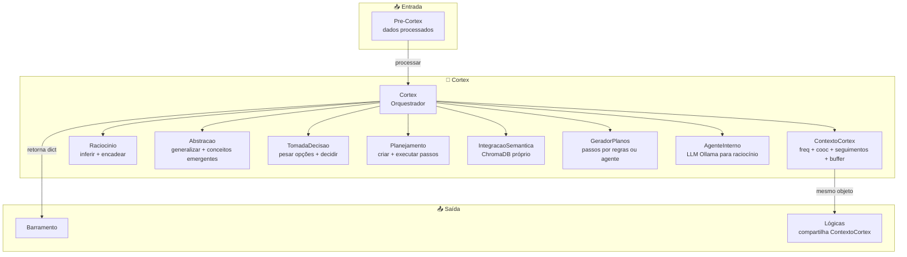
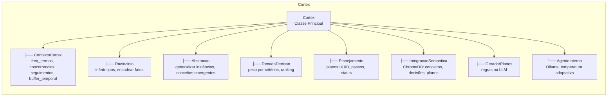
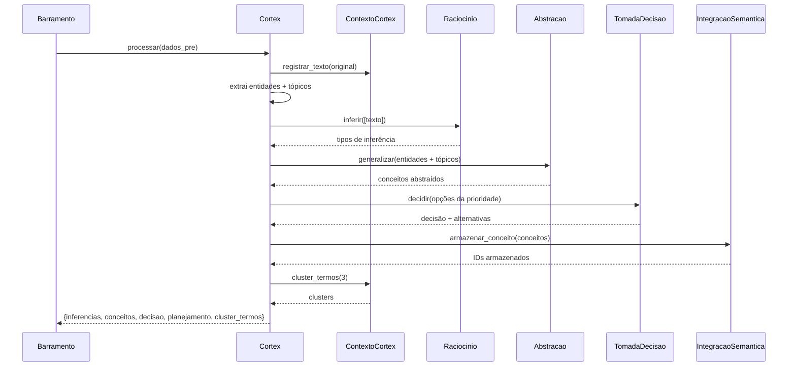
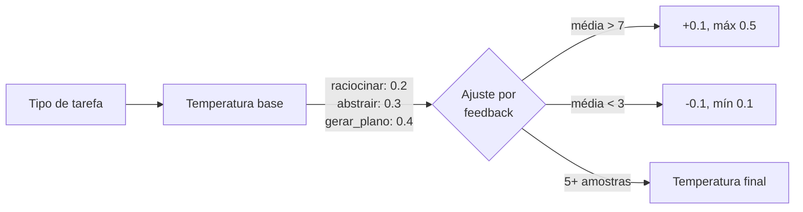
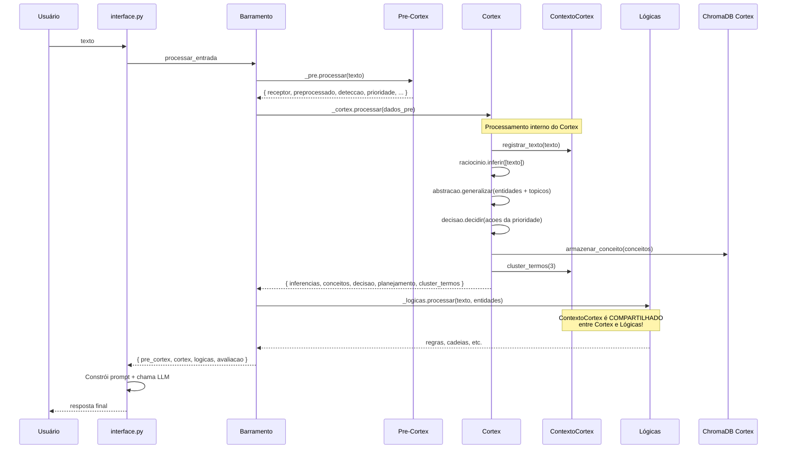
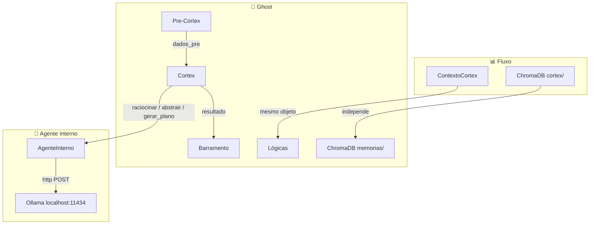

# Cortex — Memória de Curto Prazo e Raciocínio do Ghost

> **Propósito:** Camada de processamento cognitivo de curto prazo. Analisa termos, constrói co-occorrências, infere relações, generaliza conceitos, toma decisões ponderadas, gera planos e armazena conhecimento semântico em ChromaDB próprio. É o "pensamento rápido" do Ghost.

---

## Arquitetura Geral



---

## Organograma do Cortex



---

## Arquivos e Responsabilidades

### `__init__.py` — Classe `Cortex` (58 linhas)

**Responsabilidade:** Orquestrador principal do subsistema. Cria e conecta todos os 8 submódulos. É o ponto de entrada chamado pelo `Barramento`.

| Método | Parâmetros | Retorno | Descrição |
|---|---|---|---|
| `__init__(usar_agente, modelo_agente)` | `bool`, `str` | — | Cria: `ContextoCortex`, `Raciocinio`, `Planejamento`, `Abstracao`, `TomadaDecisao`, `IntegracaoSemantica`, `AgenteInterno`, `GeradorPlanos` |
| `processar(dados_pre_cortex)` | `dict` do Pre-Cortex | `dict` | Pipeline principal: registra texto → infere → generaliza → decide → armazena → clusteriza |
| `raciocinar(problema)` | `str` | `str` | Raciocínio via LLM (AgenteInterno) |
| `gerar_plano(objetivo, contexto, usar_agente)` | `str`, `str?`, `bool` | `dict` | Geração de plano (regras ou agente) |

**Fluxo de `processar()`:**



---

### `contexto.py` — Classe `ContextoCortex` (79 linhas)

**Responsabilidade:** Memória de curto prazo do Cortex. Rastreia frequência de termos, matriz de co-ocorrência, transições sequenciais e buffer temporal. É o **único objeto compartilhado** entre `Cortex` e `Lógicas`.

**Estruturas de dados:**

| Atributo | Tipo | Descrição |
|---|---|---|
| `freq_termos` | `Counter` | Quantas vezes cada termo apareceu |
| `coocorrencias` | `defaultdict(str, Counter)` | Pares simétricos: `cooc[a][b]` = vezes que a e b co-ocorreram |
| `seguimentos` | `defaultdict(str, Counter)` | Transições direcionais: `seg[a][b]` = vezes que a foi seguido por b |
| `buffer_temporal` | `list[set]` | Conjuntos de termos por turno de conversa (FIFO, máximo 200) |
| `total_analises` | `int` | Contador de textos processados |
| `padroes_inferencia` | `defaultdict(str, float)` | Pesos de padrões de inferência |
| `historico_abstracoes` | `list` | Histórico de generalizações |

| Método | Descrição |
|---|---|
| `novo_turno()` | Cria novo slot no buffer temporal (FIFO 200) |
| `registrar_texto(texto)` | Extrai palavras ≥3 chars, atualiza `freq_termos`, `coocorrencias`, `seguimentos` |
| `score_coocorrencia(a, b)` | Retorna contagem de co-ocorrência entre dois termos |
| `similares(termo, n)` | Top N termos mais co-ocorrentes |
| `score_inferencia(texto)` | Classifica tipo: `"direto"`, `"sequencial"`, `"recorrente"` |
| `cluster_termos(n)` | Algoritmo greedy: pega top 20 termos, agrupa cada um com seus N similares |

**Exemplo de `registrar_texto("ghost aprende python"):**

```
freq_termos: {ghost: 1, aprende: 1, python: 1}
coocorrencias: {ghost: {aprende: 1, python: 1}, aprende: {ghost: 1, python: 1}, python: {ghost: 1, aprende: 1}}
seguimentos: {ghost: {aprende: 1}, aprende: {python: 1}}
buffer_temporal[0]: {ghost, aprende, python}
```

---

### `raciocinio.py` — Classe `Raciocinio` (31 linhas)

**Responsabilidade:** Motor de raciocínio leve. Infere tipos de relação lógica entre termos e encadeia fatos com confiança.

| Método | Parâmetros | Retorno | Descrição |
|---|---|---|---|
| `inferir(premissas)` | `list[str]` | `list[dict]` | Para cada premissa, classifica tipo via `score_inferencia()` |
| `encadear(fatos)` | `list[str]` (≥2) | `list[dict]` | Cadeias `fato[i] → fato[i+1]` com score de co-ocorrência como confiança |

**Exemplo de `encadear(["ghost", "aprende", "python"]):**
```
[{"relacao": "ghost -> aprende", "confianca": 0.8},
 {"relacao": "aprende -> python", "confianca": 0.6}]
```

---

### `abstracao.py` — Classe `Abstracao` (39 linhas)

**Responsabilidade:** Generaliza instâncias específicas em conceitos abstratos usando similaridade de co-ocorrência.

| Método | Parâmetros | Retorno | Descrição |
|---|---|---|---|
| `generalizar(instancias)` | `list[str]` | `list[dict]` | Cada instância → similar mais próximo (top-3) vira `conceito` |
| `conceitos_emergentes(n)` | `int` | `list[str]` | Top N conceitos mais frequentes |

**Exemplo:** `generalizar(["python", "javascript", "rust"])`
```
→ [{"instancia": "python", "conceito": "linguagem"},
    {"instancia": "javascript", "conceito": "linguagem"},
    {"instancia": "rust", "conceito": "sistema"}]
```

---

### `decisao.py` — Classe `TomadaDecisao` (38 linhas)

**Responsabilidade:** Tomada de decisão ponderada por critérios com pesos.

| Método | Parâmetros | Retorno | Descrição |
|---|---|---|---|
| `decidir(opcoes, criterios)` | `list[dict]`, `dict` | `dict` | Pontua cada opção, ordena por score, retorna `{escolhida, alternativas}` |
| `_pesar_opcao(opcao, criterios)` | `dict`, `dict` | `(float, dict)` | Soma de `valor × peso` para cada critério |

**Exemplo:**
```python
opcoes = [{"nome": "ler_pdf"}, {"nome": "buscar_web"}]
criterios = {"velocidade": 0.7, "precisao": 0.3}
# cada opção tem valores para cada critério
decidir(opcoes, criterios)
# → {escolhida: opcao_com_maior_score, alternativas: [...]}
```

---

### `planejamento.py` — Classe `Planejamento` (56 linhas)

**Responsabilidade:** Criação e rastreamento de planos com passos, UUIDs e status.

| Método | Parâmetros | Retorno | Descrição |
|---|---|---|---|
| `criar_plano(objetivo, passos)` | `str`, `list[str]?` | `dict` | UUID 6-char hex, status `"ativo"` |
| `adicionar_passo(plano_id, descricao, ordem)` | `str`, `str`, `int?` | `dict` | UUID 4-char hex, status `"pendente"` |
| `executar_passo(plano_id, passo_id)` | `str`, `str` | `bool` | Marca como `"executado"` |
| `planos_ativos()` | — | `list[dict]` | Filtra por status `"ativo"` |

---

### `semantica.py` — Classe `IntegracaoSemantica` (89 linhas)

**Responsabilidade:** Memória semântica de longo prazo do Cortex. Usa ChromaDB próprio em `cortex/db_semantica/` — **independente** do ChromaDB do `OrquestradorMemoria`.

**Coleções ChromaDB:**

| Coleção | Conteúdo | Método de escrita |
|---|---|---|
| `conceitos` | Conceitos abstraídos | `armazenar_conceito(conceito, descricao)` |
| `decisoes` | Decisões tomadas + contexto | `armazenar_decisao(decisao, contexto)` |
| `planos` | Planos gerados | `armazenar_plano(id, descricao)` |

| Método | Descrição |
|---|---|
| `armazenar_conceito(conceito, descricao, metadados)` | Upsert via embedding `"conceito: descricao"` |
| `buscar(consulta, colecao, n)` | Busca por similaridade cosseno |
| `contar(colecao)` | Total de itens na coleção |

**ID único:** MD5 hash (12 primeiros hex) do texto embedado.

---

### `agente_interno.py` — Classe `AgenteInterno` (73 linhas)

**Responsabilidade:** Agente LLM interno que se comunica com servidor Ollama local para raciocínio, abstração e geração de planos.

| Método | Parâmetros | Retorno | Descrição |
|---|---|---|---|
| `raciocinar(problema)` | `str` | `str` | Prompt de raciocínio → Ollama |
| `abstrair(instancias)` | `list` | `str` | JSON de instâncias → generalização via LLM |
| `gerar_plano(objetivo, contexto)` | `str`, `str?` | `str` | Plano em JSON via LLM |
| `registrar_feedback(score)` | `float` | — | Acumula feedback para ajuste de temperatura |

**Temperatura adaptativa:**



**Sistema:** Chama `http://localhost:11434/api/chat` com `stream=false`, timeout 60s.
**System prompt:** `"Voce e um agente interno de raciocinio."`

---

### `gerador_planos.py` — Classe `GeradorPlanos` (90 linhas)

**Responsabilidade:** Geração de planos em duas modalidades: baseada em regras (termos + co-ocorrências) ou via LLM (AgenteInterno).

| Método | Parâmetros | Retorno | Descrição |
|---|---|---|---|
| `gerar(objetivo, contexto, usar_agente)` | `str`, `str?`, `bool` | `dict` | Escolhe modalidade, gera passos, cria plano |
| `_gerar_passos(objetivo)` | `str` | `list[str]` | Regras: top 4 termos relevantes → seguimentos → similares |
| `_gerar_com_agente(objetivo, contexto)` | `str`, `str?` | `dict` | LLM: parseia JSON `{"passos": [{"ordem": 1, "acao": "..."}]}` |
| `_termos_relevantes(texto)` | `str` | `list[str]` | Score por `freq + len*peso_tamanho`, top 4 |

**Fluxo de `_gerar_passos()`:**

```mermaid
graph TB
    OBJ[objetivo] --> TERMOS[_termos_relevantes<br/>top 4]
    TERMOS --> SEG{seguimentos<br/>entre termos?}
    SEG -->|sim| PASSOS[Cria passos como<br/>"termoA termoB"]
    SEG -->|não| SIM[similares]
    SIM --> PASSOS
    PASSOS --> CAP[Corta em 4 passos]
    CAP --> PLANO[criar_plano]
```

---

## Fluxo de Dados Completo



---

## Integrações com Outros Subsistemas



### Mapa de Conexões

| Componente | Conexão com Cortex |
|---|---|
| **Barramento** | Recebe `Cortex` como `cortex_pipeline`. Chama `_cortex.processar(dados_pre)`. Usa `_cortex._ctx` para `GerenciadorContexto` e `MonitorMetas`. Registra como recurso `"cortex"` |
| **Pre-Cortex** | Alimenta o Cortex com `dados_pre` — texto original, entidades extraídas, tópicos detectados, ações priorizadas |
| **Lógicas** | **Compartilha o mesmo `ContextoCortex`** — ambos leem/escrevem `freq_termos`, `coocorrencias`, `seguimentos`, `buffer_temporal` |
| **Interface.py** | Cria `Cortex()` no módulo. Passa `cortex_pipeline._ctx` para `RaciocinioPipeline`. Chama `cortex_pipeline.raciocinar()` e `cortex_pipeline.gerar_plano()` diretamente em comandos. Acessa `cortex_pipeline.semantica` para buscas |
| **ChromaDB do Cortex** | **Independente** — usa `cortex/db_semantica/`. Não se mistura com o ChromaDB de `memorias/semantica/` |
| **OrquestradorMemória** | **Não há conexão direta.** Cortex não importa nada de `memorias/`. Toda comunicação com memória de longo prazo é via barramento |
| **Ollama** | `AgenteInterno` chama `localhost:11434/api/chat` diretamente com HTTP POST. System prompt fixo: `"Voce e um agente interno de raciocinio."` |

---

## Padrões de Design Presentes

| Padrão | Implementação |
|---|---|
| **Facade** | `Cortex` esconde 8 submódulos atrás de `processar()`, `raciocinar()`, `gerar_plano()` |
| **Composite** | `Cortex` compõe `Raciocinio` + `Abstracao` + `TomadaDecisao` + `Planejamento` + `IntegracaoSemantica` |
| **Strategy** | `GeradorPlanos.gerar()` alterna entre regras (`_gerar_passos`) e agente (`_gerar_com_agente`) |
| **Blackboard** | `ContextoCortex` é o quadro-negro compartilhado entre `Cortex` e `Lógicas` |
| **Chain of Responsibility** | `processar()` → `raciocinio.inferir()` → `abstracao.generalizar()` → `tomadaDecisao.decidir()` → `semantica.armazenar()` |
| **Repository** | `IntegracaoSemantica` abstrai ChromaDB com métodos de domínio (`armazenar_conceito`, `buscar`, `contar`) |
| **Adapter** | `AgenteInterno._consultar()` adapta API HTTP do Ollama para interface Python |
| **Singleton indireto** | `ContextoCortex` é instância única compartilhada entre `Cortex` pipeline e `Lógicas` pipeline |

---

## Comparação: ChromaDB do Cortex vs. ChromaDB das Memórias

| Aspecto | Cortex | OrquestradorMemória |
|---|---|---|
| **Diretório** | `cortex/db_semantica/` | `memorias/semantica/` |
| **Coleções** | `conceitos`, `decisoes`, `planos` | Mensagens, conceitos, conhecimento |
| **Populado por** | `IntegracaoSemantica` (Cortex.processar) | `MemoriaSemantica` (processar_mensagem) |
| **Finalidade** | Raciocínio de curto prazo | Memória permanente do Ghost |
| **Compartilhado com** | Apenas Cortex | CoAgente, Barramento, Interface |

---

## Estatísticas do Diretório

| Métrica | Valor |
|---|---|
| Arquivos Python | 9 |
| Linhas de código | ~570 |
| Classes | 9 (Cortex, ContextoCortex, Raciocinio, Abstracao, TomadaDecisao, Planejamento, IntegracaoSemantica, AgenteInterno, GeradorPlanos) |
| Métodos | 35 |
| Coleções ChromaDB | 3 (conceitos, decisoes, planos) |
| Banco ChromaDB persistente | `cortex/db_semantica/` (~1.9 MB) |

---

## Resumo

> **O Cortex é a camada de raciocínio de curto prazo do Ghost.** Enquanto o Barramento orquestra pipelines e o CoAgente coordena agentes inteligentes, o Cortex é onde o "pensamento rápido" acontece — análise de termos, descoberta de co-ocorrências, generalização de conceitos, decisões ponderadas e geração de planos.
>
> O coração do Cortex é o `ContextoCortex`: um **quadro-negro compartilhado** com o pipeline de Lógicas, contendo frequências, co-ocorrências, transições e buffer temporal. Cada interação do usuário alimenta esse contexto, que ambos os pipelines (Cortex e Lógicas) consomem e modificam simultaneamente.
>
> O Cortex mantém seu **próprio banco ChromaDB** (`cortex/db_semantica/`), separado do sistema de memórias principal — uma decisão arquitetural que isola o raciocínio de curto prazo da persistência de longo prazo.
>
> Quando o raciocínio baseado em regras não é suficiente, o `AgenteInterno` invoca um modelo LLM local (Ollama) para raciocinar, abstrair ou gerar planos — com temperatura ajustada automaticamente conforme feedback das interações anteriores.
