# Lógicas — Motor de Raciocínio Multi-Paradigma do Ghost

> **Propósito:** Sistema de raciocínio que combina 8 paradigmas lógicos diferentes — heurísticas, lógica simbólica, fuzzy, temporal, probabilística, Fourier, caos e Polyakov — todos operando sobre o mesmo `ContextoCortex` compartilhado com o Cortex. É o "pensamento profundo" do Ghost.

---

## Arquitetura Geral

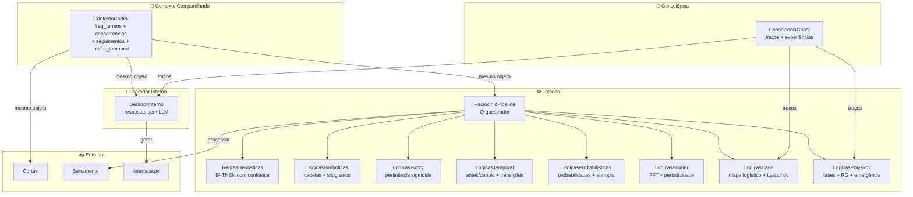

---

## Organograma das Lógicas

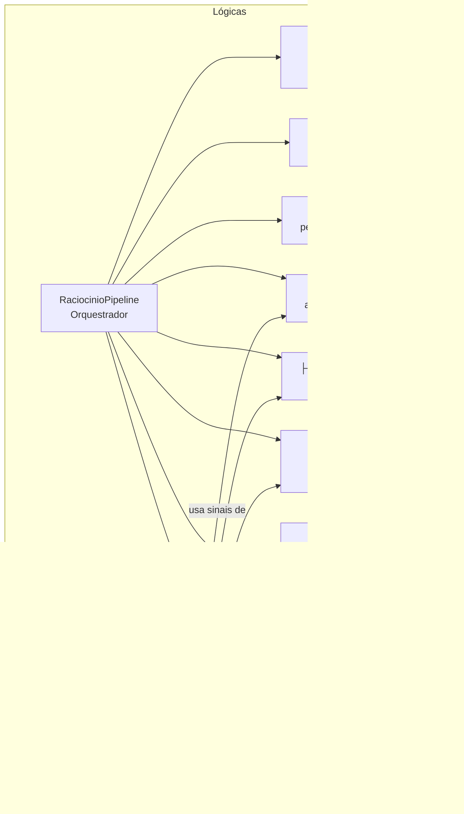

---

## Arquivos e Responsabilidades

### `__init__.py` (9 linhas)

**Responsabilidade:** Exporta todas as 9 classes principais.

**Exporta:** `RegrasHeuristicas`, `LogicasSimbolicas`, `LogicasFuzzy`, `LogicasTemporal`, `LogicasProbabilisticas`, `LogicasFourier`, `LogicasCaos`, `LogicasPolyakov`, `RaciocinioPipeline`

**Não exporta:** `GeradorInterno` — importado diretamente onde necessário.

---

### `raciocinio_pipeline.py` — Classe `RaciocinioPipeline` (101 linhas)

**Responsabilidade:** Orquestrador principal. Instancia e coordena todos os 8 módulos lógicos. É o único ponto de entrada chamado pelo `Barramento`.

| Método | Parâmetros | Retorno | Descrição |
|---|---|---|---|
| `__init__(ctx, consciencia)` | `ContextoCortex`, `ConscienciaGhost?` | — | Cria todos os 8 submódulos |
| `processar(texto, entidades)` | `str`, `list[str]?` | `dict` | Pipeline completo de raciocínio multi-paradigma |
| `set_consciencia(consciencia)` | `ConscienciaGhost` | — | Propaga consciência para Caos e Polyakov |
| `registrar_estado_ghost()` | — | — | Registra estado nos módulos Caos e Polyakov |
| `resumo_estado()` | — | `dict` | Agrega `resumo()` de todos os 8 submódulos |

**Fluxo de `processar()`:**

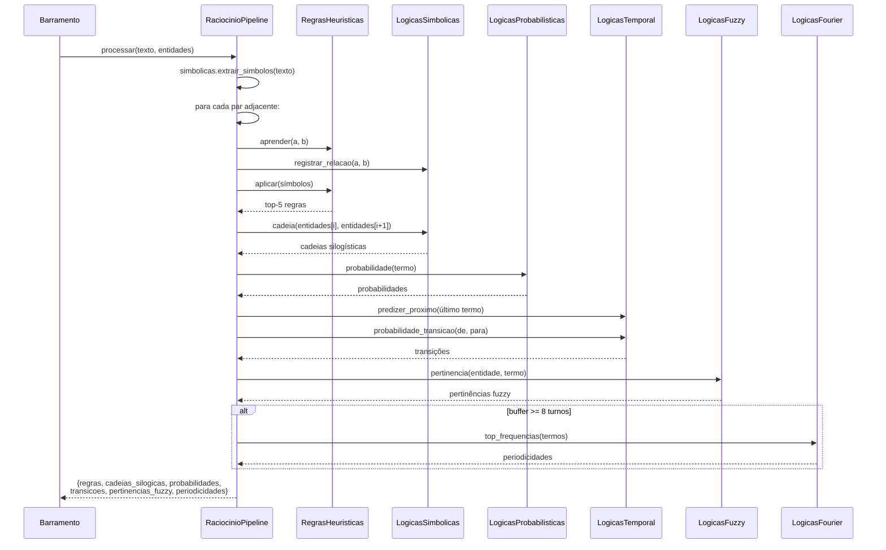

---

### `regras_heuristicas.py` — Classe `RegrasHeuristicas` (55 linhas)

**Responsabilidade:** Mineração de regras de associação (SE → ENTÃO) a partir de co-ocorrências, com confiança e reforço por feedback.

| Método | Parâmetros | Retorno | Descrição |
|---|---|---|---|
| `aprender(antecedente, consequente)` | `str`, `str` | — | Registra regra com confiança = `cooc / freq(ant)` |
| `aplicar(antecedentes)` | `list[str]` | `list[dict]` | Retorna regras matching, ordenadas por confiança |
| `feedback(antecedente, consequente, sucesso)` | `str`, `str`, `bool` | — | Atualiza contadores de acerto/erro |
| `confianca(antecedente, consequente)` | `str`, `str` | `float` | Confiança armazenada |
| `taxa_acerto(antecedente, consequente)` | `str`, `str` | `float` | Taxa de sucesso com feedback |

**Exemplo:** Se `"ghost"` e `"aprende"` co-ocorrem 5 vezes e `"ghost"` aparece 10 vezes:
- Regra: `ghost → aprende` com confiança 0.5

---

### `logicas_simbolicas.py` — Classe `LogicasSimbolicas` (65 linhas)

**Responsabilidade:** Lógica simbólica — descoberta de cadeias de termos via BFS e inferência de silogismos.

| Método | Parâmetros | Retorno | Descrição |
|---|---|---|---|
| `extrair_simbolos(texto)` | `str` | `list[str]` | Tokens lowercase ≥3 chars |
| `registrar_relacao(a, b)` | `str`, `str` | — | Relação simétrica entre a e b |
| `relacao_direta(a, b)` | `str`, `str` | `bool` | `cooc(a,b) > 0` |
| `cadeia(a, b, prof=3)` | `str`, `str`, `int` | `list?` | BFS de `a` até `b` via `ctx.similares()`, profundidade máxima 3 |
| `silogismo(a, b, c)` | `str`, `str`, `str` | `dict?` | Se `a→b` e `b→c`, infere `a→c` com confiança = `min(conf_a_b, conf_b_c)` |

**Exemplo de cadeia:** `ghost → inteligência → artificial → aprendizado`

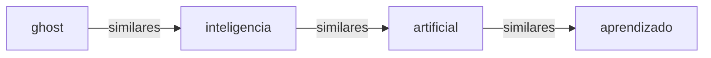

---

### `logicas_fuzzy.py` — Classe `LogicasFuzzy` (50 linhas)

**Responsabilidade:** Lógica fuzzy — funções de pertinência sigmoide para medir associação conceitual.

| Método | Parâmetros | Retorno | Descrição |
|---|---|---|---|
| `pertinencia(termo, conceito)` | `str`, `str` | `float` | `1 / (1 + exp(-5 * (freq_rel - mediana)))` |
| `fuzzy_and(*valores)` | `float...` | `float` | `min(...)` |
| `fuzzy_or(*valores)` | `float...` | `float` | `max(...)` |
| `fuzzy_not(valor)` | `float` | `float` | `1 - valor` |
| `centroide(termo, conceitos)` | `str`, `list` | `float` | Média das pertinências |

**Curva sigmoide:** O limiar é adaptativo — mediana do histórico de frequências relativas.

---

### `logicas_temporal.py` — Classe `LogicasTemporal` (43 linhas)

**Responsabilidade:** Lógica sequencial — relações de antes/depois, probabilidades de transição e predição do próximo termo.

| Método | Parâmetros | Retorno | Descrição |
|---|---|---|---|
| `antes(a, b)` | `str`, `str` | `float` | Direcionalidade: +1 = `a` tende antes de `b`, -1 = depois |
| `depois(a, b)` | `str`, `str` | `float` | `-antes(a, b)` |
| `predizer_proximo(termo, n=3)` | `str`, `int` | `list[str]` | Top N seguidores mais frequentes |
| `probabilidade_transicao(de, para)` | `str`, `str` | `float` | `freq(para segue de) / freq(de)` |
| `causal(a, b)` | `str`, `str` | `float` | `P(b\|a) - P(a\|b)` — assimetria causal |

**Fonte de dados:** `ctx.seguimentos` — dicionário de Counters que registra quais termos seguem quais na ordem da conversa.

---

### `logicas_probabilisticas.py` — Classe `LogicasProbabilisticas` (56 linhas)

**Responsabilidade:** Teoria da probabilidade — probabilidades marginal, conjunta, condicional, Bayes, odds e entropia de Shannon.

| Método | Parâmetros | Retorno | Descrição |
|---|---|---|---|
| `probabilidade(termo)` | `str` | `float` | `freq(termo) / total_termos` |
| `conjunta(a, b)` | `str`, `str` | `float` | `cooc(a,b) / total_termos` |
| `condicional(a, b)` | `str`, `str` | `float` | `P(a\|b) = cooc(b,a) / freq(b)` |
| `bayes(a, b)` | `str`, `str` | `float` | `P(a\|b) = P(b\|a) × P(a) / P(b)` |
| `odds(termo)` | `str` | `float` | `p / (1-p)` |
| `entropia()` | — | `float` | Entropia de Shannon (base 2) da distribuição de termos |

---

### `logicas_fourier.py` — Classe `LogicasFourier` (109 linhas)

**Responsabilidade:** Análise espectral via FFT — detecta periodicidades no aparecimento de termos ao longo dos turnos da conversa.

**Sinal binário:** Para cada termo, constrói um vetor de 64 bits: `1` se o termo apareceu naquele turno, `0` caso contrário.

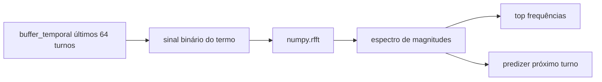

| Método | Parâmetros | Retorno | Descrição |
|---|---|---|---|
| `espectro(termo)` | `str` | `np.ndarray` | FFT magnitude spectrum (parte real) |
| `top_frequencias(termo, n, min_periodo)` | `str`, `int`, `int` | `list[dict]` | Top N componentes com `{freq, periodo, magnitude}` |
| `frequencia_dominante(termo)` | `str` | `dict?` | Componente de maior magnitude |
| `predizer_proximo(termo, janela)` | `str`, `int` | `dict` | `{proximo, turnos_ate_proximo, confianca}` |
| `similaridade_espectral(a, b)` | `str`, `str` | `float` | Cosseno entre espectros de dois termos |

---

### `logicas_caos.py` — Classe `LogicasCaos` (177 linhas)

**Responsabilidade:** Teoria do caos — modela a dinâmica interna do Ghost usando mapa logístico, expoente de Lyapunov e detecção de atratores.

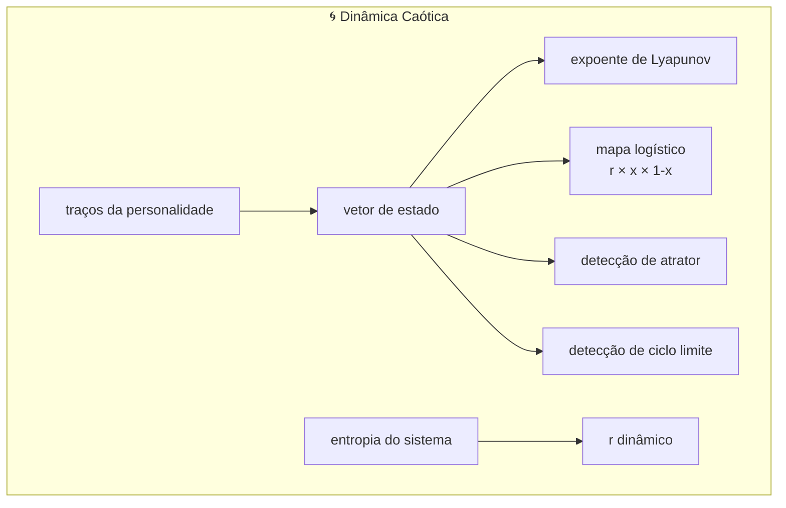

| Método | Parâmetros | Retorno | Descrição |
|---|---|---|---|
| `r_organico()` | — | `float` | Parâmetro r do mapa logístico, calculado de entropia + variância dos traços. Clamp [0.1, 4.0] |
| `evoluir_traco(valor_atual)` | `float` | `float` | Aplica mapa logístico: `r × x × (1-x)` |
| `estado_caotico()` | — | `float` | Nível de caos [0,1] baseado no percentil do Lyapunov |
| `detectar_atrator(janela)` | `int` | `dict?` | Detecta se sistema está em regime de atrator |
| `ciclo_limite(tolerancia)` | `float?` | `bool` | Detecta ciclos limite a cada 5 passos |
| `regime_atual()` | — | `dict` | Classifica regime: `atrator`, `ciclo_limite`, `caotico`, `transiente`, `estavel` |

**Exemplo de regimes:**
- `r = 0.5` → estável (ponto fixo)
- `r = 2.8` → ciclo limite
- `r = 3.6` → caótico
- `r = 4.0` → caos total

---

### `logicas_polyakov.py` — Classe `LogicasPolyakov` (165 linhas)

**Responsabilidade:** Teoria de gauge / grupo de renormalização — modela o estado interno do Ghost como um "campo" com fases (confinado/crítico/desconfinado) e transformações RG sobre memórias.

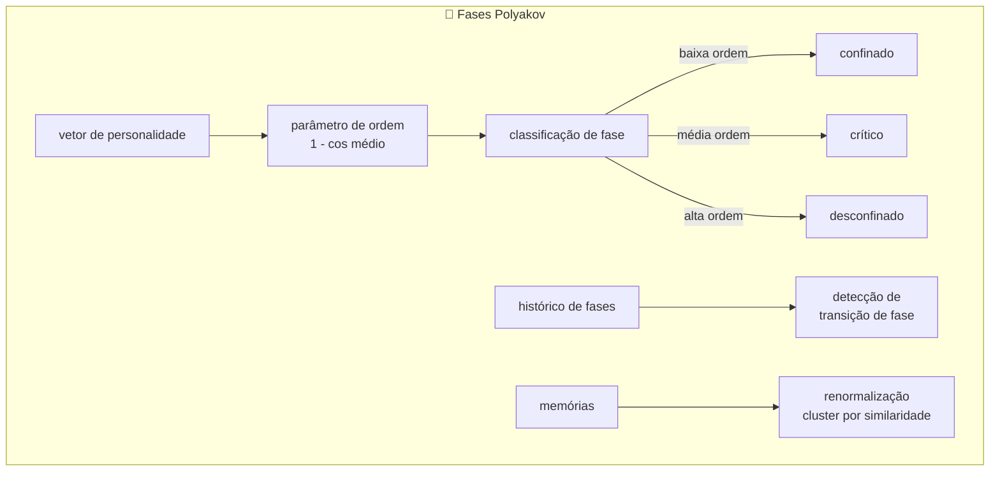

| Método | Parâmetros | Retorno | Descrição |
|---|---|---|---|
| `parametro_ordem()` | — | `float` | `1 - média(cosseno)` entre pares de estados separados por sliding window |
| `fase()` | — | `str` | `"confinado"`, `"critico"`, `"desconfinado"` |
| `transicao_fase()` | — | `dict?` | Detecta transições nas últimas 3 fases |
| `renormalizar(grupo_memorias)` | `list` | `list[list]` | Agrupa memórias por similaridade (RG transformation) |
| `estruturas_emergentes()` | — | `dict` | `{dimensao_correlacao, entropia_estrutural, n_dimensoes_possiveis}` |

**Analogia física:**
- **Confinado** → personalidade rígida, pouca variação
- **Crítico** → transição, flexibilidade máxima
- **Desconfinado** → personalidade fluida, alta variação

---

### `gerador_interno.py` — Classe `GeradorInterno` (156 linhas)

**Responsabilidade:** Geração de respostas usando **apenas tokens internos** do Ghost (sem LLM externo). Combina múltiplos sinais lógicos para produzir respostas coerentes.

**Pesos dos sinais:**

| Sinal | Peso | Fonte |
|---|---|---|
| Transição temporal | 35% | `LogicasTemporal.predizer_proximo()` |
| Co-ocorrência | 25% | `ContextoCortex.coocorrencias` |
| Memória similar (embedding) | 20% | ChromaDB similaridade cosseno |
| Periodicidade Fourier | 10% | `LogicasFourier.predizer_proximo()` |
| Viés de personalidade | 10% | `ConscienciaGhost.tracos` |

**Fluxo de `gerar()`:**

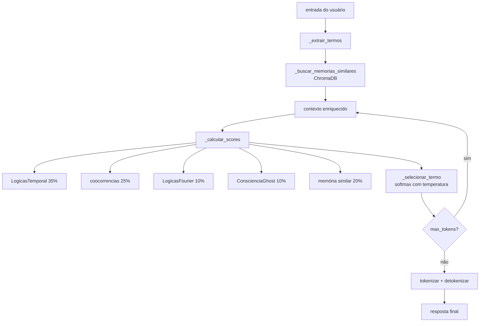

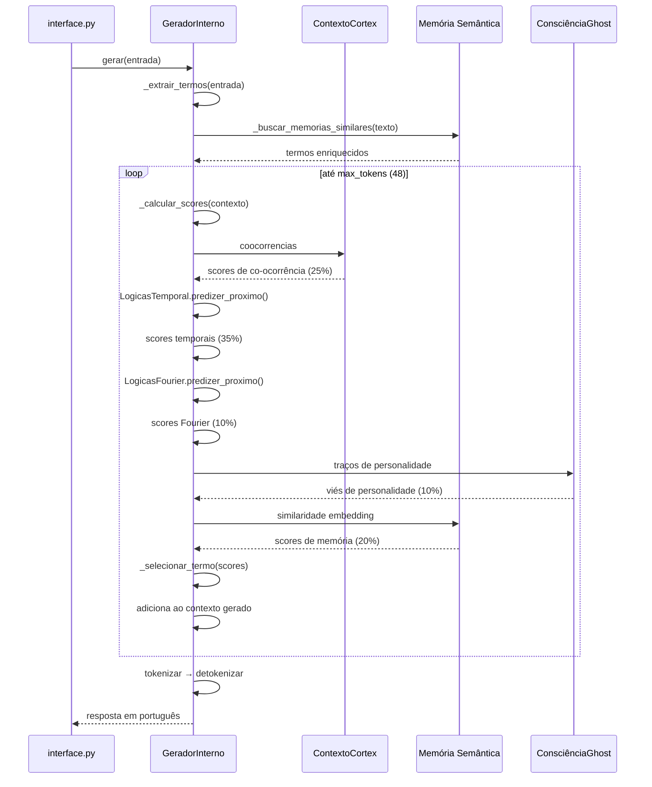

---

## Fluxo de Dados Completo

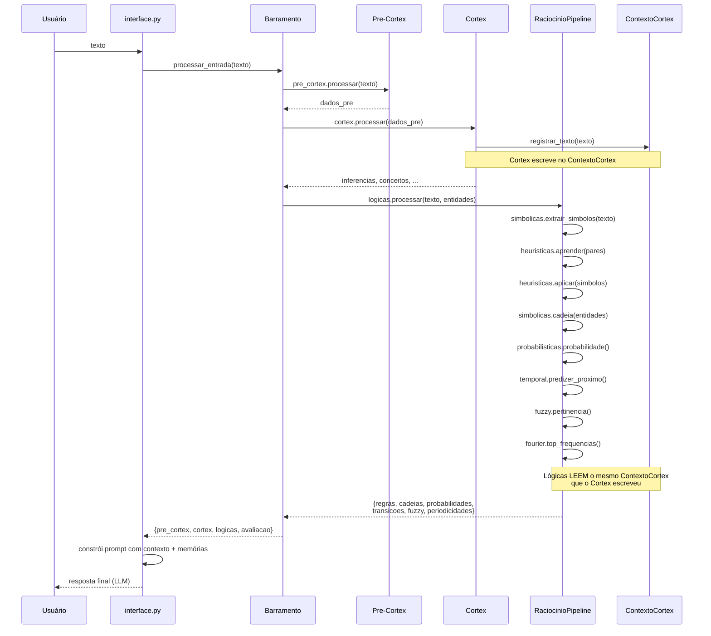

---

## Integrações com Outros Subsistemas

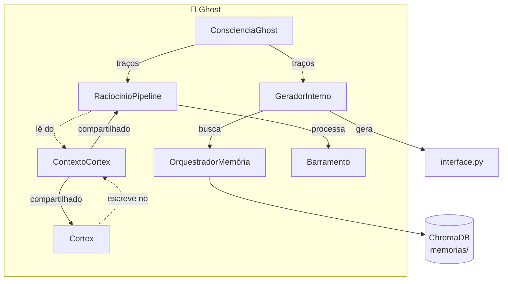

### Mapa de Conexões

| Componente | Conexão com Lógicas |
|---|---|
| **ContextoCortex** | **Compartilhado** com o Cortex. Todos os 8 módulos lógicos leem dele. O Cortex escreve (via `registrar_texto`), as Lógicas leem |
| **ConsciênciaGhost** | Injetada no `RaciocinioPipeline` via `set_consciencia()`. Usada por: `LogicasCaos` (evoluir traços, r_orgânico), `LogicasPolyakov` (vetor de estado), `GeradorInterno` (viés de personalidade) |
| **Barramento** | Chama `RaciocinioPipeline.processar()` dentro de `processar_entrada()`. Inclui resultado no dicionário retornado sob chave `"logicas"` |
| **Interface.py** | Cria `RaciocinioPipeline(cortex_pipeline._ctx)`. Chama `logicas_pipeline.set_consciencia()`. Importa `GeradorInterno` diretamente para modo `/interno` |
| **OrquestradorMemória** | Indireta — `GeradorInterno` recebe `memoria_semantica` como parâmetro e chama `.buscar(texto, n)` para enriquecer contexto |
| **Cortex** | Compartilha o `ContextoCortex`. Não há importação direta — a injeção de dependência é feita via `interface.py` que passa `cortex_pipeline._ctx` para `RaciocinioPipeline` |

---

## Pipeline de Processamento (`raciocinio_pipeline.py`)

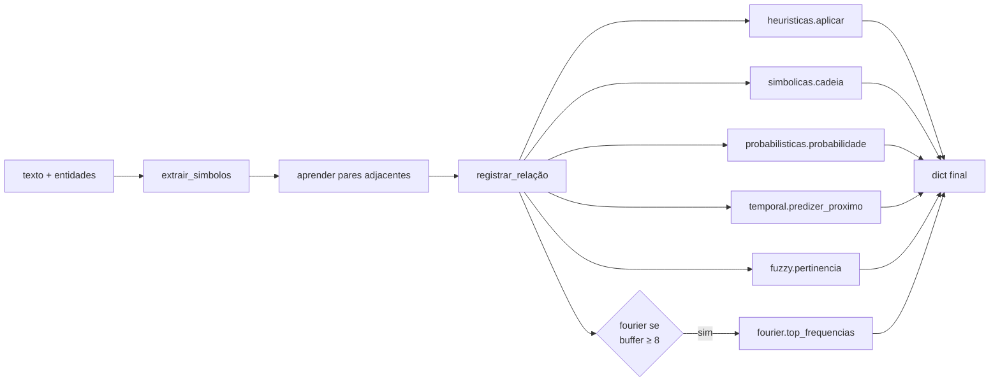

**O que retorna:**
```python
{
    "regras": [...],              # top-5 regras SE→ENTÃO
    "cadeias_silogicas": [...],   # cadeias BFS entre entidades
    "probabilidades": {...},      # P(termo) para cada termo
    "transicoes": {...},          # predizer_proximo + prob_transição
    "pertinencias_fuzzy": [...],  # pares entidade→termo acima do limiar
    "periodicidades": [...],      # top frequências FFT (se buffer ≥ 8)
}
```

---

## Padrões de Design Presentes

| Padrão | Implementação |
|---|---|
| **Facade** | `RaciocinioPipeline` esconde 8 módulos atrás de `processar()` |
| **Strategy** | Cada módulo lógico é uma estratégia diferente para o mesmo problema (raciocinar sobre o texto) |
| **Blackboard** | `ContextoCortex` é o quadro-negro compartilhado entre Cortex e todas as Lógicas |
| **Chain of Responsibility** | `processar()` executa módulos em sequência, cada um alimentando o próximo |
| **Dependency Injection** | `ctx` e `consciencia` são injetados — nenhum módulo importa diretamente suas dependências |
| **Template Method** | Todos os módulos seguem a mesma interface com `resumo()` |
| **Lazy Initialization** | `GeradorInterno._iniciar_modulos()` e `LogicasCaos._inicializar()` carregam módulos sob demanda |

---

## Comparação: Cortex vs. Lógicas

| Aspecto | Cortex | Lógicas |
|---|---|---|
| **Papel** | Pensamento rápido (análise, conceitos, decisão) | Pensamento profundo (múltiplos paradigmas) |
| **Relação com ContextoCortex** | **Escreve** (registrar_texto) | **Lê** (coocorrências, seguimentos, buffer) |
| **Uso de LLM** | Sim (`AgenteInterno`) | Não (apenas `GeradorInterno` que não usa LLM) |
| **Persistência** | ChromaDB próprio (`cortex/db_semantica/`) | Nenhuma (só lê do ContextoCortex) |
| **ConsciênciaGhost** | Não usa | Usa (Caos, Polyakov, GeradorInterno) |
| **Complexidade** | 9 arquivos, ~570 linhas | 11 arquivos, ~1000 linhas |
| **Paradigmas** | 1 (raciocínio simbólico + ML) | 8 (heurísticas, simbólico, fuzzy, temporal, probabilístico, Fourier, caos, gauge) |

---

## Estatísticas do Diretório

| Métrica | Valor |
|---|---|
| Arquivos Python | 11 |
| Linhas de código | ~1.100 |
| Classes | 10 |
| Módulos lógicos | 8 (heurísticas, simbólico, fuzzy, temporal, probabilístico, Fourier, caos, Polyakov) |
| Gerador interno | 1 (GeradorInterno — 5 sinais combinados) |
| Bancos/Arquivos externos | Nenhum (tudo in-memory via ContextoCortex) |

---

## Resumo

> **As Lógicas são o motor de raciocínio multi-paradigma do Ghost.** Enquanto o Cortex faz a análise rápida (frequências, conceitos, decisões), as Lógicas aplicam 8 paradigmas diferentes sobre o mesmo `ContextoCortex` compartilhado — descobrindo regras heurísticas, cadeias simbólicas, pertinências fuzzy, transições temporais, probabilidades, periodicidades Fourier, dinâmica caótica e fases Polyakov.
>
> O `RaciocinioPipeline` executa todos os 8 módulos em sequência a cada interação, e o resultado alimenta o prompt do LLM com insights de cada paradigma. Em paralelo, o `GeradorInterno` pode produzir respostas completas usando apenas os sinais internos (temporal 35% + co-ocorrência 25% + memória 20% + Fourier 10% + personalidade 10%) — sem chamar LLM nenhum.
>
> **O ContextoCortex é a peça central:** o Cortex escreve (alimenta), as Lógicas leem (analisam), e o ciclo se repete a cada mensagem. É um verdadeiro blackboard pattern onde múltiplos "especialistas" cooperam no mesmo quadro de conhecimento.
