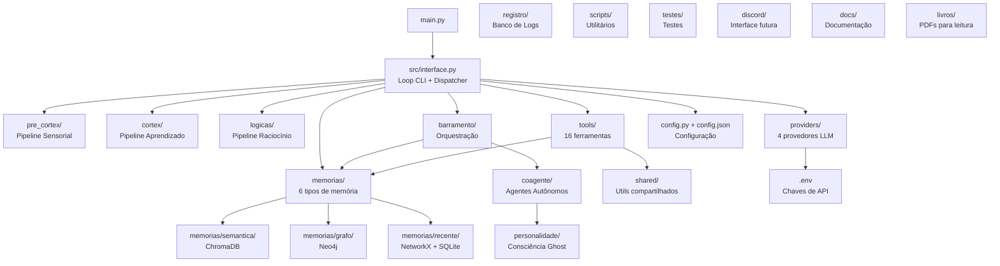
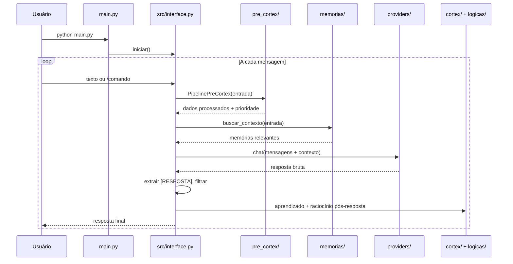

# `memoria_com_ollama` — Raiz do Projeto

> **Sistema de agente de IA com memória persistente, pipeline sensorial (pre-cortex), raciocínio (lógicas), aprendizado (cortex), múltiplos tipos de memória (semântica, procedural, episódica, grafo, recente, estática), personalidade evolutiva (Ghost), ferramentas auto-registráveis, e suporte a múltiplos provedores LLM (Ollama, OpenAI, LM Studio, Gemini).**

---

## Mapa da Arquitetura



---

## Estrutura de Diretórios (sem .png, .canvas)

```
memoria_com_ollama/
├── main.py                 # Ponto de entrada do sistema
├── config.py               # Carregador/validador de config.json
├── config.json             # Configuração ativa (modelo, provider, temperatura)
├── requirements.txt        # Dependências Python (12 pacotes)
├── .env                    # Chaves de API (Neo4j, Google, OpenAI)
├── .obsidian/              # Configuração do Obsidian (vault)
│
├── src/                    # CAMADA DE ENTRADA (7 arquivos, ~1808 linhas)
│   ├── interface.py        #   Loop CLI + dispatcher de comandos (1491 linhas)
│   ├── response_policy.py  #   Filtro de resposta [RESPOSTA]
│   ├── context_builder.py  #   Montagem de contexto system
│   ├── chat_session.py     #   Histórico de mensagens
│   ├── intent_tools.py     #   Detecção de intenção pré-LLM
│   ├── ollama_client.py    #   Wrapper de provedor LLM
│   └── __init__.py         #   Pacote vazio
│
├── pre_cortex/             # PIPELINE SENSORIAL (8 arquivos)
│   ├── __init__.py         #   PipelinePreCortex (6 estágios)
│   └── ContextoAprendizado #   Aprendizado orgânico (frequências, importância)
│
├── cortex/                 # PIPELINE DE APRENDIZADO (12+ arquivos)
│   ├── __init__.py         #   PipelineCortex
│   ├── semantica/          #   ChromaDB (conceitos, decisões, planos)
│   ├── auto/               #   Aprendizado automático
│   ├── reflexao/           #   Reflexão pós-interação
│   ├── abstrato/           #   Abstração de padrões
│   └── ContextoCortex      #   Co-ocorrências + seguimentos
│
├── logicas/                # PIPELINE DE RACIOCÍNIO (11 arquivos)
│   ├── __init__.py         #   PipelineLogicas
│   ├── GeradorInterno      #   8 paradigmas lógicos
│   └── ContextoCortex      #   Compartilhado com cortex
│
├── memorias/               # SISTEMA DE MEMÓRIA (22+ módulos)
│   ├── orquestrador.py     #   OrquestradorMemória
│   ├── registro_memorias   #   Hot-reload de módulos
│   ├── procedural/         #   Memória procedural (BPE, n-gram, MLP, embeddings 256d)
│   ├── semantica/          #   Memória semântica (ChromaDB, 2 coleções)
│   ├── recente/            #   Memória recente (NetworkX, SQLite, BufferAtencao)
│   ├── grafo/              #   Memória relacional (Neo4j, 12 taxas decay)
│   ├── estatica/           #   Memória estática (BancoAutonomo thread-safe)
│   ├── episodica/          #   Memória episódica (6 tipos de evento, timeline)
│   └── n4/                 #   Configuração Neo4j
│
├── barramento/             # ORQUESTRAÇÃO CENTRAL
│   ├── __init__.py         #   Barramento (amarra subsistemas)
│   ├── fluxo.py            #   Fluxo de decisão
│   └── sinc.py             #   Sincronização
│
├── coagente/               # AGENTES AUTÔNOMOS
│   ├── __init__.py         #   Coagente orquestrador
│   ├── base/               #   Agente base
│   ├── memoria_primeiro    #   Memória-Primeiro (cache de respostas)
│   └── consciencia/        #   Ghost Consciência
│
├── personalidade/          # CONSCIÊNCIA GHOST
│   ├── __init__.py         #   ConscienciaGhost
│   ├── agentes/            #   Agentes de traço
│   └── sistema/            #   Sistema de emergência
│
├── tools/                  # FERRAMENTAS (16 registradas)
│   ├── REGISTRO            #   Auto-descoberta de módulos
│   ├── executor_llm        #   Execução via LLM
│   ├── ler_arquivo/        #   Leitura de arquivos
│   ├── ler_pdf/            #   Leitura de PDFs
│   ├── buscar_web/         #   Busca na web
│   └── ...
│
├── providers/              # PROVEDORES LLM (4 implementações)
│   ├── ollama_provider     #   Ollama (local)
│   ├── openai_provider     #   OpenAI API
│   ├── lmstudio_provider   #   LM Studio (local)
│   └── gemini_provider     #   Google Gemini API
│
├── registro/               # SISTEMA DE LOGS
│   ├── banco_logs.py       #   SQLite de logs
│   ├── analise.py          #   AnalisadorLogs (agentes, ferramentas, LLM, erros)
│   └── ...
│
├── shared/                 # COMPARTILHADO
│   ├── utils.py            #   parse_valor, extrair_chamada, extrair_resposta_tag
│   └── __init__.py
│
├── scripts/                # UTILITÁRIOS
│   └── zerar_memorias.py   #   Zera ChromaDB, SQLite, Neo4j e RAM
│
├── testes/                 # TESTES (7 arquivos)
│   ├── test_ciclo_completo.py
│   ├── test_fluxo_completo.py
│   ├── test_consciencia.py
│   ├── test_evolucao.py
│   ├── test_memoria_procedural.py
│   ├── test_buscar_semantica.py
│   └── test_ferramentas.py
│
├── discord/                # INTERFACE FUTURA
│   └── __init__.py         #   Placeholder para bot Discord
│
├── docs/                   # DOCUMENTAÇÃO
│   ├── arquitetura.md      #   Diagrama de arquitetura (Mermaid, 277 linhas)
│   └── arquitetura_detalhada.md  #   Documento detalhado (677 linhas)
│
├── mds/                    # RELATÓRIOS OBSIDIAN (gerados, 16 arquivos)
│   ├── barramento.md, coagente.md, cortex.md, logicas.md
│   ├── pre_cortex.md, personalidade.md, tools.md, src.md
│   └── memorias_geral.md + 7 sub-relatórios
│
└── livros/                 # PDFs DE LEITURA
    ├── livro_completo.pdf
    ├── narnia.pdf
    ├── volume_1.pdf
    └── volume_1A.pdf
```

---

## Arquivos Raiz

### `main.py` (30 linhas)
Ponto de entrada único. Lê `--modelo` de `sys.argv`, carrega config, chama `src.interface.iniciar()`.

### `config.py` (45 linhas)
Carregador/validador de `config.json`. API:
- `load()` → lê JSON, cria default se não existir
- `save(config)` → persiste
- `get(key, default)` → busca com fallback para `DEFAULT_CONFIG`
- `set_key(key, value)` → atalho para save

Carrega `.env` via `python-dotenv` automaticamente no module level.

### `config.json` (9 linhas)
```json
{
  "model": "gemma-4-26b-a4b-it",
  "provider": "gemini",
  "temperature": 0.7,
  "stream": true
}
```

### `.env` (5 linhas)
Segredos do ambiente:
- `SENHA_NEO4J` — senha do banco Neo4j
- `NEO4J_DATABASE` — nome do banco (`notas`)
- `NEO4J_DATAPERSONALIDADE` — banco de personalidade (`ghost`)
- `GOOGLE-API` — chave da API Gemini
- `OPENAI_API_KEY` — comentada (fallback)

### `requirements.txt` (12 pacotes)
`requests`, `rich`, `python-dotenv`, `neo4j`, `chromadb`, `networkx`, `numpy`, `pypdf`, `pdfplumber`, `pillow`, `pytesseract`, `pytest`.

---

## Subsistemas e Seus Papéis

| Subsistema | Função | Tecnologias |
|------------|--------|-------------|
| `src/` | Entrada CLI, dispatcher, ciclo LLM | ~1808 linhas, maior arquivo: `interface.py` |
| `pre_cortex/` | Pipeline sensorial: 6 estágios de análise de entrada | Níveis 1-5 de prioridade |
| `cortex/` | Pipeline de aprendizado: semântica, reflexão, abstração | ChromaDB, auto, abstrato |
| `logicas/` | Pipeline de raciocínio: 8 paradigmas lógicos | GeradorInterno |
| `memorias/` | 6 tipos de memória + orquestrador + hot-reload | ChromaDB, Neo4j, NetworkX, SQLite, BPE, MLP |
| `barramento/` | Orquestração central, fluxo, sincronização | Amarra todos os subsistemas |
| `coagente/` | Agentes autônomos, Memória-Primeiro | Cache de respostas |
| `personalidade/` | Consciência Ghost evolutiva | 6 traços emergentes zero-shot |
| `tools/` | 16 ferramentas auto-registráveis | Executor LLM, leitura, busca |
| `providers/` | 4 provedores LLM | Ollama, OpenAI, LM Studio, Gemini |
| `registro/` | Logs de agentes, ferramentas, LLM, erros | SQLite, AnalisadorLogs |
| `shared/` | Utilitários compartilhados | Parsing de ferramentas, extração de resposta |
| `scripts/` | `zerar_memorias.py` | Reset total de todas as memórias |

---

## Fluxo de Execução



---

## Métricas do Projeto

| Métrica | Valor |
|---------|-------|
| Total de subsistemas | 13 diretórios de código |
| Total estimado de arquivos .py | ~90+ |
| Linhas totais estimadas | ~15.000+ |
| Provedores LLM | 4 (Ollama, OpenAI, LM Studio, Gemini) |
| Tipos de memória | 6 (semântica, procedural, episódica, grafo, recente, estática) |
| Ferramentas registradas | 16 |
| Agentes autônomos | Múltiplos (coagente, ghost, memoria-primeiro) |
| Bancos de dados | ChromaDB, Neo4j, SQLite, NetworkX (RAM) |
| Testes | 7 arquivos |
| Relatórios gerados | 16 arquivos em `mds/` |
