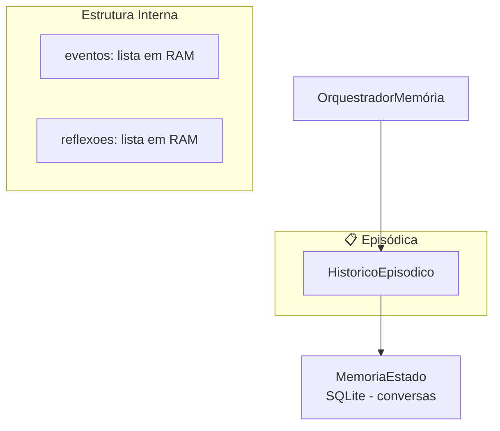

# Memórias / Episódica — Histórico de Eventos e Reflexões

> **Propósito:** Registro cronológico de eventos significativos do Ghost — interações, reflexões, aprendizados, erros, comandos e metadados. É a "autobiografia" do Ghost: o que aconteceu, quando e o que foi aprendido.

---

## Arquitetura

---

## `historico.py` — Classe `HistoricoEpisodico` (74 linhas)

**Responsabilidade:** Registra eventos e reflexões do Ghost em ordem cronológica. Combina dados próprios (eventos em RAM) com consultas ao SQLite (conversas).

### Tipos de Evento

| Tipo | Exemplo |
|---|---|
| `reflexao` | Ghost refletiu sobre uma conversa |
| `aprendizado` | Ghost aprendeu algo novo |
| `erro` | Algo deu errado |
| `comando` | Usuário executou um comando (/) |
| `interacao` | Interação normal |
| `meta` | Metadados do sistema |

### Métodos

| Método | Descrição |
|---|---|
| `registrar_evento(tipo, dados, modelo, usuario)` | Cria evento com timestamp, valida tipo (fallback `interacao`) |
| `registrar_reflexao(pergunta, resposta, resultado)` | Registra o ciclo de reflexão com LLM |
| `ultimas_interacoes(n=10)` | Delega para `MemoriaEstado.ultimas_mensagens()` |
| `buscar_eventos(tipo, usuario, limite=20)` | Filtra eventos por tipo e/ou usuário (janela 500) |
| `ultimas_reflexoes(n=5)` | Últimas N reflexões |
| `timeline(limite=20)` | Combina conversas + eventos + reflexões |
| `trajetoria(sessao_id, limite=20)` | Sequência ordenada de eventos |
| `resumo()` | Contagem por tipo, total de reflexões |

### Exemplo de Timeline

```mermaid
gantt
    title Timeline de Eventos do Ghost
    dateFormat HH:mm
    axisFormat %H:%M

    section Conversas
    Usuário: "O que é IA?"        :c1, 10:00, 1min
    Ghost: "IA é..."              :c2, 10:01, 1min
    Usuário: "Explique mais"      :c3, 10:03, 1min

    section Eventos
    reflexao sobre IA             :e1, 10:02, 1min
    aprendizado: novo conceito    :e2, 10:04, 1min

    section Sistema
    comando /recarregar           :s1, 10:05, 1min
```

---

## Integrações

| Componente | Conexão |
|---|---|
| **OrquestradorMemória** | Cria `HistoricoEpisodico(self.estado)` e retorna em `estatisticas()` |
| **MemoriaEstado** | Recebida como dependência, usada para `ultimas_mensagens()` |
| **Interface** | Chama `Orquestrador.estatisticas()` que inclui `episodico.resumo()` |

---

## Estatísticas

| Métrica | Valor |
|---|---|
| Arquivos Python | 2 (incluindo `__init__`) |
| Classes | 1 |
| Tipos de evento | 6 (`reflexao`, `aprendizado`, `erro`, `comando`, `interacao`, `meta`) |
| Janela de eventos | 500 eventos em RAM |
| Persistência | Nenhuma direta (dados em RAM volátil; conversas via MemoriaEstado) |

---

## Resumo

> **O Histórico Episódico é o diário do Ghost.** Enquanto as outras camadas de memória focam em "o que" foi dito (semântica) e "quem se conecta com quem" (relacional), a episódica foca em "o que aconteceu" — eventos, reflexões e a sequência temporal de interações.
>
> Combina dados voláteis em RAM (eventos das últimas 500 ações) com consultas ao SQLite (conversas) para montar uma timeline completa. É usado principalmente para diagnóstico e relatórios de estado.
>
> **Atenção:** eventos em RAM são perdidos se o processo reiniciar. Apenas as conversas são persistidas via `MemoriaEstado`.
