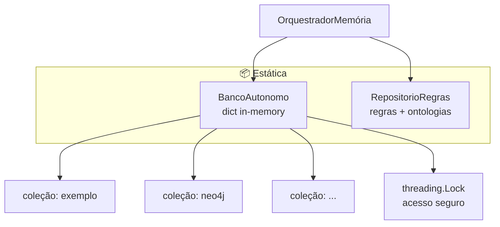
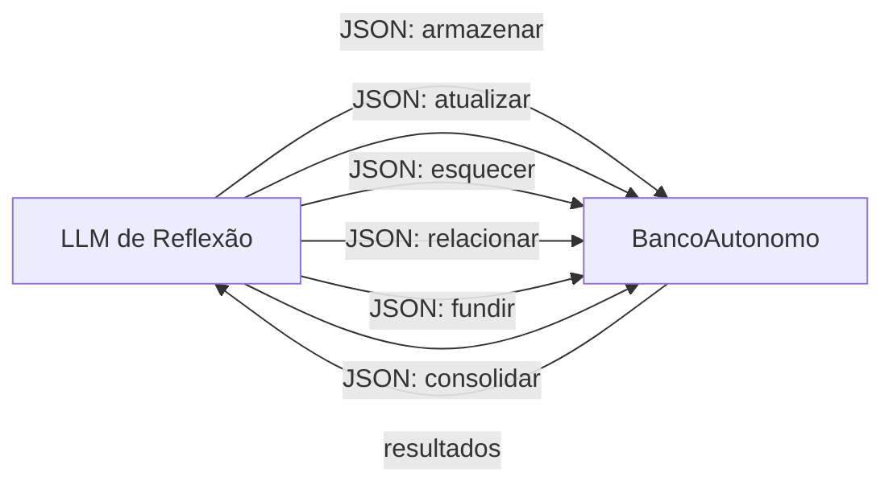

# Memórias / Estática — Banco Autônomo e Repositório de Regras

> **Propósito:** Camada de memória estática do Ghost — armazenamento chave-valor in-memory thread-safe (`BancoAutonomo`) e repositório de regras, ontologias e prompt de reflexão (`RepositorioRegras`).

---

## Arquitetura



---

## Arquivos e Responsabilidades

### `autonomo.py` — Classe `BancoAutonomo` (154 linhas)

**Responsabilidade:** Banco de dados in-memory thread-safe, usado pelo LLM de reflexão para armazenar/atualizar/esquecer informações sem precisar de banco externo.



| Método | Descrição |
|---|---|
| `criar_colecao(nome)` | Cria namespace |
| `armazenar(colecao, dados, id)` | Insere registro com ID gerado (hash do primeiro valor ou UUID) |
| `consultar(colecao, filtro)` | Lista registros com filtro opcional por chave-valor |
| `atualizar(colecao, id, dados)` | Atualiza parcialmente um registro |
| `esquecer(colecao, id, filtro)` | Remove por ID ou filtro |
| `fundir(origem, destino)` | Move todos os registros de uma coleção para outra |
| `listar_colecoes()` | Nomes de todas as coleções |
| `executar_acoes(acoes)` | Processa lista de comandos do LLM |
| `estatisticas()` | Número de coleções e registros |

**Ações suportadas pelo `executar_acoes()`:**

| Ação | Comportamento |
|---|---|
| `criar_colecao` | Cria namespace com nome ou label |
| `armazenar` | Insere dados com metadados |
| `atualizar` | Atualiza registro existente |
| `esquecer` | Remove por ID ou filtro |
| `fundir` | Move coleção inteira |
| `consolidar` | Remove duplicatas (JSON sort) |

**Schema do registro:**
```python
{
    "id": str,                    # 30 chars, alfanumérico
    "dados": dict,                # dados arbitrários
    "criado": "ISO datetime",
    "atualizado": "ISO datetime",
}
```

---

### `regras.py` — Classe `RepositorioRegras` e Prompt Base (63 linhas)

**Responsabilidade:** Armazena regras, ontologias e o _BASE_PROMPT usado pelo LLM de reflexão para decidir o que fazer com novas informações.

**_BASE_PROMPT:**
```
Você é um sistema de memória que aprende organicamente com conversas.
Observe a conversa e identifique o que vale a pena reter a longo prazo.
Fatos sobre o usuário, padrões de comportamento, preferências, 
conceitos novos, relações entre ideias — tudo isso é material válido.

Para cada descoberta, escolha uma ação:
- "armazenar": algo novo que merece ser lembrado
- "atualizar": algo já conhecido que mudou ou se refinou
- "relacionar": duas coisas que se conectam
- "esquecer": algo que já não faz mais sentido

Retorne sua decisão como JSON dentro de ```json ... ```:
[{"acao": "...", "labels": ["..."], "dados": {...}, "id": "..."}, ...]
Ou se nada surgiu: ```json [{"acao": "nenhuma"}] ```

Conversa:
Usuário: {usuario}
Assistente: {assistente}
```

| Método | Descrição |
|---|---|
| `registrar_regra(nome, descricao, condicao)` | Armazena regra nomeada |
| `registrar_ontologia(nome, categorias)` | Armazena ontologia (categorização de conceitos) |
| `definir_config(chave, valor)` / `obter_config(chave, padrao)` | Configurações genéricas |
| `prompt_reflexao()` | Retorna o _BASE_PROMPT |
| `regras_aplicaveis(contexto)` | Lista todas as regras |
| `ontologias_registradas()` | Lista ontologias |

---

## Integrações

| Componente | Conexão |
|---|---|
| **OrquestradorMemória** | `Orquestrador.refletir()` chama `autonomo.executar_acoes()` para processar ações do LLM. Sincroniza com Neo4j e grafo ativo depois |
| **Orquestrador._sincronizar_neo4j()** | Espelha ações do BancoAutonomo no Neo4j (upsert, link, remover) |
| **Orquestrador._carregar_registros_neo4j()** | Carrega registros do Neo4j para o BancoAutonomo na inicialização, coleção "neo4j" |
| **Orquestrador._validar_acoes()** | Valida ações antes de executar no BancoAutonomo (limites de tamanho JSON) |
| **RepositorioRegras** | Usado pelo `Orquestrador` via `_montar_prompt_reflexao()` que chama `_BASE_PROMPT` |

---

## Estatísticas

| Métrica | Valor |
|---|---|
| Arquivos Python | 3 (incluindo `__init__`) |
| Classes | 2 |
| Ações suportadas | 7 (`criar_colecao`, `armazenar`, `atualizar`, `esquecer`, `fundir`, `consolidar`, `nenhuma`) |
| Thread-safe | Sim (threading.Lock) |

---

## Resumo

> **A camada Estática é onde o LLM de reflexão guarda o que aprendeu.** O `BancoAutonomo` é um dicionário in-memory com lock de thread, organizado em coleções, que aceita comandos CRUD do LLM. Tudo que a reflexão decide "armazenar" vai para cá primeiro, e depois é sincronizado com Neo4j.
>
> O `RepositorioRegras` guarda o prompt base da reflexão (que instrui o LLM sobre como decidir o que memorizar) além de regras e ontologias registradas manualmente.
>
> **É a única camada que o LLM controla diretamente** — o Ghost pode decidir autonomamente o que merece ser lembrado.
