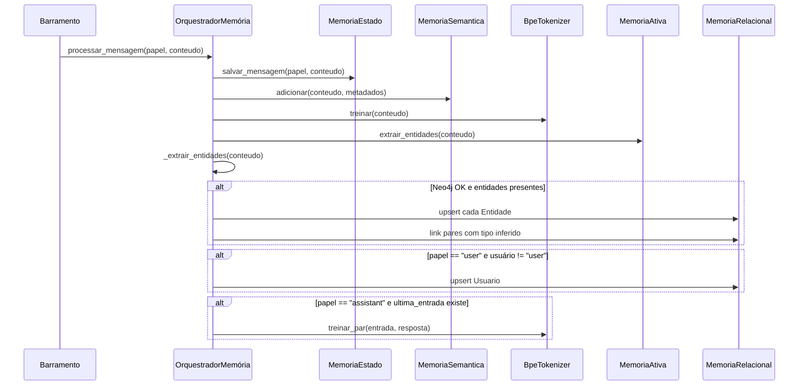
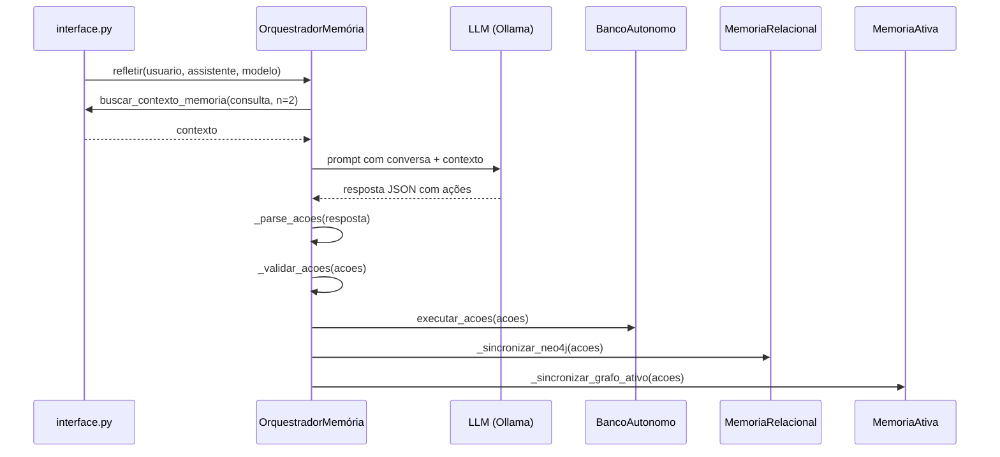
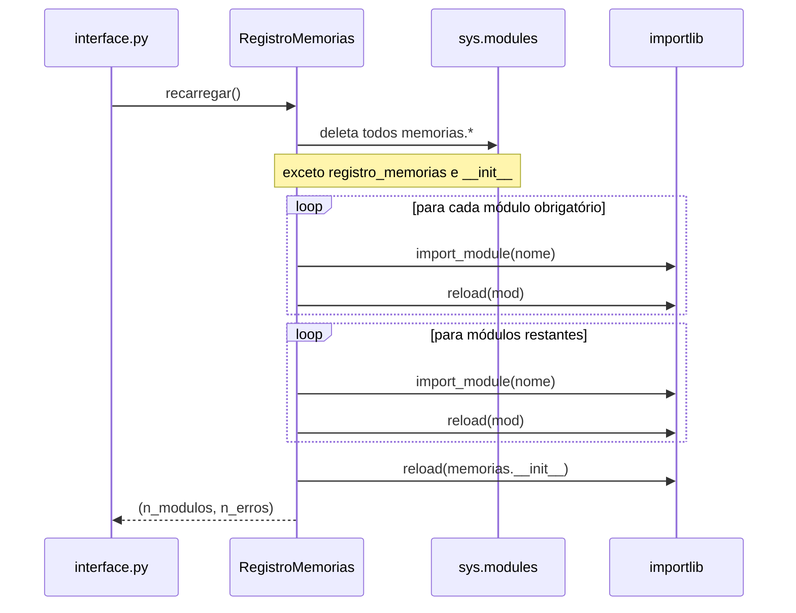
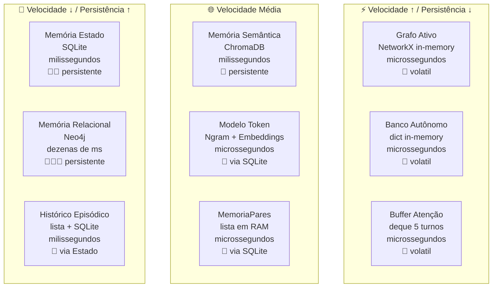
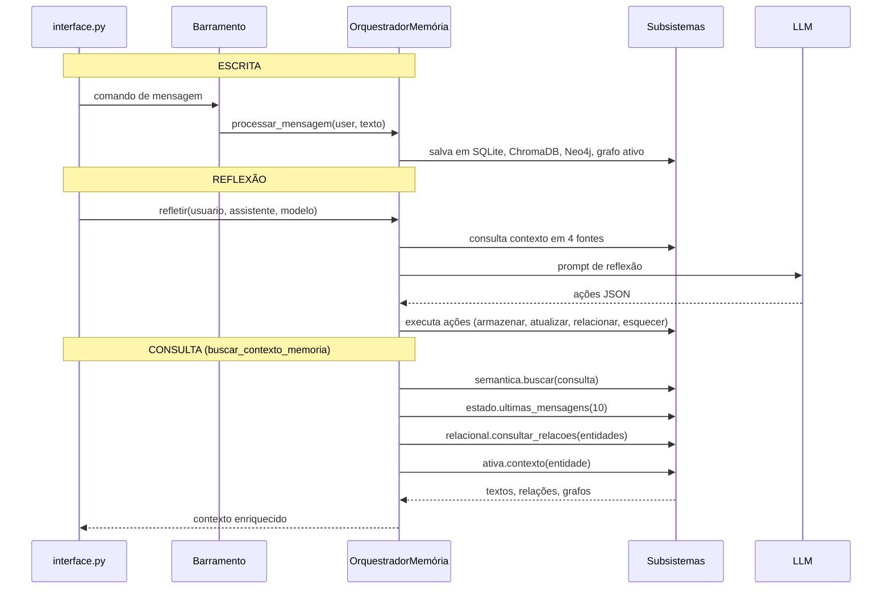
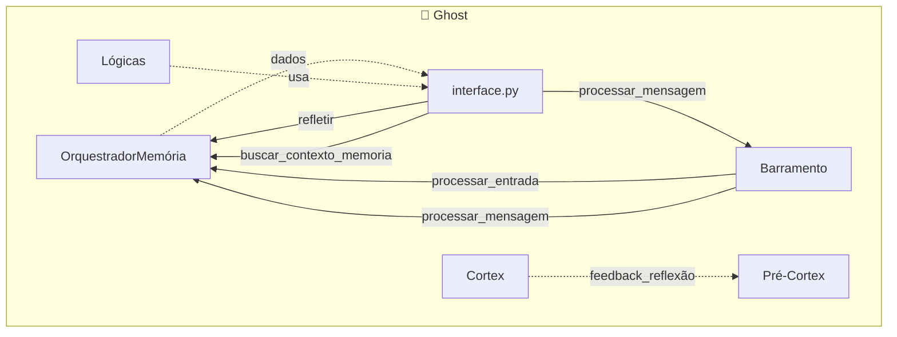

# Memórias — Sistema de Memória Multi-Camada do Ghost

> **Propósito:** O sistema de memória completo do Ghost, organizado em múltiplas camadas com diferentes velocidades, persistências e paradigmas — desde memória procedural (BPE + embeddings + MLP) até memória semântica (ChromaDB), relacional (Neo4j), episódica, estática, recente e grafo ativo. Tudo orquestrado pelo `OrquestradorMemória`.

---

## Arquitetura Geral

```mermaid
graph TB
    subgraph Orchestrator["🎼 Orquestrador"]
        ORC[OrquestradorMemória]
        REG[RegistroMemorias<br/>reload em runtime]
    end

    subgraph Procedural["⚙️ Procedural"]
        BPE[BpeTokenizer<br/>byte-pair encoding]
        NGRAM[ModeloTokenNgram<br/>n-gram hierárquico 7 janelas]
        EMB[ModeloTokenEmbedding<br/>256d embeddings + skip-gram]
        MLP[MLPTransicao<br/>256→128→vocab]
        PARES[MemoriaPares<br/>entrada→resposta]
        REF[ReforçoCoerência<br/>feedback semântico]
        PLANOS[BibliotecaPlanos<br/>planos + rotinas]
    end

    subgraph Recente["🕐 Recente"]
        ATV[MemoriaAtiva<br/>networkx grafo ativo]
        EST[MemoriaEstado<br/>SQLite persistente]
        BUF[BufferAtencao<br/>janela de 5 turnos]
    end

    subgraph Semantica["📚 Semântica"]
        SEM[MemoriaSemantica<br/>ChromaDB cosseno]
    end

    subgraph Grafo["🕸️ Relacional"]
        REL[MemoriaRelacional<br/>Neo4j + decay]
        INF[InferenciaGrafo<br/>BFS + cadeias]
    end

    subgraph Estatica["📦 Estática"]
        AUT[BancoAutonomo<br/>CRUD em RAM]
        REGR[RepositorioRegras<br/>ontologias + prompt]
    end

    subgraph Episodica["📋 Episódica"]
        EPI[HistoricoEpisodico<br/>eventos + reflexões]
    end

    subgraph N4["🔌 Neo4j"]
        NEO[Neo4j Database<br/>bolt://localhost:7687]
    end

    ORC --> BPE
    ORC --> NGRAM
    ORC --> EMB
    ORC --> MLP
    ORC --> PARES
    ORC --> ATV
    ORC --> EST
    ORC --> SEM
    ORC --> REL
    ORC --> EPI
    ORC --> AUT
    ORC --> REGR
    ORC --> PLANOS
    ORC --> INF

    REL --> NEO
    EST --> DB[(SQLite<br/>memoria.db)]
    SEM --> CH[(ChromaDB<br/>chroma_db/)]

    REG -->|reload| ORC
```

---

## Organograma do Sistema de Memória

```mermaid
graph LR
    subgraph Memorias["📦 Memorias (22 módulos)"]
        direction TB
        ORC[OrquestradorMemória]

        ORC --> REC[├── Recente]
        REC --> ATV[│   MemoriaAtiva]
        REC --> EST[│   MemoriaEstado]
        REC --> BUF[│   BufferAtencao]

        ORC --> SEM[├── Semântica]
        SEM --> SME[│   MemoriaSemantica]

        ORC --> GRA[├── Grafo]
        GRA --> MRL[│   MemoriaRelacional]
        GRA --> INF[│   InferenciaGrafo]

        ORC --> ESTA[├── Estática]
        ESTA --> BA[│   BancoAutonomo]
        ESTA --> RR[│   RepositorioRegras]

        ORC --> EPI[├── Episódica]
        EPI --> HE[│   HistoricoEpisodico]

        ORC --> PROC[├── Procedural]
        PROC --> BPE[│   BpeTokenizer]
        PROC --> NGR[│   ModeloTokenNgram]
        PROC --> EMB[│   ModeloTokenEmbedding]
        PROC --> MLP[│   MLPTransicao]
        PROC --> PAR[│   MemoriaPares]
        PROC --> REF[│   ReforcoCoerencia]
        PROC --> MOD[│   ClassificadorModo]
        PROC --> PEN[│   Penalidade]
        PROC --> ANL[│   Análise Ngram]
        PROC --> PLA[│   BibliotecaPlanos]

        ORC --> N4[├── Neo4j]
        N4 --> NEO[│   Conexão]

        ORC --> REG[└── RegistroMemorias]
    end
```

---

## `orquestrador.py` — Classe `OrquestradorMemória` (553 linhas)

**Responsabilidade:** Orquestrador central. Instancia e coordena todos os subsistemas de memória. É o único ponto de contato usado pela interface e pelo Barramento.

### Subordinados Criados no `__init__`

| Atributo | Classe | Função |
|---|---|---|
| `ativa` | `MemoriaAtiva` | Grafo NetworkX de entidades in-memory |
| `estado` | `MemoriaEstado` | SQLite persistente (conversas, merges, ngrams, estado) |
| `semantica` | `MemoriaSemantica` | ChromaDB (busca por cosseno) |
| `relacional` | `MemoriaRelacional` | Neo4j (relações com decay) |
| `bpe` | `BpeTokenizer` | Tokenizador BPE |
| `modelo_token` | `ModeloTokenHibrido` | Ngram + Embedding + MLP + MemoriaPares + Reforço |
| `buffer` | `BufferAtencao` | Janela de atenção de 5 turnos |
| `episodico` | `HistoricoEpisodico` | Eventos de reflexão e interação |
| `regras` | `RepositorioRegras` | Regras, ontologias e prompt base |
| `inferencia` | `InferenciaGrafo` | BFS e cadeias sobre Neo4j |
| `planos` | `BibliotecaPlanos` | Armazenamento de planos multi-passo |
| `autonomo` | `BancoAutonomo` | CRUD in-memory thread-safe |

### Serviços Principais

| Método | Descrição |
|---|---|
| `processar_mensagem(papel, conteudo, ...)` | Pipeline completo: salva SQLite → adiciona ChromaDB → treina BPE → extrai entidades → upsert Neo4j |
| `refletir(usuario_msg, assistente_msg, modelo)` | Pede ao LLM que analise a conversa e decida ações (armazenar/atualizar/esquecer/relacionar) |
| `buscar_contexto_memoria(consulta, n=3)` | Busca em 4 fontes: semântica (ChromaDB) + estática (SQLite) + relacional (Neo4j) + grafo ativo (NetworkX) |
| `encerrar(...)` | Salva merges BPE, embeddings, fecha Neo4j |
| `estatisticas()` | Resumo de todos os subsistemas |
| `_extrair_entidades(texto)` | Extrai entidades com maiúscula ou uppercase |
| `_inferir_tipo_relacao(a, b, contexto)` | Infere tipo de relação entre entidades por heurísticas de texto |
| `_validar_acoes(acoes)` | Valida ações da reflexão (limites de tamanho JSON) |

### Fluxo de `processar_mensagem()`

### Fluxo de `refletir()`

---

## `registro_memorias.py` — Classe `RegistroMemorias` (90 linhas)

**Responsabilidade:** Recarregar todo o módulo `memorias` em runtime, sem reiniciar o Ghost. Usa singleton `REGISTRO_MEMORIAS`.

---

## Hierarquia de Memória por Velocidade e Persistência

---

## Fluxo de Dados entre Subsistemas

---

## Integrações com Outros Subsistemas

| Componente | Conexão com Memórias |
|---|---|
| **interface.py** | Chama `orc.processar_mensagem()`, `orc.refletir()`, `orc.buscar_contexto_memoria()` diretamente. Usa `orc.gerar()` para o modo `/interno`. |
| **Barramento** | Chama `orc.processar_mensagem()` para salvar cada mensagem nos 4 bancos simultaneamente |
| **Pré-Cortex** | Não conectado diretamente. O `ContextoAprendizado` é separado dos bancos de memória |
| **Lógicas** | `GeradorInterno` recebe `memoria_semantica` como dependência para buscar termos similares. Usa `ContextoCortex`, não as memórias do `Orquestrador` |
| **Cortex** | Mantém seu próprio ChromaDB (`cortex/db_semantica/`), separado do ChromaDB de mensagens de `MemoriaSemantica` |

---

## Padrões de Design Presentes

| Padrão | Implementação |
|---|---|
| **Facade** | `OrquestradorMemória` esconde dezenas de classes atrás de `processar_mensagem()`, `refletir()`, `buscar_contexto_memoria()` |
| **Strategy** | Cada tipo de memória (semântica, relacional, estática, procedural) é uma estratégia diferente de armazenar/recuperar |
| **Mediator** | `OrquestradorMemória` media entre interface e todos os subsistemas de memória |
| **Singleton** | `REGISTRO_MEMORIAS` é singleton global para recarregar módulos |
| **Provider** | `buscar_contexto_memoria()` consulta 4 provedores e agrega os resultados |
| **Command** | O LLM de reflexão gera comandos (`armazenar`, `atualizar`, `esquecer`, `relacionar`) que são executados pelo `BancoAutonomo` e sincronizados com Neo4j |
| **Decay Pattern** | `MemoriaRelacional.aplicar_decay()` reduz confiança de relações ao longo do tempo, podando as fracas |
| **Thread-Safe** | `BancoAutonomo` usa `threading.Lock`; decay roda em thread separada |

---

## Estatísticas do Diretório

| Métrica | Valor |
|---|---|
| Arquivos Python | 22 |
| Classes | 20+ |
| Bancos de dados | 3 (SQLite, ChromaDB, Neo4j) |
| Grafos | 1 (NetworkX in-memory) + 1 (Neo4j) |
| Tokenizadores | 2 (Byte + BPE) |
| Modelos de linguagem interna | 3 (Ngram, Embedding, MLP) |
| Armazenamento in-memory | 1 (BancoAutonomo com Lock) |
| Recarregável em runtime | Sim (via RegistroMemorias) |

---

## Resumo

> **O sistema de memória do Ghost é multi-camada e multi-paradigma.** Cada mensagem é simultaneamente armazenada em 4 formatos diferentes: SQLite (histórico linear), ChromaDB (busca semântica por cosseno), Neo4j (grafo relacional com decay temporal), e NetworkX (grafo ativo in-memory para contexto imediato).
>
> Além disso, o Ghost treina seu próprio modelo de linguagem interno (BPE tokenizer + n-gram hierárquico de 7 janelas + embeddings 256d + MLP de transição + memória de pares) a cada interação — permitindo gerar respostas sem LLM externo via `ModeloTokenHibrido.gerar()`.
>
> O **`OrquestradorMemória`** é o cérebro por trás de tudo: instancia, coordena e sincroniza todos os subsistemas. Quando o LLM de reflexão decide que algo deve ser armazenado ou esquecido, o Orquestrador executa a ação em todos os bancos simultaneamente.
>
> **E tudo pode ser recarregado em runtime** — o `RegistroMemorias` limpa o `sys.modules` e reimporta todos os 22 módulos sem reiniciar o processo.
