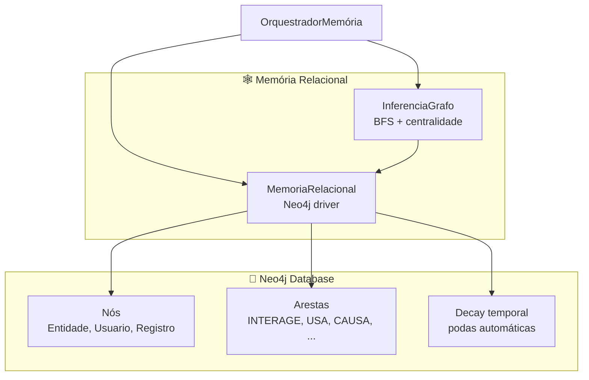
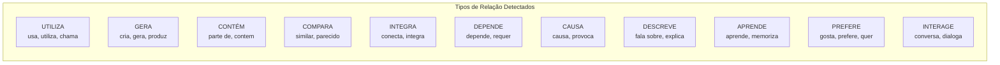
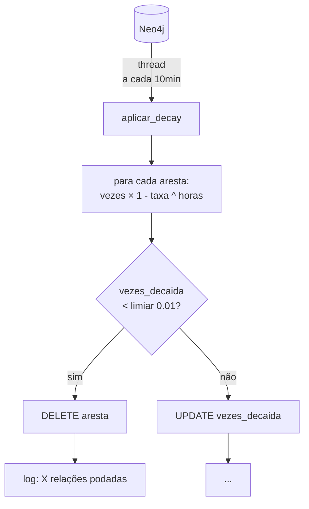
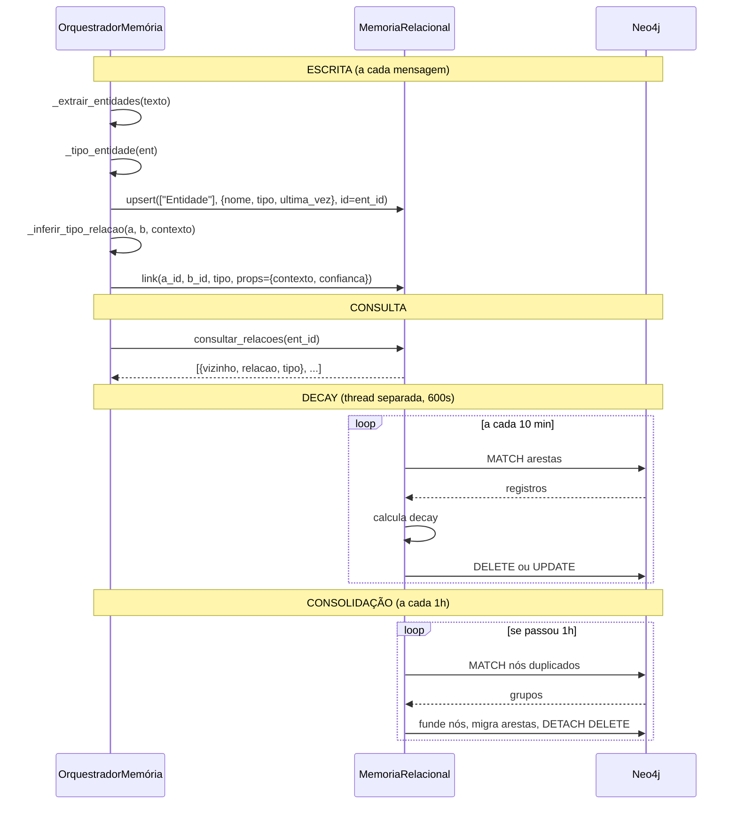

# Memórias / Grafo — Banco Relacional Neo4j

> **Propósito:** Memória relacional do Ghost usando Neo4j como banco grafo. Armazena entidades, usuários e registros como nós, e suas relações com tipos semânticos, confiança, decay temporal e consolidação de duplicatas. É a memória de longo-prazo mais rica do sistema.

---

## Arquitetura



---

## Arquivos e Responsabilidades

### `relacional.py` — Classe `MemoriaRelacional` (329 linhas)

**Responsabilidade:** Interface completa com Neo4j — CRUD de nós, relacionamentos tipados, decay temporal e consolidação.

**Conexão (via `.env`):**
```
NEO4J_URI=bolt://localhost:7687
NEO4J_USER=neo4j
SENHA_NEO4J=password
NEO4J_DATABASE=notas
```

**Taxas de Decay por Tipo de Relação:**

| Tipo | Taxa | Sentido |
|---|---|---|
| `INTERAGE` | 0.02 | Lento (conversas) |
| `CONHECE` | 0.02 | Lento (conhecimento) |
| `USA` / `UTILIZA` | 0.04 | Moderado |
| `INTEGRA` | 0.04 | Moderado |
| `GERA` / `CAUSA` / `DEPENDE` | 0.06 | Rápido (ações) |
| `APRENDE` | 0.03 | Lento |
| `DESCREVE` / `ASSOCIADO` | 0.05 | Médio |
| `COMPARA` / `CONTÉM` | 0.08 | Rápido |
| Default | 0.05 | — |



| Método | Descrição |
|---|---|
| `upsert(labels, propriedades, id)` | MERGE nó com id, SET propriedades, incrementa `vezes_mencionado` |
| `link(origem_id, destino_id, tipo, labels_origem, labels_destino, props)` | MERGE aresta com tipo, incrementa `vezes` + confiança (cap 1.0) |
| `consultar(labels, filtros, limit)` | MATCH com filtros opcionais |
| `consultar_relacoes(id_no, labels, limit)` | MATCH arestas do nó para todos os vizinhos |
| `consultar_por_contexto(termo, limit)` | CONTAINS no id ou nome |
| `remover(id_no, labels)` | DETACH DELETE nó |
| `aplicar_decay(limiar_poda=0.01)` | Reduz `vezes_decaida` pela taxa (ajustada por centralidade), poda se < limiar |
| `consolidar_duplicatas()` | Funde nós com mesmo nome, migra arestas |
| `executar(cypher, params)` | Cypher arbitrário |
| `saudacao()` | Testa conexão |

#### Fluxo de Decay



**Decay com centralidade:** Nós mais conectados têm decay mais lento (`boost_centralidade = log(grau+1) × 0.1`).

---

### `inferencia.py` — Classe `InferenciaGrafo` (58 linhas)

**Responsabilidade:** Algoritmos de inferência sobre o grafo Neo4j — BFS para dependências e cadeias, centralidade e comunidade.

| Método | Descrição |
|---|---|
| `dependencias(no_id, labels, profundidade=3)` | BFS: retorna lista de `{de, para, relacao, nivel}` |
| `cadeia(inicio, fim, labels, max_passos=10)` | BFS até achar caminho entre dois nós |
| `centralidade(no_id, labels)` | Número de relações do nó |
| `comunidade(no_id, labels, profundidade=2)` | Alias para `dependencias()` |

---

## Tipos de Nó

| Tipo | Criado por | Propriedades |
|---|---|---|
| `Entidade` | `processar_mensagem()` | `{nome, ultima_vez, tipo (pessoa/tecnologia/conceito)}` |
| `Usuario` | `processar_mensagem()` (se nome ≠ "user") | `{nome, ultima_vez}` |
| `Registro` | `refletir()` LLM (ação `armazenar`) | `{criado, atualizado, ...}` |
| `NOTA` (default) | Fallback quando sem labels | `{criado, atualizado, ...}` |

---

## Fluxo de Dados



---

## Integrações

| Componente | Conexão |
|---|---|
| **OrquestradorMemória** | Cria `MemoriaRelacional`, chama `upsert()`/`link()` a cada mensagem (`processar_mensagem()`). Chama `consultar_relacoes()` em `buscar_contexto_memoria()` |
| **InferenciaGrafo** | Recebe `MemoriaRelacional` no `__init__` e chama `consultar_relacoes()` para BFS e cadeias |
| **Orquestrador._sincronizar_neo4j()** | Executa ações do LLM de reflexão no Neo4j (armazenar, atualizar, relacionar, esquecer) |
| **BancoAutonomo** | Sincroniza registros do Neo4j para RAM: `_carregar_registros_neo4j()` |

---

## Estatísticas

| Métrica | Valor |
|---|---|
| Arquivos Python | 3 (incluindo `__init__`) |
| Classes | 2 |
| Taxas de decay | 12 tipos diferentes |
| Decay automático | Thread a cada 600s |
| Consolidação | Automática a cada 3600s |
| Cache de caminhos | `InferenciaGrafo._cache_caminhos` |

---

## Resumo

> **O Neo4j é a memória relacional de longo-prazo do Ghost.** Enquanto o ChromaDB guarda "o que foi dito", o Neo4j guarda "quem se conecta com quem e como". Entidades são nós, relações são arestas tipadas (USA, GERA, CAUSA, DEPENDE, etc.) com confiança que aumenta a cada menção.
>
> O **decay temporal** enfraquece relações não usadas — se Ghost e Python não são mencionados juntos há dias, a relação esfria até ser podada. Mas nós centrais (com muitas conexões) decaem mais devagar. Uma vez por hora, duplicatas são fundidas.
>
> A **InferenciaGrafo** permite navegar o grafo: dependências BFS a partir de um nó, cadeias entre dois nós, e centralidade. Tudo via Cypher.
>
> **Se Neo4j estiver offline, o Ghost opera sem ele** — o `_neo4j_ok` flag controla ativação/desativação graciosa.
