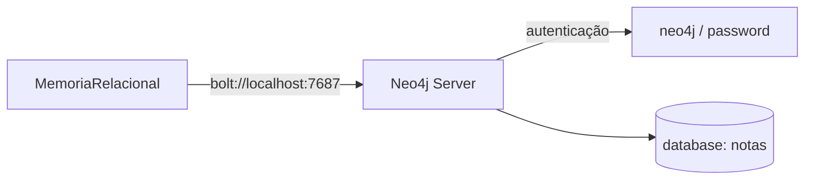

# Memórias / N4 — Configuração do Neo4j

> **Propósito:** Diretório de dados, configuração, cache e logs do banco Neo4j local usado pelo subsistema de Memória Relacional.

---

## Estrutura do Diretório

```
n4/
├── Cache/       # Cache do Neo4j
├── Config/      # Configurações do banco (porta, autenticação, etc.)
├── Data/        # Dados persistentes do grafo
├── Logs/        # Logs de operação do Neo4j
├── Nova pasta/  # Pasta vazia (não utilizada)
├── Stores/      # Stores transactionais
├── Tmp/         # Arquivos temporários
```

---

## Conexão



A configuração é carregada de variáveis de ambiente (`.env`):

```
NEO4J_URI=bolt://localhost:7687
NEO4J_USER=neo4j
SENHA_NEO4J=password
NEO4J_DATABASE=notas
```

---

## Relação com o Código

O diretório `n4/` não contém código Python — é um artefato da instalação/execução do Neo4j. O código que o utiliza está em:

| Arquivo | Função |
|---|---|
| `memorias/grafo/relacional.py` | `MemoriaRelacional` — driver Neo4j, CRUD, decay, consolidação |
| `memorias/grafo/inferencia.py` | `InferenciaGrafo` — BFS, cadeias sobre o Neo4j |

Os subdiretórios (`Cache/`, `Data/`, `Logs/`, etc.) são gerenciados automaticamente pelo servidor Neo4j e **não devem ser editados manualmente**.

---

## Integrações

| Componente | Conexão |
|---|---|
| **MemoriaRelacional** | Único ponto de contato. Conecta via driver Neo4j Python |
| **OrquestradorMemória** | Chama `MemoriaRelacional` para upsert/link/consulta. Thread de decay a cada 600s |

---

## Resumo

> **O diretório `n4/` contém a instância local do Neo4j** usada pelo Ghost como banco grafo relacional. Entidades, usuários e registros são armazenados como nós, e as relações entre eles como arestas tipadas com decay temporal.
>
> O código de conexão está em `memorias/grafo/relacional.py`, que lê as credenciais do `.env` e se conecta via protocolo Bolt na porta 7687.
