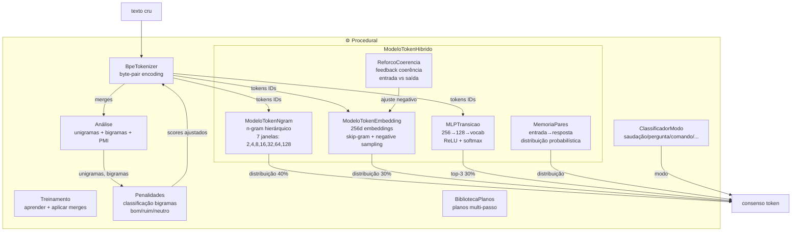
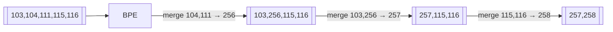
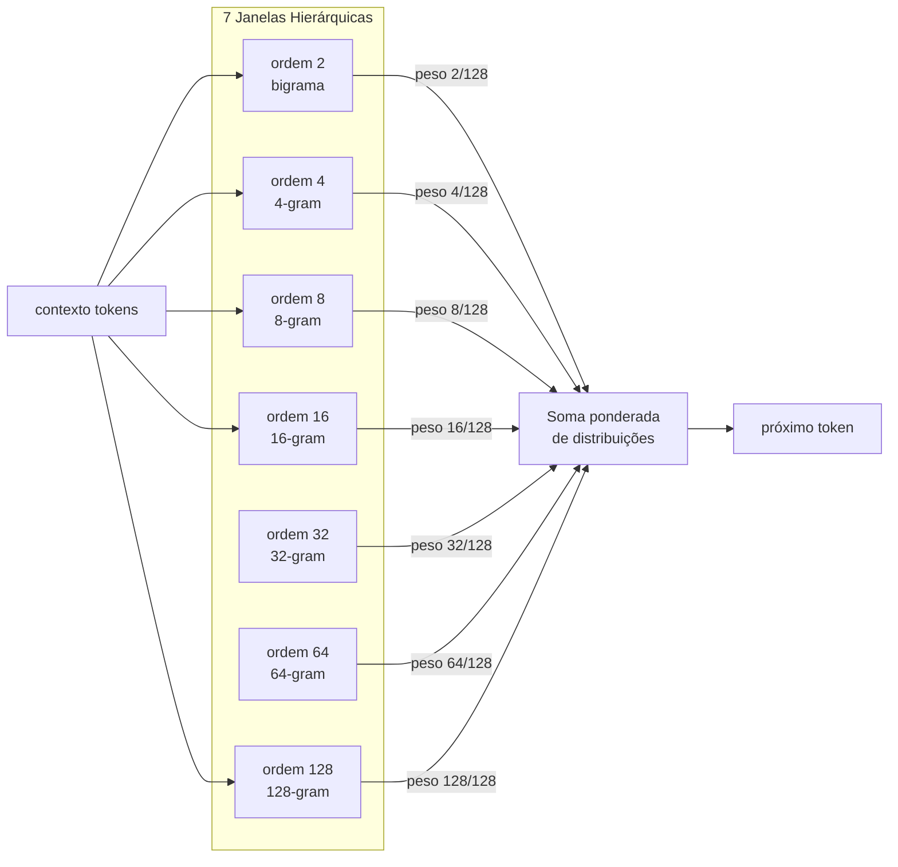
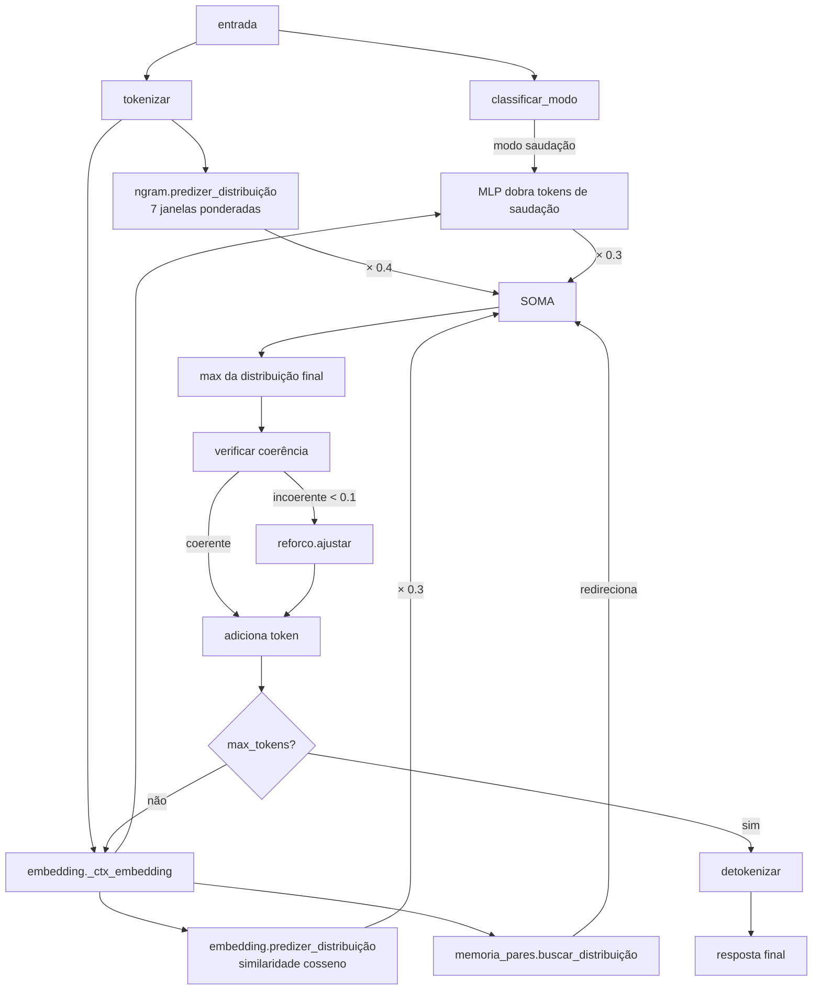
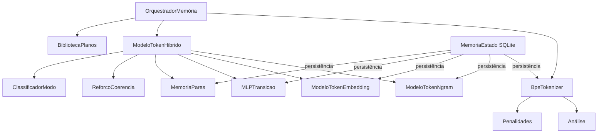

# Memórias / Procedural — Motor de Tokenização e Modelo de Linguagem Interno

> **Propósito:** Subsistema de processamento de linguagem do Ghost. Inclui tokenização BPE, modelo n-gram hierárquico, embeddings neurais 256d, MLP de transição, memória de pares entrada→resposta, e um sistema de penalidades para guiar o aprendizado de bigramas. Tudo corre **sem LLM externo** — é o "cérebro de linguagem" embutido do Ghost.

---

## Arquitetura



---

## Arquivos e Responsabilidades

### `tokenizador.py` — Classes `TokenizadorByte` e `BpeTokenizer` (151 linhas)

**Responsabilidade:** Tokenização de texto em IDs. Duas camadas: `TokenizadorByte` (byte-level) e `BpeTokenizer` (aprende merges sobre bytes).

#### `TokenizadorByte`
| Método | Descrição |
|---|---|
| `tokenizar(texto)` | `texto → bytes → [byte_ids]` |
| `detokenizar(tokens)` | `[byte_ids] → bytes → texto` |
| `vocabulario` | `list(range(256))` |

#### `BpeTokenizer`
| Método | Descrição |
|---|---|
| `aprender(texto, min_freq=2)` | Aprende merges BPE (até 5 passos). Retorna relatório com pares, scores, novos IDs |
| `tokenizar(texto)` | Aplica merges iterativamente até não achar mais pares |
| `detokenizar(tokens)` | Resolve merge IDs recursivamente até bytes, decodifica UTF-8 |
| `carregar_merges(registros)` | Carrega merges do SQLite |

**Exemplo de merge:**
- Texto: `"ghost aprende"`
- Bytes: `[103,104,111,115,116,32,97,112,114,101,110,100,101]`
- Passo 1: merge `(101,110)` → `"en"` → novo ID 256
- Passo 2: merge `(104,111)` → `"ho"` → novo ID 257
- ...



---

### `analise.py` — Funções (49 linhas)

**Responsabilidade:** Análise estatística de tokens com NumPy vetorizado.

| Função | Descrição |
|---|---|
| `contar_unigramas(tokens)` | Frequência de cada token via `np.unique` |
| `contar_bigramas(tokens)` | Frequência de bigramas via bit-pack `uint32` |
| `pmi(unigramas, bigramas)` | Pointwise Mutual Information: `log2(P(ab) / (P(a) × P(b)))` |
| `calcular_score(pmi_dict, bigramas)` | `PMI × log(freq)` para ranking |

---

### `penalidades.py` — Classe `Penalidade` e funções (113 linhas)

**Responsabilidade:** Classifica cada bigrama como `bom`, `ruim` ou `neutro` baseado nos tipos de byte, e calcula pesos individuais para guiar o BPE.

| Função | Descrição |
|---|---|
| `_classificar_padrao(a, b)` | `bom` = duas letras; `ruim` = espaço+letra, letra+espaço, espaço+espaço; senão `neutro` |
| `calcular_pesos_individuais(bigramas, unigramas, pmi)` | Para bigramas bons: `log2(P(b\|a)/P(b)) × P(b\|a)` (positivo). Para ruins: negativo |

**Classe `Penalidade`**

| Método | Descrição |
|---|---|
| `a_partir_de(bigramas, unigramas, pmi)` | Factory que calcula pesos |
| `aplicar(pmi_dict)` | `PMI + peso_individual` |
| `filtrar(dicionario, manter_ruins)` | Remove bigramas classificados como `ruim` |

**Exemplo:**
- Bigrama `("h","o")` → letra+letra = **bom** → peso positivo
- Bigrama `(" ", "g")` → espaço+letra = **ruim** → peso negativo
- Bigrama `("1","2")` → neutro → peso 0

---

### `classificador_modo.py` — Função `classificar_modo()` (33 linhas)

**Responsabilidade:** Classifica o modo da entrada para ajustar geração.

| Modo | Exemplo | Efeito na geração |
|---|---|---|
| `saudacao` | "ola", "bom dia" | MLP dá peso 2× para tokens de saudação |
| `pergunta` | "o que", "como?" | — |
| `comando` | "/cmd", "execute" | — |
| `despedida` | "tchau", "ate mais" | — |
| `afirmacao` | (implícito) | — |
| `neutro` | default | — |

---

### `modelo_token.py` — Classes `ModeloTokenNgram` e `ModeloTokenHibrido` (268 linhas)

**Responsabilidade:** O modelo de linguagem interno do Ghost. Combina 3 abordagens: n-gram hierárquico, embeddings neurais e MLP.

#### `ModeloTokenNgram`

**Arquitetura:** 7 janelas hierárquicas: `[2, 4, 8, 16, 32, 64, 128]`



| Método | Descrição |
|---|---|
| `treinar(texto)` | Tokeniza e registra contagens n-gram para cada janela |
| `treinar_lote(textos)` | Treina em lote |
| `predizer(contexto, temperatura)` | Amostra da distribuição combinada com temperatura |
| `predizer_distribuicao(contexto, temperatura)` | Soma ponderada das distribuições de cada janela |
| `gerar(entrada, max_tokens, temperatura)` | Gera texto completo |

#### `ModeloTokenHibrido`

Combina 3 modelos para o próximo token:

| Fonte | Peso | Detalhe |
|---|---|---|
| `ngram.predizer_distribuicao()` | **40%** | N-gram hierárquico (7 janelas) |
| `embedding.predizer_distribuicao()` | **30%** | Similaridade cosseno de embeddings 256d |
| `mlp.predizer(ctx_emb, top_k=3)` | **30%** | MLP 256→128→vocab (apenas top-3, cada um ×0.3) |

**Além disso:**
- `MemoriaPares` pode redirecionar o token escolhido (probabilidade `distribuicao[prox] × 0.5`, max 60%)
- `ReforcoCoerencia` verifica se token gerado é coerente com a entrada; se não, ajusta embeddings
- Se coerência cair abaixo de 0.1, `reforco.ajustar()` puxa embedding para perto do original



| Método | Descrição |
|---|---|
| `gerar(entrada, max_tokens, temperatura)` | Pipeline completo de geração híbrida |
| `treinar(texto)` | Treina ngram + embedding |
| `treinar_par(entrada, resposta)` | Treina o par e registra em MemoriaPares + MLP |
| `salvar(estado)` | Salva ngram + embedding + pares + MLP no SQLite |
| `carregar(estado)` | Carrega tudo, com migração automática 64d→256d |

---

### `modelo_token_embedding.py` — Classe `ModeloTokenEmbedding` (162 linhas)

**Responsabilidade:** Embeddings neurais 256d para cada token, treinados com skip-gram + negative sampling.

**Arquitetura:** Cada token ID mapeia para um vetor 256d. Treinamento: embedding do alvo é puxado na direção do embedding médio do contexto (janelas hierárquicas), enquanto embeddings negativos (amostrados) são empurrados para longe.

| Método | Descrição |
|---|---|
| `treinar(texto)` | Para cada token alvo, puxa embedding para perto do contexto (média das 7 janelas), empurra 3 negativos |
| `predizer_distribuicao(contexto)` | Similaridade cosseno entre embedding do contexto e todos os embeddings conhecidos |
| `_ctx_embedding(tokens)` | Média dos embeddings dos tokens |
| `salvar(estado)` | Salva como dict `{token_id: [float...]}` no SQLite |
| `carregar(estado)` | Carrega com migração automática 64d → 256d |

**Taxa de aprendizado adaptativa:** `max(0.005, 0.02 / (1 + passos^0.3))`

---

### `memoria_pares.py` — Classe `MemoriaPares` (68 linhas)

**Responsabilidade:** Armazena pares `embedding_entrada → tokens_resposta` como distribuição de probabilidade (não como resposta fixa).

| Método | Descrição |
|---|---|
| `registrar(embedding_entrada, tokens_resposta)` | Adiciona par (max 500 pares, FIFO) |
| `buscar_distribuicao(embedding_entrada, top_k=5, limiar=0.4)` | Encontra pares similares por cosseno, retorna distribuição com decaimento posicional |
| `salvar(estado)` / `carregar(estado)` | Persistência com migração 64d→256d |

**Decaimento posicional:** `peso / (1 + i × 0.5)` — tokens no início da resposta têm mais peso.

---

### `mlp_transicao.py` — Classe `MLPTransicao` (99 linhas)

**Responsabilidade:** Mini MLP 256→128→vocab_size que prevê o próximo token dado o embedding do contexto.

**Arquitetura:**
```
Input: 256d (embedding do contexto)
Hidden: 128 neurônios (ReLU)
Output: vocab_size neurônios (softmax)
```

| Camada | Shape | Ativação |
|---|---|---|
| W1 | 256 × 128 | ReLU |
| b1 | 128 | — |
| W2 | 128 × vocab_size | Softmax |
| b2 | vocab_size | — |

| Método | Descrição |
|---|---|
| `treinar(embedding_entrada, token_alvo, taxa=0.01)` | Forward + backward manual (cross-entropy) |
| `predizer(embedding_entrada, top_k=5)` | Forward, retorna top-k tokens com probabilidade |
| `salvar(estado)` / `carregar(estado)` | Persistência dos pesos + vocabulário |

---

### `reforco_coerencia.py` — Classe `ReforcoCoerencia` (39 linhas)

**Responsabilidade:** Avalia e ajusta a coerência semântica entre entrada e saída gerada.

| Método | Descrição |
|---|---|
| `avaliar(emb_entrada, emb_saida, modo_entrada)` | Calcula perda: para saudação, espera similaridade ≥ 0.3; para comando, espera ≤ 0.8 |
| `ajustar(emb_saida, emb_entrada, perda)` | Aplica gradiente: `emb -= taxa × perda × (emb_saida - emb_entrada)` e normaliza |

---

### `planos.py` — Classe `BibliotecaPlanos` (67 linhas)

**Responsabilidade:** Armazena e recupera planos multi-passo, procedimentos e rotinas.

| Método | Descrição |
|---|---|
| `registrar_plano(objetivo, passos, contexto, modelo)` | Armazena plano com ID baseado no objetivo |
| `registrar_procedimento(nome, passos, tags)` | Procedimento reutilizável com tags |
| `registrar_rotina(nome, sequencia, condicao)` | Rotina condicional |
| `buscar_plano(objetivo)` | Recupera por ID |
| `procedimentos_por_tag(tag)` | Filtra procedimentos por tag |
| `rotina_para_contexto(contexto)` | Retorna rotina se condição match |

---

## Integrações Internas



---

## Estatísticas

| Métrica | Valor |
|---|---|
| Arquivos Python | 11 |
| Classes | 10 |
| Janelas hierárquicas | 7 (2, 4, 8, 16, 32, 64, 128) |
| Dimensão embedding | 256 |
| MLP hidden | 128 |
| Max pares memória | 500 |
| Passos BPE | 5 (MAX_LOOP) |
| Modos de classificação | 6 (saudação, pergunta, afirmação, comando, despedida, neutro) |

---

## Resumo

> **O subsistema Procedural é o cérebro de linguagem embutido do Ghost.** Sem depender de LLM externo, ele tokeniza texto (BPE byte-level), mantém um modelo n-gram hierárquico de 7 janelas, embeddings neurais 256d treinados com skip-gram, e uma MLP 256→128→vocab que prevê transições. Tudo combinado num consenso ponderado (40% ngram + 30% embedding + 30% MLP) para gerar respostas.
>
> A **MemoriaPares** guarda a última interação como inspiração probabilística, e o **ReforçoCoerencia** puxa o embedding de volta se a saída for incoerente com a entrada. O **ClassificadorModo** ajusta a geração (ex: dobra tokens de saudação em modo "olá").
>
> O BPE usa **Penalidades** para não fundir espaços com letras, guiado por PMI + classificação de padrões de byte (bom = letra+letra, ruim = espaço+letra).
>
> **Tudo é treinado a cada mensagem** — o Ghost aprende continuamente enquanto conversa, e tudo é persistido no SQLite via `MemoriaEstado`.
