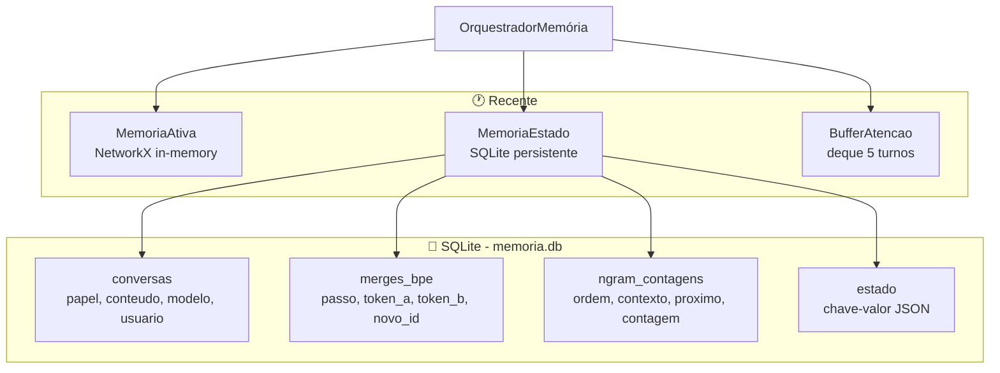
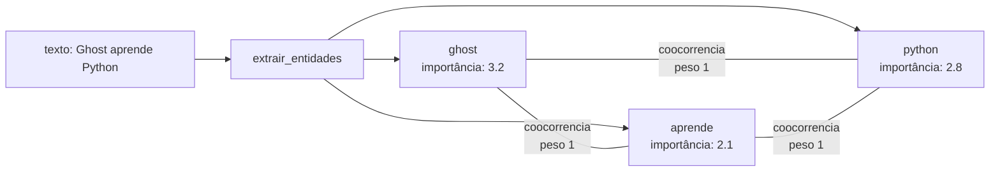
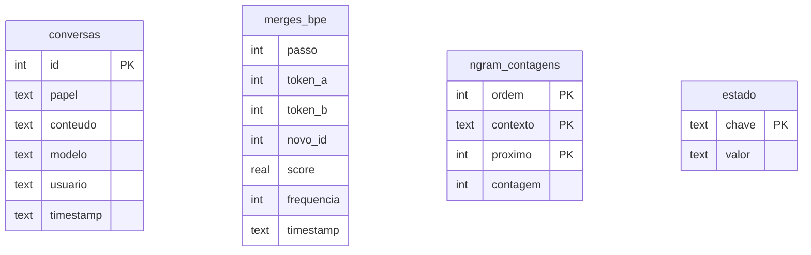
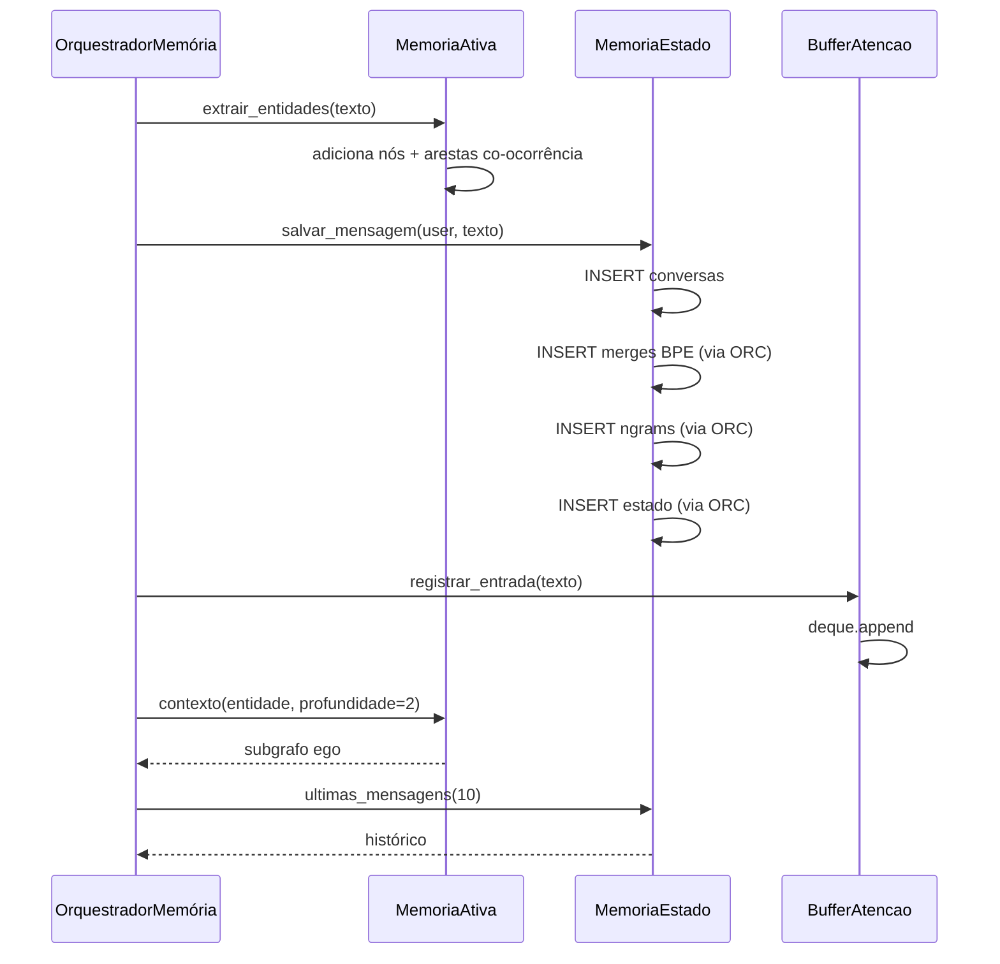

# Memórias / Recente — Grafo Ativo, Estado SQLite e Buffer de Atenção

> **Propósito:** Camada de memória de curto-prazo do Ghost. Inclui o grafo ativo de entidades (NetworkX in-memory), o estado persistente (SQLite com conversas, merges BPE, n-grams e estado chave-valor), e o buffer de atenção (janela dos últimos 5 turnos).

---

## Arquitetura

---

## Arquivos e Responsabilidades

### `ativa.py` — Classe `MemoriaAtiva` (119 linhas)

**Responsabilidade:** Grafo in-memory (NetworkX) de entidades e suas conexões. Extrai entidades do texto e as conecta por co-ocorrência. Suporta poda por importância e subgrafos de contexto.

| Método | Descrição |
|---|---|
| `extrair_entidades(texto, importancia_base)` | Extrai palavras (maiúsculas ou ≥4 letras), adiciona nós e conecta co-ocorrências (janela 4) |
| `adicionar_entidade(nome, tipo, importancia)` | Adiciona ou atualiza nó no grafo |
| `conectar(origem, destino, relacao, peso)` | Cria ou reforça aresta |
| `entidades_importantes(n=10)` | Top N entidades por importância + frequência |
| `contexto(entidade, profundidade=2)` | Subgrafo ego (nós + arestas) ao redor de uma entidade |
| `caminho(origem, destino)` | Shortest path via NetworkX |
| `podar(min_importancia)` | Remove nós abaixo do threshold (média - desvio padrão) |
| `resumo()` | Contagem de nós e arestas |

**Heurística de importância:** `importancia_base + frequencia × (ultima_importancia / max_importancia)`. O histórico de importâncias alimenta o limiar de poda.

---

### `estado.py` — Classe `MemoriaEstado` (153 linhas)

**Responsabilidade:** Camada de persistência SQLite. Armazena todo o estado permanente do sistema de memória: conversas, merges BPE, contagens n-gram e estado chave-valor genérico.

**Banco:** `memorias/recente/estado/memoria.db`

**Tabelas:**

| Método | Descrição |
|---|---|
| `salvar_mensagem(papel, conteudo, modelo, usuario)` | INSERT em conversas |
| `ultimas_mensagens(n=10)` | SELECT das últimas N conversas |
| `salvar_merge(passo, token_a, token_b, novo_id, score, freq)` | Registra merge BPE aprendido |
| `carregar_merges()` | Carrega todos os merges para o BPE |
| `salvar_estado(chave, valor)` | UPSERT chave-valor (JSON serializado) |
| `ler_estado(chave)` | Lê e faz JSON parse do valor |
| `salvar_ngrams_lote(registros)` | INSERT OR REPLACE em lote |
| `carregar_ngrams()` | Carrega todas as contagens n-gram |
| `carregar_todas_mensagens()` | Para treinar modelo token na inicialização |
| `carregar_pares_conversa()` | Pares ordenados por timestamp |
| `estatisticas()` | Contagem de mensagens e merges |

---

### `buffer_atencao.py` — Classe `BufferAtencao` (53 linhas)

**Responsabilidade:** Janela deslizante dos últimos 5 turnos da conversa. Mantém estado de processamento e metadados.

| Método | Descrição |
|---|---|
| `registrar_entrada(texto, metadados)` | Adiciona ao deque (max 5), retorna índice |
| `marcar_processado(indice)` | Marca entrada como processada |
| `janela_atencao()` | Lista completa com índices |
| `ultimos(n=3)` | Últimos N turnos |
| `definir_processamento(chave, valor)` | Estado de processamento atual |
| `obter_processamento(chave)` | Lê estado de processamento |
| `resumo()` | Tamanho da janela, max, processando |

---

## Fluxo de Dados

---

## Integrações

| Componente | Conexão |
|---|---|
| **OrquestradorMemória** | Chama todos os 3: `ativa.extrair_entidades()` a cada mensagem, `estado` para persistir tudo, `buffer` para registrar entrada |
| **ModeloTokenHibrido** | Usa `estado` para salvar/carregar ngrams, embeddings, MLP, pares |
| **BpeTokenizer** | Usa `estado` para salvar/carregar merges |
| **HistoricoEpisodico** | Recebe `memoria_estado` no `__init__` para acessar `ultimas_mensagens()` |
| **Interface** | Chama `OrquestradorMemória.encerrar()` que salva tudo no `estado` |

---

## Estatísticas

| Métrica | Valor |
|---|---|
| Arquivos Python | 4 (incluindo `__init__`) |
| Classes | 3 |
| Banco SQLite | 4 tabelas (conversas, merges_bpe, ngram_contagens, estado) |
| Grafo NetworkX | 1 (in-memory, sem limite de tamanho) |
| Buffer | Deque max 5 turnos |
| Persistência | SQLite via `MemoriaEstado` |

---

## Resumo

> **A camada Recente é a memória de curto-prazo e a fundação persistente do Ghost.** A `MemoriaAtiva` mantém um grafo NetworkX de entidades e co-ocorrências, permitindo buscas de contexto por subgrafo ego e caminhos mais curtos. A `MemoriaEstado` é o SQLite que persiste tudo — conversas, merges BPE, n-grams e estado genérico — e é usado por todos os outros subsistemas para salvar/carregar. O `BufferAtencao` é a janela dos últimos 5 turnos, usada para rastrear o que está sendo processado no momento.
>
> **Juntos, eles formam a espinha dorsal de persistência:** sem o `MemoriaEstado`, o Ghost não lembraria de nada entre reinícios.
