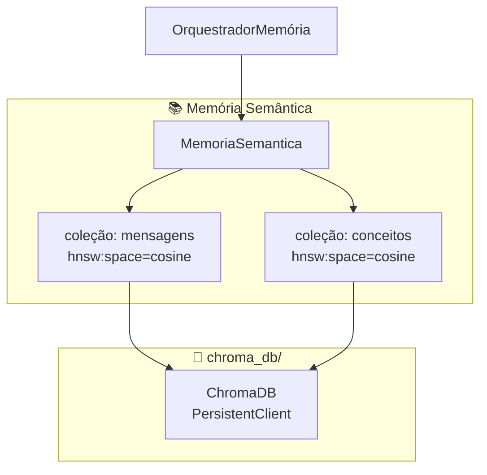
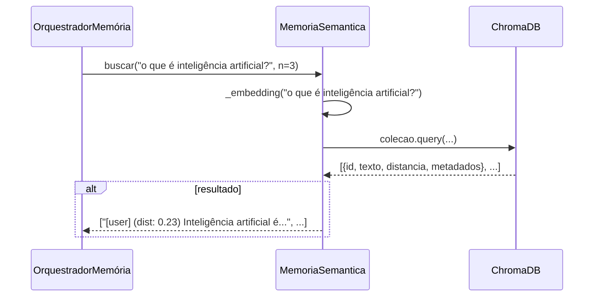

# Memórias / Semântica — Busca Vetorial com ChromaDB

> **Propósito:** Memória semântica do Ghost — armazena mensagens e conceitos como embeddings vetoriais e permite busca por similaridade cosseno. Usa ChromaDB com `PersistentClient` para persistência em disco.

---

## Arquitetura

---

## `memoria.py` — Classe `MemoriaSemantica` (101 linhas)

**Responsabilidade:** Interface para ChromaDB — adiciona, busca e gerencia mensagens e conceitos por similaridade semântica.

### Coleções

| Coleção | Conteúdo | ID | Metadados |
|---|---|---|---|
| `mensagens` | Texto completo de cada mensagem | MD5 hash (12 chars) | `{papel, usuario, modelo, ...}` |
| `conceitos` | `"nome: descricao"` | Nome lowercase | `{categoria, tipo=conceito, ...}` |

### Métodos

| Método | Descrição |
|---|---|
| `adicionar(texto, metadados, papel, usuario)` | Upsert na coleção `mensagens` com embedding automático |
| `buscar(consulta, n=5)` | Query por similaridade cosseno na coleção `mensagens` |
| `adicionar_conceito(nome, descricao, categoria, detalhes)` | Upsert na coleção `conceitos` |
| `buscar_conceito(consulta, n=5)` | Query por similaridade cosseno na coleção `conceitos` |
| `conceitos_relacionados(conceito_id, n=3)` | Busca conceitos similares a um conceito existente |
| `contar_mensagens()` | `colecao.count()` |
| `obter_todas_mensagens(limit)` | Retorna todas as mensagens para treino inicial do modelo token |
| `limpar()` | Deleta e recria coleção `mensagens` |

### Exemplo de busca

---

## Integrações

| Componente | Conexão |
|---|---|
| **OrquestradorMemória** | Chama `semantica.adicionar()` em cada `processar_mensagem()`. Chama `semantica.buscar()` em `buscar_contexto_memoria()` e `refletir()` |
| **ModeloTokenHibrido** | `_inicializar_modelo_token()` chama `semantica.obter_todas_mensagens(limit=2000)` para treino inicial |
| **GeradorInterno (Lógicas)** | Recebe `memoria_semantica` como parâmetro e chama `buscar()` para enriquecer tokens |

---

## Estatísticas

| Métrica | Valor |
|---|---|
| Arquivos Python | 2 (incluindo `__init__`) |
| Classes | 1 |
| Coleções ChromaDB | 2 (`mensagens`, `conceitos`) |
| Espaço de busca | Cosseno (`hnsw:space=cosine`) |
| Embedding function | `chromadb.utils.embedding_functions.DefaultEmbeddingFunction()` |

---

## Resumo

> **A Memória Semântica é o banco vetorial do Ghost.** Cada mensagem é convertida em embedding (via `DefaultEmbeddingFunction` do ChromaDB) e armazenada na coleção `mensagens` com metadados de papel, usuário e modelo. A busca por similaridade cosseno permite encontrar conversas semanticamente relacionadas, mesmo sem palavras-chave exatas.
>
> O `OrquestradorMemória` grava todas as mensagens aqui e também consulta para contexto de reflexão e busca de memória. É o único subsistema que persiste significado, não apenas texto bruto ou relações.
