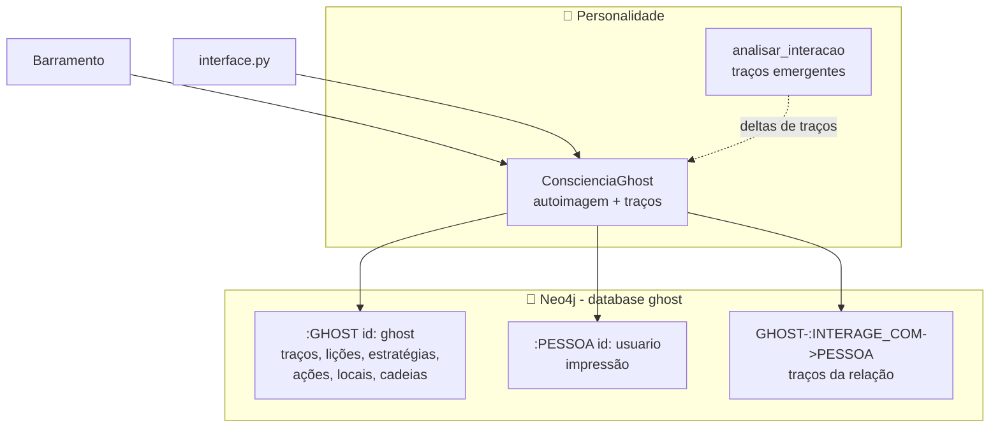
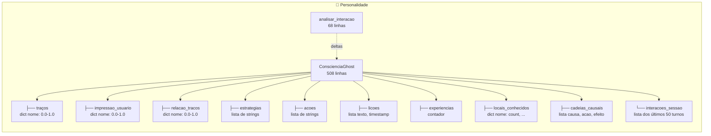
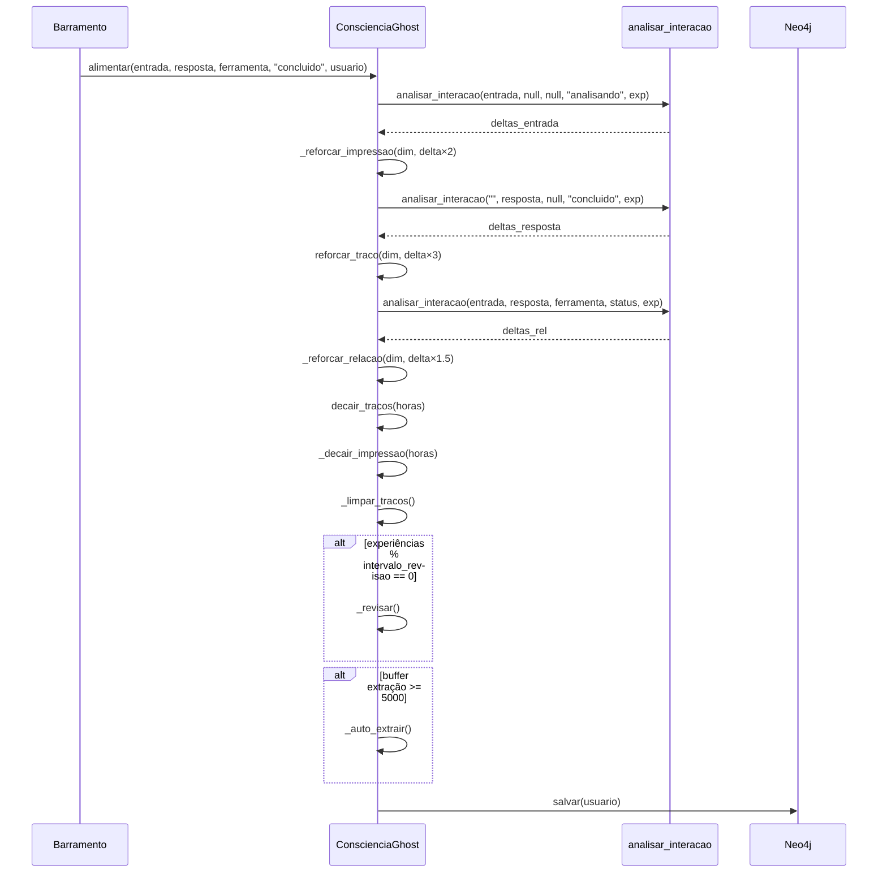
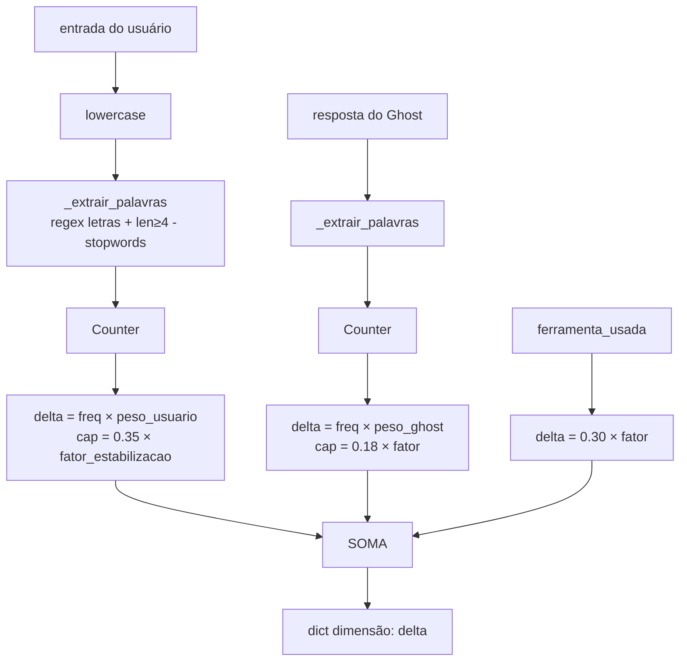
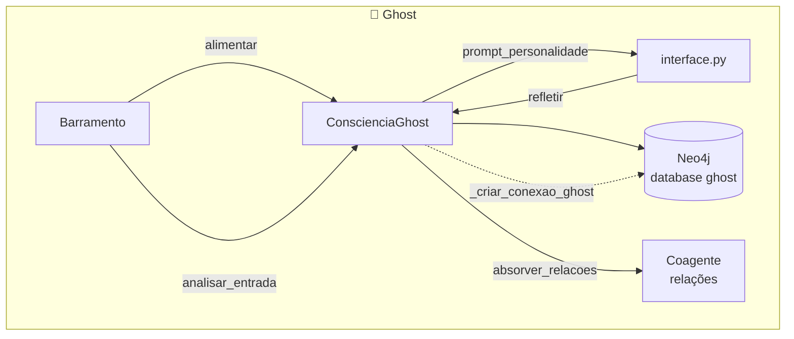

# Personalidade — Consciência e Evolução do Ghost

> **Propósito:** Sistema de personalidade emergente do Ghost. Diferente de traços fixos, o Ghost desenvolve sua personalidade **organicamente** a partir das palavras que aparecem nas conversas — cada palavra significativa pode se tornar uma dimensão de personalidade. O sistema inclui a `ConscienciaGhost` (autoimagem, impressão do usuário, memória procedural em Neo4j) e a função `analisar_interacao` (extração de traços emergentes).

---

## Arquitetura Geral



---

## Organograma



---

## `consciencia.py` — Classe `ConscienciaGhost` (508 linhas)

**Responsabilidade:** A consciência/identidade do Ghost. Mantém traços de personalidade emergentes, impressão sobre cada usuário, relação com o usuário, lições aprendidas, estratégias e ações derivadas dos traços dominantes, locais conhecidos, cadeias causais e interações recentes.

### Atributos Principais

| Atributo | Tipo | Descrição |
|---|---|---|
| `tracos` | `dict[str, float]` | Traços de personalidade emergentes (0.0-1.0). Ex: `{"aprender": 0.8, "codigo": 0.6}` |
| `impressao_usuario` | `dict[str, float]` | Impressão sobre o usuário atual — traços percebidos |
| `relacao_tracos` | `dict[str, float]` | Traços da relação Ghost↔Usuário |
| `estrategias` | `list[str]` | Estratégias derivadas do traço dominante |
| `acoes` | `list[str]` | Ações derivadas dos traços > 0.4 |
| `licoes` | `list[dict]` | Lições aprendidas (max 100) |
| `experiencias` | `int` | Contador de experiências |
| `locais_conhecidos` | `dict` | Locais extraídos de preposições (em, no, na...) |
| `cadeias_causais` | `list[dict]` | Causa → Ação → Efeito (max 50) |
| `interacoes_sessao` | `list[dict]` | Últimas 50 interações da sessão |

### Métodos

#### Ciclo de Vida

| Método | Descrição |
|---|---|
| `__init__(orquestrador_memoria, nome)` | Inicializa traços vazios, conecta no Neo4j database `ghost`, carrega estado salvo |
| `salvar(usuario)` | Persiste tudo no Neo4j: nó GHOST, nó PESSOA, aresta INTERAGE_COM |
| `_carregar_do_neo4j(usuario)` | Carrega traços, lições, estratégias, locais, cadeias do Neo4j |

#### Alimentação (chamado a cada interação)

| Método | Descrição |
|---|---|
| `alimentar(entrada, resposta, ferramenta_usada, status, usuario)` | Pipeline completo: analisa entrada→reforça impressão, analisa resposta→reforça traços, aplica decay temporal, limpa traços fracos, extrai conhecimento automaticamente, revisa estratégias, salva no Neo4j |
| `analisar_entrada(entrada)` | Pré-ativação: analisa entrada antes da resposta, atualiza impressão e relação sem salvar |
| `registrar_interacao(entrada, resposta, ferramenta)` | Registra na sessão, extrai locais, monta cadeias causais |

#### Traços

| Método | Descrição |
|---|---|
| `reforcar_traco(nome, intensidade=0.12)` | Aumenta traço com boost quadrático: `min(1.0, atual + boost × (1-atual))` |
| `decair_tracos(horas=1)` | Decai todos os traços usando `Decaimento` do coagente. Remove se < 0.05 |
| `traco_dominante()` | Traço com maior valor |
| `resumo_tracos()` | Dict sorted por valor decrescente |
| `_limpar_tracos()` | Normaliza e remove traços abaixo da média |

#### Usuário

| Método | Descrição |
|---|---|
| `_reforcar_impressao(nome, intensidade)` | Mesma lógica de boost, aplicado em `impressao_usuario` |
| `_decair_impressao(horas)` | Decai impressão do usuário |
| `absorver_relacoes(resumo_relacional)` | Absorve médias relacionais do grafo como traços de personalidade |

#### Geração de Prompt

| Método | Descrição |
|---|---|
| `prompt_personalidade()` | Monta bloco de contexto para o LLM: traços, impressão, relação, estratégias, ações, tempo, espaço, causa/efeito, lições |
| `status()` | Dict com resumo completo |

### Fluxo de `alimentar()`



### Exemplo de Evolução de Traços

```
Experiência 1: Usuário diz "Ghost, vamos aprender Python"
  → "aprender" aparece → traço "aprender" = 0.3 + 0.15×1 = 0.45
  → "python" aparece → traço "python" = 0.3 + 0.15×1 = 0.45

Experiência 5: Ghost responde "Eu gosto de aprender código"
  → "aprender" aparece na resposta → traço "aprender" = 0.45 + 0.08×0.55 = 0.49
  → "codigo" aparece → traço "codigo" = 0.3 + 0.08 = 0.38

Após 10 experiências: traço dominante = "aprender" (0.6)
  → Estratégia gerada: "usar aprender como guia nas respostas"

Após 50 experiências sem mencionar "python":
  → Decay: "python" cai abaixo de 0.05 e é removido
```

---

## `evolucao.py` — Função `analisar_interacao()` (68 linhas)

**Responsabilidade:** Extrai traços emergentes **zero-shot** — nenhuma palavra é pré-mapeada. Cada palavra significativa (≥4 letras, não stopword) vira uma dimensão de personalidade.

```python
# Exemplo de entrada: "Ghost vamos aprender codigo em Python"
# Palavras extraídas: ["vamos", "aprender", "codigo", "python"]
# Stopwords ignoradas: "em"
# Traços gerados: {"vamos": 0.15, "aprender": 0.15, "codigo": 0.15, "python": 0.15}
```

### Parâmetros

| Parâmetro | Descrição |
|---|---|
| `entrada` | Texto do usuário |
| `resposta` | Texto do Ghost (opcional) |
| `ferramenta_usada` | Nome da ferramenta (opcional) |
| `status` | Status da interação |
| `experiencias` | Contador de experiências (para fator de estabilização) |

### Pesos

| Fonte | Peso base | Cap | Fórmula |
|---|---|---|---|
| Palavras do usuário | 0.15 × fator | 0.35 × fator | `freq × peso_usuario` |
| Palavras do Ghost | 0.08 × fator | 0.18 × fator | `freq × peso_ghost` |
| Ferramenta usada | 0.30 × fator | — | delta direto |

**Fator de estabilização:** `1.0 / (1.0 + 0.015 × experiencias)` — com o tempo, cada palavra tem menos impacto. O Ghost se estabiliza.

### Fluxo de Decisão



---

## Integrações



| Componente | Conexão |
|---|---|
| **Barramento** | Cria a `ConscienciaGhost` e chama `alimentar()` e `analisar_entrada()` a cada interação |
| **interface.py** | Usa `cg.prompt_personalidade()` para montar o contexto do LLM. Chama `absorver_relacoes()` do coagente |
| **Neo4j (database `ghost`)** | Persiste toda a personalidade — nó `:GHOST`, nó `:PESSOA`, aresta `INTERAGE_COM`. Database separado do `notas` usado pela Memória Relacional |
| **Coagente (relações)** | `ConscienciaGhost.absorver_relacoes()` consome médias relacionais para gerar traços |
| **Memória (Orquestrador)** | `buscar_memorias()` delega para `OrquestradorMemória.buscar_contexto_memoria()` |

---

## Padrões de Design

| Padrão | Implementação |
|---|---|
| **Emergent Behavior** | Personalidade emerge das palavras da conversa — sem traços pré-definidos |
| **Decay Pattern** | `decair_tracos()` usa `Decaimento` do coagente para esquecimento gradual |
| **State Snapshot** | Toda a personalidade é salva/recarregada do Neo4j como JSON |
| **Strategy** | `estrategias` e `acoes` são geradas dinamicamente dos traços dominantes |
| **Observer** | O Ghost se auto-observa via `_revisar()` a cada N interações |
| **Stabilization** | Fator de estabilização reduz impacto de novas palavras com o tempo |

---

## Estatísticas

| Métrica | Valor |
|---|---|
| Arquivos Python | 3 (incluindo `__init__`) |
| Classes | 1 |
| Funções | 1 (`analisar_interacao`) |
| Stopwords do evolucao | ~60 palavras |
| Locais conhecidos pré-cadastrados | ~25 termos |
| Database Neo4j | `ghost` (separado do `notas` da memória) |
| Experiências máximas | Ilimitado |

---

## Resumo

> **A Personalidade do Ghost é 100% emergente.** Não há um dicionário de traços pré-definidos — cada palavra significativa que aparece na conversa pode se tornar uma dimensão de personalidade. Se o usuário fala muito de "código", o Ghost desenvolve um traço "codigo". Se o Ghost responde com "aprender" repetidamente, o traço "aprender" se fortalece.
>
> A `ConscienciaGhost` mantém 3 camadas de traços: **traços do Ghost** (quem ele é), **impressão do usuário** (quem o usuário parece ser), e **relação com o usuário** (como é a dinâmica entre eles). Cada uma com seu próprio decay e reforço.
>
> Tudo é persistido no Neo4j em um database separado (`ghost`), com nó `:GHOST` contendo traços, lições, estratégias, ações, locais e cadeias causais serializados como JSON. O nó `:PESSOA` guarda a impressão, e a aresta `INTERAGE_COM` guarda os traços relacionais.
>
> Com o tempo, o Ghost se estabiliza — o fator de estabilização (`1/(1+0.015×exp)`) reduz o impacto de novas palavras, e traços não reforçados decaem até serem esquecidos. A cada N interações, o Ghost revisa seus traços e gera novas estratégias e ações para guiar seu comportamento.
