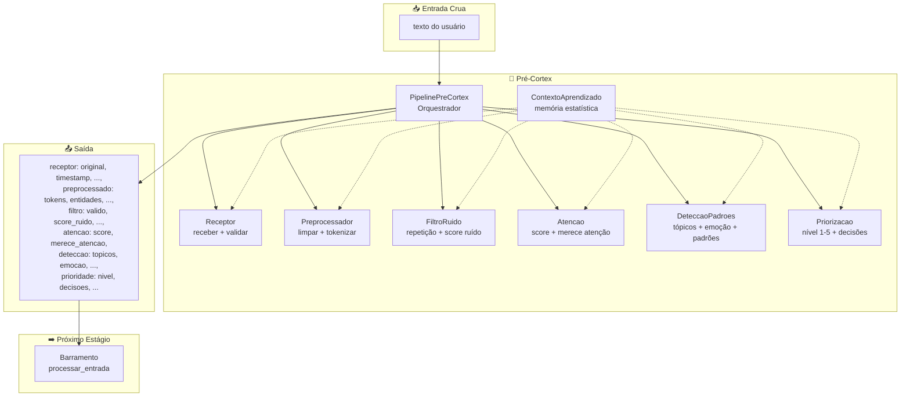
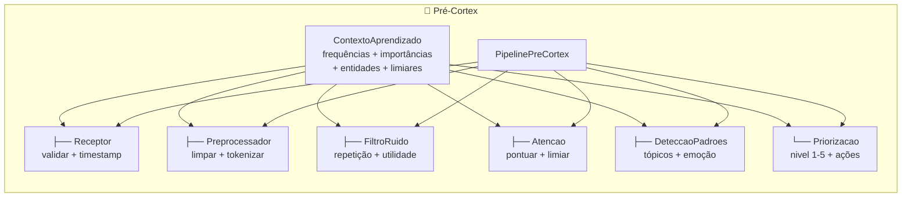
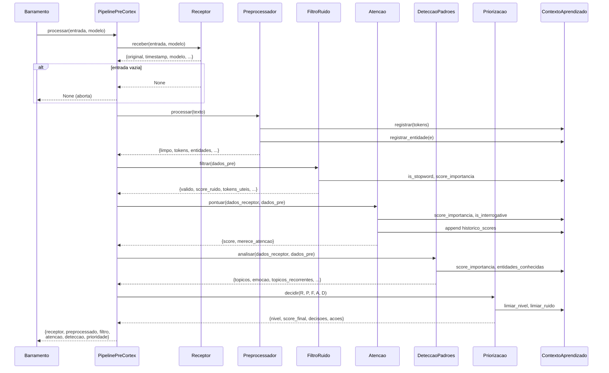
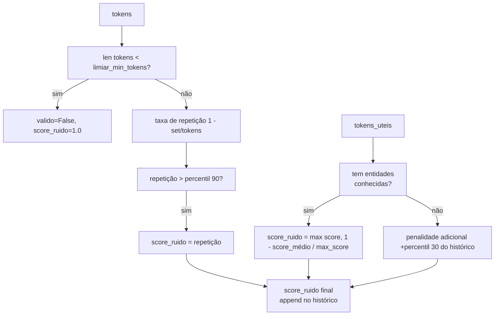
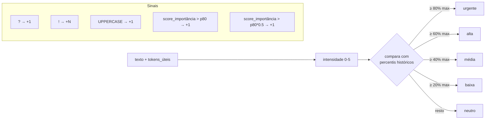
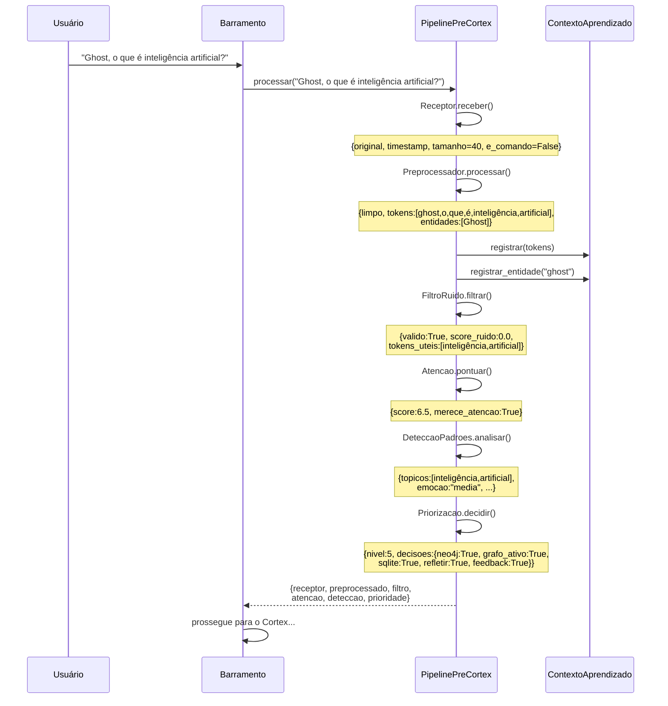
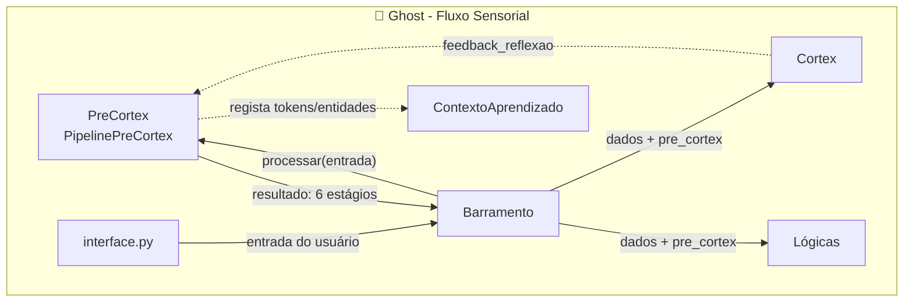
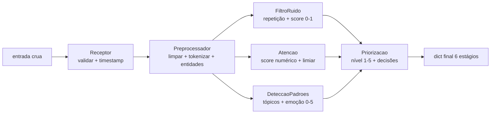

# Pré-Cortex — Estágio Sensorial do Ghost

> **Propósito:** Primeiro estágio de processamento do Ghost. Recebe a entrada crua do usuário, pré-processa, filtra ruído, detecta padrões/emoções, pontua atenção e decide a prioridade do que merece ser processado adiante. É o "sistema sensorial" antes do Cortex.

---

## Arquitetura Geral



---

## Organograma do Pré-Cortex



---

## Arquivos e Responsabilidades

### `__init__.py` — Classe `PipelinePreCortex` (42 linhas)

**Responsabilidade:** Orquestrador. Instancia todas as 6 classes do Pré-Cortex com um `ContextoAprendizado` compartilhado e executa o pipeline sequencial.

| Método | Parâmetros | Retorno | Descrição |
|---|---|---|---|
| `__init__()` | — | — | Cria `ContextoAprendizado()` + Receptor + Preprocessador + FiltroRuido + Atencao + DeteccaoPadroes + Priorizacao |
| `processar(entrada, modelo)` | `str`, `callable?` | `dict?` | Pipeline completo: receptor → preprocessador → filtro → atenção → detecção → priorização |
| `feedback_reflexao(texto)` | `str` | — | Passa texto de auto-reflexão para o `ContextoAprendizado` |

**Exporta:** `ContextoAprendizado`, `Receptor`, `Preprocessador`, `FiltroRuido`, `Atencao`, `DeteccaoPadroes`, `Priorizacao`, `PipelinePreCortex`

**Fluxo de `processar()`:**



---

### `contexto.py` — Classe `ContextoAprendizado` (105 linhas)

**Responsabilidade:** Núcleo estatístico do Pré-Cortex. Mantém frequências, importâncias, entidades conhecidas, polaridade, históricos de scores e limiares adaptativos. **É o único estado persistente entre chamadas** — todos os outros módulos dependem dele.

| Atributo | Tipo | Descrição |
|---|---|---|
| `freq_palavras` | `Counter` | Frequência bruta de cada palavra |
| `freq_docs` | `Counter` | Frequência em documentos (quantas mensagens cada termo aparece) |
| `importancia` | `defaultdict(float)` | Score de importância acumulado por palavra |
| `entidades_conhecidas` | `set` | Entidades com letra maiúscula já registradas |
| `total_mensagens` | `int` | Contador de mensagens processadas |
| `historico_scores` | `list` | Histórico de scores de atenção |
| `historico_tamanhos` | `list` | Histórico de tamanhos de entrada |
| `freq_em_perguntas` | `Counter` | Frequência de cada termo em perguntas |
| `polaridade` | `defaultdict(float)` | Polaridade acumulada por palavra |
| `historico_score_ruido` | `list` | Histórico de scores de ruído |
| `_pesos_aprendidos` | `dict` | Pesos: idf=0.5, entidade=2.0, reflexao=2.0, registro=1.0 |

| Método | Parâmetros | Retorno | Descrição |
|---|---|---|---|
| `registrar(tokens)` | `list[str]` | — | Incrementa `freq_palavras` e `freq_docs` |
| `registrar_pergunta(tokens)` | `list[str]` | — | Marca tokens que aparecem em perguntas |
| `registrar_entidade(palavra)` | `str` | — | Adiciona ao `entidades_conhecidas`, +1.0 de importância |
| `feedback_reflexao(texto)` | `str` | — | Auto-reflexão: +2.0 de importância para palavras-chave |
| `is_stopword(palavra)` | `str` | `bool` | Stopword se `freq_docs(p) / total > 0.7` |
| `score_importancia(palavra)` | `str` | `float` | `importancia + 2.0(se entidade) + idf * 0.5` |
| `is_interrogative(palavra)` | `str` | `bool` | Voto se >50% das ocorrências foram em perguntas |
| `aprender_polaridade(palavra, delta)` | `str`, `float` | — | Acumula polaridade |
| `score_polaridade(palavra)` | `str` | `float` | Polaridade acumulada |
| `limiar_atencao()` | — | `float` | Percentil 60 do histórico de scores, mínimo 0.5 |
| `limiar_min_tokens()` | — | `int` | Percentil 20 dos tamanhos históricos, mínimo 1 |
| `limiar_nivel(percentil)` | — | `float` | Percentil `p * 20` dos scores históricos |
| `limiar_ruido_baixo()` | — | `float` | Percentil 30 do histórico de ruído, ou 0.3 |
| `limiar_ruido_medio()` | — | `float` | Percentil 60 do histórico de ruído, ou 0.6 |

---

### `receptor.py` — Classe `Receptor` (19 linhas)

**Responsabilidade:** Porta de entrada. Valida se há conteúdo, extrai metadados da entrada.

| Método | Parâmetros | Retorno | Descrição |
|---|---|---|---|
| `receber(entrada, modelo)` | `str`, `callable?` | `dict?` | `None` se vazio; senão: `{original, timestamp, modelo, tamanho, e_comando}` |

**Saída:**
```python
{
    "original": "texto do usuário",
    "timestamp": "2026-05-26T12:00:00",
    "modelo": None,           # modelo de linguagem opcional
    "tamanho": 15,           # len(texto)
    "e_comando": False,       # começa com "/"?
}
```

---

### `preprocessador.py` — Classe `Preprocessador` (42 linhas)

**Responsabilidade:** Limpeza, tokenização, extração de entidades e filtragem de stopwords. **Escreve no `ContextoAprendizado`** (`registrar`, `registrar_entidade`).

| Método | Parâmetros | Retorno | Descrição |
|---|---|---|---|
| `limpar(texto)` | `str` | `str` | Trim, normaliza espaços, limita a 1024 chars |
| `tokenizar(texto)` | `str` | `list[str]` | Regex `\b[^\W\d_]+\b` → lowercase |
| `filtrar_stopwords(tokens)` | `list[str]` | `list[str]` | Remove stopwords do ContextoAprendizado |
| `entidades(texto)` | `str` | `list[str]` | Palavras com maiúscula: `[A-Z][a-z]{2,}` |
| `processar(texto)` | `str` | `dict` | Pipeline completo de pré-processamento |

**Saída de `processar()`:**
```python
{
    "original": "texto",
    "limpo": "texto limpo",
    "tokens": ["texto", "limpo"],           # todas as palavras
    "tokens_uteis": ["texto"],              # sem stopwords
    "entidades": ["Ghost"],
    "total_tokens": 2,
    "total_uteis": 1,
}
```

---

### `filtro_ruido.py` — Classe `FiltroRuido` (74 linhas)

**Responsabilidade:** Filtragem adaptativa de ruído. Avalia taxa de repetição, utilidade dos termos e pontua quanto "ruído" a entrada tem. **Não descarta mensagens — só pontua o nível de ruído.**

| Método | Parâmetros | Retorno | Descrição |
|---|---|---|---|
| `filtrar(dados_pre)` | `dict` | `dict` | `{valido, motivo, score_ruido, tokens_uteis}` |

**Lógica de score_ruído:**



**Exemplo adaptativo:**
- Entrada `"aaaa aaaa aaaa aaaa aaaa"` → `score_ruido ~1.0, repetitivo`
- Entrada `"Ghost aprende conceitos novos"` → `score_ruido ~0.0, válido`
- Entrada `"é uma coisa que talvez"` → `score_ruido ~0.3` (sem entidades)

---

### `atencao.py` — Classe `Atencao` (56 linhas)

**Responsabilidade:** Pontua a relevância da mensagem com base em entidades, vocabulário, tamanho e se é pergunta. Decide se merece atenção do sistema.

| Método | Parâmetros | Retorno | Descrição |
|---|---|---|---|
| `pontuar(dados_receptor, dados_pre)` | `dict`, `dict` | `dict` | `{score, merece_atencao}` |

**Cálculo do score:**

| Fator | Peso | Detalhe |
|---|---|---|
| Entidades conhecidas | 1.5× | Soma dos `score_importancia` das entidades |
| Vocabulário | 1.0× | Média dos `score_importancia` dos tokens úteis |
| Tamanho | 0.5-2.0× | Adaptativo: ≤p20=0.5, ≥p80=2.0 |
| Pergunta | +2.0 | Se tem `?` ou palavra interrogativa conhecida |

**Decisão:** `merece_atencao = score >= ContextoAprendizado.limiar_atencao()` (percentil 60 dos scores históricos).

---

### `deteccao.py` — Classe `DeteccaoPadroes` (97 linhas)

**Responsabilidade:** Detecção de tópicos, emoção/intensidade, padrões emocionais e co-ocorrências entre tópicos ao longo do tempo.

| Método | Parâmetros | Retorno | Descrição |
|---|---|---|---|
| `analisar(dados_receptor, dados_pre)` | `dict`, `dict` | `dict` | `{topicos, emocao, topicos_recorrentes, padrao_emocional}` |
| `reset()` | — | — | Limpa todos os históricos |

**Detecção de emoção (5 níveis):**



**Saída:**
```python
{
    "topicos": ["inteligência", "artificial"],
    "emocao": "baixa",
    "topicos_recorrentes": ["ghost", "aprender", "código"],
    "padrao_emocional": [("neutro", 12), ("baixa", 3)],
}
```

---

### `priorizacao.py` — Classe `Priorizacao` (50 linhas)

**Responsabilidade:** Decisão final: combina score de atenção e score de ruído para definir um nível de 1 a 5, e aciona decisões binárias.

| Método | Parâmetros | Retorno | Descrição |
|---|---|---|---|
| `decidir(R, P, F, A, D)` | 5 dicts | `dict` | `{nivel, score_final, score_ruido, decisoes, acoes}` |

**Matriz de Nível:**

| Nível | Condição | Ações |
|---|---|---|
| **5** | score ≥ n5 **E** ruído < baixo (ou emoção urgente) | Neo4j + Grafo + SQLite + Refletir + Feedback |
| **4** | score ≥ n4 **E** ruído < médio | Neo4j + Grafo + SQLite + Refletir + Feedback |
| **3** | score ≥ n3 **E** ruído < médio | Neo4j + Grafo + SQLite + Refletir |
| **2** | score ≥ n2 | Grafo + SQLite |
| **1** | default | SQLite apenas |

**Decisões mapeadas:**
```python
{
    "neo4j": nivel >= 3,        # Armazenar em banco grafo
    "grafo_ativo": nivel >= 2,  # Manipular grafo em memória
    "sqlite": True,             # Sempre persistir
    "refletir": nivel >= 3,     # Auto-reflexão
    "feedback": nivel >= 4,     # Feedback aprendizado
}
```

---

## Fluxo de Dados Completo



---

## Integrações com Outros Subsistemas



### Mapa de Conexões

| Componente | Conexão com Pré-Cortex |
|---|---|
| **Barramento** | Chama `PipelinePreCortex.processar()` e recebe o dict completo de 6 estágios. Inclui `"pre_cortex"` como chave no retorno de `processar_entrada()` |
| **Cortex** | Recebe os dados do Pré-Cortex via Barramento. Também chama `PipelinePreCortex.feedback_reflexao()` após auto-reflexão para ajustar importâncias |
| **Lógicas** | Recebem os dados indiretamente — o Barramento passa os resultados do Pré-Cortex junto com os do Cortex para o prompt final |
| **interface.py** | Não chama o Pré-Cortex diretamente — tudo passa pelo Barramento. O prompt final inclui metadados do Pré-Cortex (nível de atenção, emoção, tópicos) |
| **Persistência** | Nenhuma direta. O `ContextoAprendizado` vive em memória dentro do `PipelinePreCortex`, que é criado pelo `Barramento` e vive enquanto o processo durar |

---

## Pipeline de Processamento Visual



---

## Padrões de Design Presentes

| Padrão | Implementação |
|---|---|
| **Pipeline** | `PipelinePreCortex.processar()` executa 6 estágios em sequência, cada um recebendo dados do anterior |
| **Facade** | `PipelinePreCortex` esconde todas as 6 classes atrás de `processar()` |
| **Strategy** | Cada estágio encapsula uma estratégia diferente de análise (recepção, limpeza, filtro, atenção, detecção, priorização) |
| **Blackboard** | `ContextoAprendizado` é o quadro-negro compartilhado entre todos os estágios — todos leem e alguns escrevem |
| **Adapter** | O Pré-Cortex inteiro é um adaptador entre a entrada crua do usuário e a representação estruturada que o Cortex/Lógicas consomem |
| **Template Method** | Todos os módulos recebem `contexto` no `__init__` e expõem métodos públicos que operam sobre ele |
| **Stateful Computation** | `ContextoAprendizado` mantém estado acumulado (frequências, limiares adaptativos, históricos) que evolui a cada mensagem |

---

## Estatísticas do Diretório

| Métrica | Valor |
|---|---|
| Arquivos Python | 8 |
| Linhas de código | ~485 |
| Classes | 7 |
| Estágios do pipeline | 6 (Receptor → Preprocessador → FiltroRuido → Atencao → DeteccaoPadroes → Priorizacao) |
| Dependências externas | `re`, `math`, `collections` (stdlib) |
| Estado compartilhado | `ContextoAprendizado` (injetado em todos) |

---

## Resumo

> **O Pré-Cortex é o sistema sensorial do Ghost.** É a primeira coisa que toca a entrada do usuário — validando, limpando, pontuando, filtrando ruído, detectando emoção e decidindo o nível de prioridade.
>
> Cada mensagem passa por 6 estágios: o **Receptor** valida e timestamps, o **Preprocessador** limpa e tokeniza (e já alimenta o `ContextoAprendizado` com frequências), o **FiltroRuido** calcula um score adaptativo de ruído baseado em repetição e utilidade, a **Atencao** pontua relevância (entidades, vocabulário, pergunta), a **DeteccaoPadroes** extrai tópicos e classifica emoção em 5 níveis, e a **Priorizacao** combina tudo num nível 1-5 que decide quais sistemas serão acionados (Neo4j, grafo ativo, SQLite, reflexão, feedback).
>
> **O `ContextoAprendizado` é o cérebro estatístico do Pré-Cortex** — mantém frequências, importâncias, entidades conhecidas, polaridade e limiares adaptativos. Todos os estágios leem dele, e o Preprocessador escreve (registra tokens e entidades). Os limiares evoluem com o tempo: o que é "atenção merecida" hoje pode não ser amanhã, conforme o Ghost aprende o que é normal.
>
> **É o único subsistema que não usa banco de dados ou LLM** — tudo é estatístico, em memória, e extremamente rápido. Uma mensagem passa pelo pipeline inteiro em microssegundos.
>
> **Mas atenção:** o `ContextoAprendizado` é resetado se o processo reiniciar. Não há persistência entre sessões. É pura memória de curto-prazo estatística.
