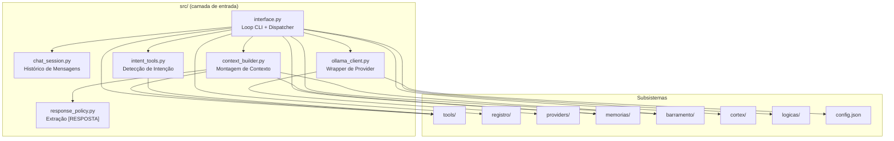
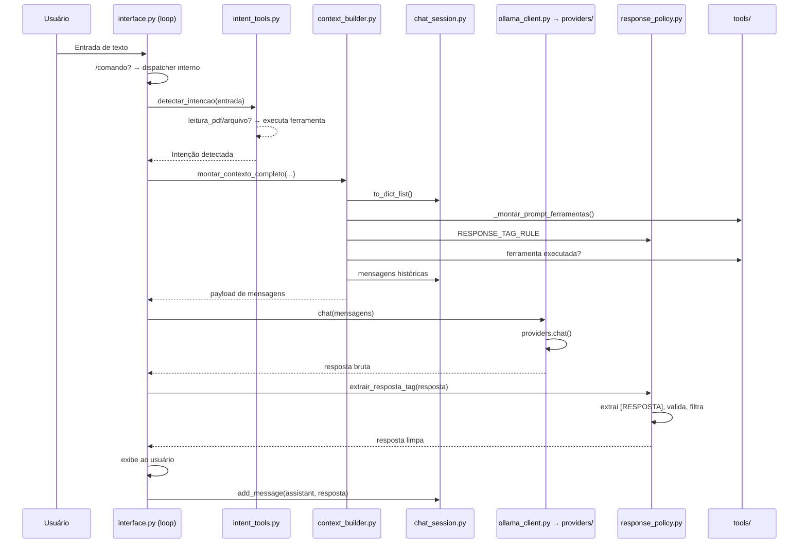

# `src/` — Ponto de Entrada e Orquestração Principal

> **Papel**: Camada de entrada do sistema. Conecta o usuário (CLI) a todos os subsistemas (barramento, memórias, ferramentas, provedores LLM). Contém o loop principal de chat e o dispatcher de comandos.

---

## Diagrama de Arquitetura



---

## Organograma de `src/`

| Arquivo | Linhas | Responsabilidade |
|---------|--------|------------------|
| `interface.py` | 1491 | **Coração do sistema**: loop `input()`, dispatcher de `/comandos`, ciclo LLM, integração com todos os subsistemas |
| `response_policy.py` | 97 | Filtragem de respostas inválidas, extração do conteúdo `[RESPOSTA]...[/RESPOSTA]`, stripping de pensamento interno |
| `context_builder.py` | 88 | Monta o contexto system completo: prompt de ferramentas + regra RESPONSE_TAG + ghost personalidade + memórias relevantes + rascunho do modelo token |
| `chat_session.py` | 41 | Gerenciamento simples de histórico: add, remove, clear, contar pares, to_dict |
| `intent_tools.py` | 63 | Detecta intenção (leitura_pdf, leitura_arquivo, código, web, chat) e executa ferramenta correspondente automaticamente |
| `ollama_client.py` | 28 | Wrapper de compatibilidade: delega `chat()` e `list_models()` ao provider configurado (ollama, openai, lmstudio, gemini) |
| `__init__.py` | 0 | Pacote vazio |

---

## Fluxo de uma Mensagem



---

## Detalhamento dos Arquivos

### `interface.py` — O Grande Dispatcher (1491 linhas)

**Maior arquivo do projeto.** Contém:

- **Loop principal (`main()`)**: `input()` infinito, detecta `/comandos` vs mensagem normal
- **Dispatcher de comandos**:
  - `/resposta` — atalho para [RESPOSTA]
  - `/relacoes` — analisa/decai/propaga pares no grafo semântico
  - `/ghost` — status/reset da Consciência Ghost
  - `/memoria primeiro` — estatísticas do Memória-Primeiro
  - `/logs` — estatísticas de agentes, ferramentas, LLM, erros
  - `/recarregar` — hot-reload de `memorias/` ou `tools/`
  - `/ajuda` — tabela de comandos
  - `/ag_registro` — consulta registros dos agentes
- **Ciclo LLM**: envia mensagens → recebe resposta → extrai [RESPOSTA] → exibe → salva no histórico
- **Integração**: importa `barramento`, `cortex`, `logicas`, `memorias`, `tools`, `registro`, `providers`

**IMPORTANTE**: `interface.py` faz `import` de praticamente todos os módulos do sistema — é o ponto central de acoplamento.

---

### `response_policy.py` — Filtro de Resposta (97 linhas)

Garante que apenas respostas úteis cheguem ao usuário:

| Função | Papel |
|--------|-------|
| `RESPONSE_TAG_RULE` | Prompt crítico: obriga o LLM a usar `[RESPOSTA]...[/RESPOSTA]` |
| `resposta_valida()` | Rejeita respostas curtas, com "não sei", "desculpe", ou padrões de "estou lendo..." |
| `extrair_resposta_tag()` | Pipeline de extração: 1) regex `[RESPOSTA]` → 2) stripping de tags de ferramenta → 3) remoção de linhas de pensamento → 4) fallback para português → 5) fallback para última linha |

**Padrões de pensamento filtrados** (~20 regex patterns): "wait", "looking", "plan", "i should", "step 1:", "note:", "self-correction", "chunk 1:", etc.

---

### `context_builder.py` — Montagem de Prompt (88 linhas)

Orquestra o que vai no system prompt:

```python
montar_contexto_completo(entrada, memoria, sessao, usuario, barramento)
```

Camadas adicionadas ao histórico:
1. `_injetar_prompt_ferramentas()` — descrição das ferramentas + `RESPONSE_TAG_RULE`
2. `_contexto_ghost()` — personalidade Ghost + relação com usuário
3. **Memórias relevantes** — `memoria.buscar_contexto_memoria(entrada, n=3)`
4. **Contexto de ferramenta** — resultado de ferramenta executada (PDF lido, arquivo, etc.)
5. **Rascunho do modelo token** — `modelo_token.gerar(entrada, max_tokens=20)` como sugestão de continuidade

---

### `chat_session.py` — Histórico de Mensagens (41 linhas)

Classe `ChatSession`:
- `add_message(role, content, name)` — append com contagem de pares
- `remove_last()` — undo da última troca
- `clear()` — mantém apenas system prompts
- `set_system_prompt(prompt)` — atualiza ou insere system prompt
- `to_dict_list()` — cópia rasa das mensagens

---

### `intent_tools.py` — Detecção Automática de Intenção (63 linhas)

Pré-processa a entrada do usuário ANTES de enviar ao LLM:

| Intenção | Detecção | Ação |
|----------|----------|------|
| `leitura_pdf` | ".pdf" + "leia"/"abra"/"ler" | `REGISTRO.executar("ler_pdf", ...)` |
| `leitura_arquivo` | extensão + "leia"/"mostra" | `REGISTRO.executar("ler_arquivo", ...)` |
| `codigo` | "crie"/"gere"/"funcao"/"script" | retorna "codigo" (tratado pelo LLM) |
| `web` | "pesquise na web" | retorna "web" (tratado pelo LLM) |
| `chat` | fallback | conversa normal |

**Extrai caminhos**: regex para `*.pdf` e `*.ext` nos argumentos.

---

### `ollama_client.py` — Wrapper de Provider (28 linhas)

Ponte de compatibilidade:
```python
from providers import chat, list_models, get_provider
```

`_iniciar_provider()` lê `config.json` → `provider` field:
- `ollama` → `get_provider("ollama")` (default)
- `openai` → `get_provider("openai")` + lê `OPENAI_API_KEY` do `.env`
- `lmstudio` → `get_provider("lmstudio")`
- `gemini` → `get_provider("gemini")` + lê `GOOGLE_API_KEY` do `.env`

A função `_iniciar_provider()` é chamada no **module level** (linha 28), executando na importação.

---

## Integrações com Outros Subsistemas

| Subsistema | Como `src/` Consome |
|------------|---------------------|
| `providers/` | Via `ollama_client.py` — delega `chat()` e `list_models()` |
| `tools/` | Via `REGISTRO` — `executar()` e `listar()` ferramentas |
| `memorias/` | Via `OrquestradorMemoria` — `buscar_contexto_memoria()`, `modelo_token.gerar()` |
| `barramento/` | Via `Barramento` — acesso a coagente, relações, ghost, pipelines |
| `cortex/` | Via `CortexPipeline` — pipeline de aprendizado |
| `logicas/` | Via `LogicasPipeline` — pipeline de raciocínio |
| `registro/` | Via `AnalisadorLogs` e `BancoLogs` — estatísticas e consultas |
| `config/` | Via `config.load()` — provider selection |

---

## Padrões e Decisões Técnicas

### Módulo Global via `sys.modules`
Em `interface.py`, variáveis de subsistema (memoria, barramento, pipeline, modelo) são expostas como **atributos do módulo** (`sys.modules[__name__].X = X`) para que `tools/` e outros módulos possam acessá-las via `import interface` sem criar instâncias duplicadas.

### Hot-Reload de Código
`/recarregar memorias` e `/recarregar` (tools) usam `importlib.reload()` via `REGISTRO_MEMORIAS.recarregar()` e `REGISTRO.recarregar()`, recriando as instâncias globais em seguida.

### Detecção de Intenção Pré-LLM
`intent_tools.py` executa ferramentas (leitura de PDF/arquivo) **antes** de montar o contexto, injetando o resultado como contexto auxiliar — evitando que o LLM precise chamar ferramentas para operações triviais.

### Fallback de Resposta em Múltiplos Estágios
`response_policy.py` tenta 5 estratégias em ordem:
1. Extração via `[RESPOSTA]`
2. Stripping de tags de ferramenta + pensamento
3. Remoção de linhas de "thinking" por regex
4. Fallback para linhas com caracteres portugueses
5. Última linha não vazia

### Sem Injeção de Dependência
`interface.py` cria manualmente cada subsistema (`OrquestradorMemoria()`, `Barramento()`, etc.) no corpo do módulo. Não há DI container ou factory — as dependências são resolvidas na ordem de importação, o que pode causar `ImportError` circulares se mal ordenado.

---

## Métricas

| Métrica | Valor |
|---------|-------|
| Total de arquivos | 7 (1 vazio) |
| Total de linhas | ~1808 |
| Arquivo mais longo | `interface.py` — 1491 linhas (82%) |
| Dependências externas | `rich` (console, Table, box), `re`, `os`, `sys` |
| Subssistemas integrados | 8 (`providers`, `tools`, `memorias`, `barramento`, `cortex`, `logicas`, `registro`, `config`) |
