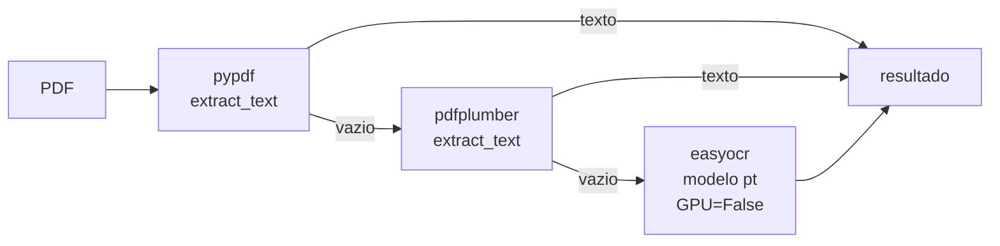
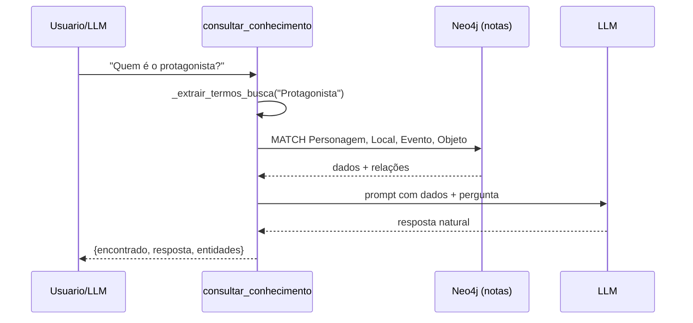
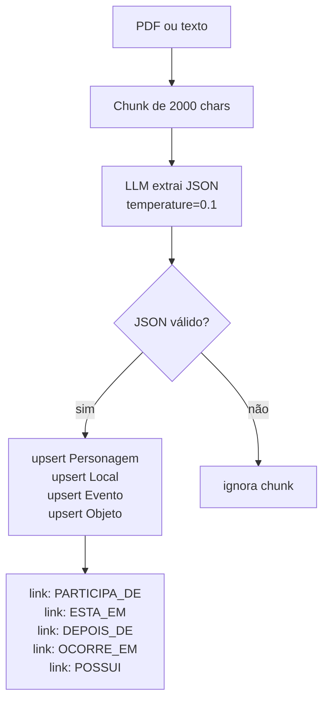
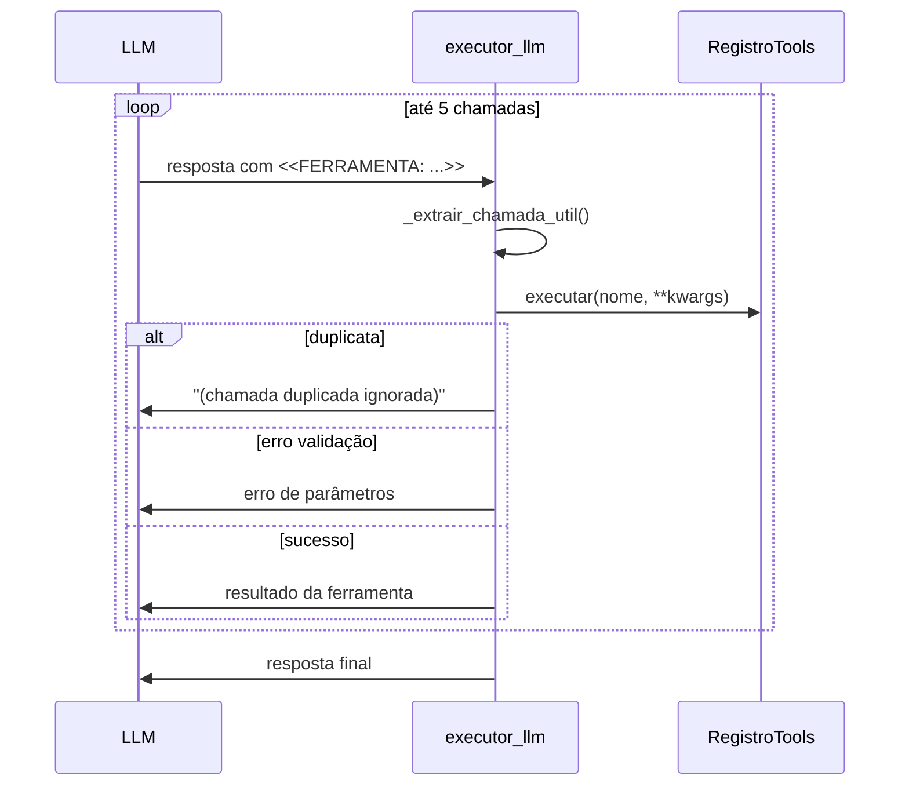
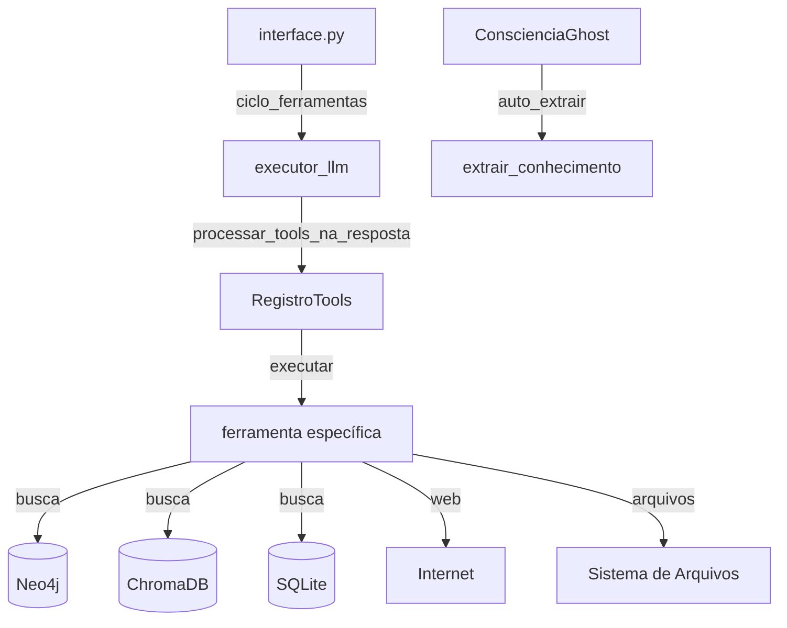

# Tools — Sistema de Ferramentas do Ghost

> **Propósito:** Conjunto de ferramentas que o Ghost pode invocar autonomamente via LLM para buscar na web, ler arquivos, executar código, consultar/persistir conhecimento, fazer diagnóstico, backup e muito mais. O sistema é auto-registrável, recarregável em runtime e segue um padrão de contrato `REGISTRAR` para cada ferramenta.

---

## Arquitetura Geral

```mermaid
graph TB
    subgraph Tools["🔧 Tools (16 ferramentas)"]
        REG[RegistroTools<br/>singleton REGISTRO]
    end

    subgraph Core["Ferramentas Core"]
        BW[busca_web<br/>DuckDuckGo]
        EC[executar_codigo<br/>Python restrito]
        LA[ler_arquivo<br/>arquivos de texto]
        LP[ler_pdf<br/>pypdf + OCR]
        NM[nota_mental<br/>notas SQLite]
        CN[consultar_notas<br/>busca notas]
        CK[consultar_conhecimento<br/>Neo4j knowledge]
        EK[extrair_conhecimento<br/>LLM → Neo4j]
        ECY[executar_cypher<br/>Neo4j raw]
        CF[criar_ferramenta<br/>auto-criação]
        AG[analise_ghost<br/>definição meta]
    end

    subgraph Analise["📊 Analise"]
        DIAG[diagnosticar_sistema<br/>diagnóstico]
        VIZ[visualizar_estado<br/>estado das memórias]
    end

    subgraph Manutencao["🔨 Manutenção"]
        BK[backup_memorias<br/>SQLite + ChromaDB]
        PD[podar_memorias<br/>limpeza old data]
    end

    subgraph Utilitarias["🧰 Utilitárias"]
        BS[buscar_semantica<br/>ChromaDB query]
        EX[exportar_memorias<br/>JSON export]
        IM[importar_conhecimento<br/>import txt/jsonl]
    end

    subgraph Executor["⚡ Executor"]
        EXEC[executor_llm<br/>ciclo de ferramentas]
        PROC[processar_tools_na_resposta]
    end

    LLM[LLM] -->|<<FERRAMENTA: nome>>| EXEC
    EXEC --> REG
    REG --> BW
    REG --> EC
    REG --> LA
    REG --> LP
    REG --> NM
    REG --> CN
    REG --> CK
    REG --> EK
    REG --> ECY
    REG --> CF
    REG --> AG
    REG --> DIAG
    REG --> VIZ
    REG --> BK
    REG --> PD
    REG --> BS
    REG --> EX
    REG --> IM
```



---

## `registro.py` — Classe `RegistroTools` e Singleton `REGISTRO` (115 linhas)

**Responsabilidade:** Discovery automático de ferramentas. Escaneia o diretório `tools/` recursivamente, importa cada módulo, extrai o contrato `REGISTRAR` e expõe como dicionário.

### Métodos

| Método | Descrição |
|---|---|
| `escanear()` | Walk recursivo em `tools/`, importa módulos `.py`, extrai dicts `REGISTRAR` ou `FERRAMENTA` |
| `recarregar()` | Limpa `sys.modules` dos módulos tools e re-escanela (runtime reload) |
| `listar()` | Lista `{nome, descricao, parametros}` de todas as ferramentas |
| `executar(nome, **kwargs)` | Chama `ferramenta["executar"](**kwargs)` |
| `obter(nome)` | Retorna dict completo da ferramenta |

### Contrato de Ferramenta

Cada arquivo de ferramenta expõe uma variável `REGISTRAR`:

```python
REGISTRAR = {
    "nome": "nome_da_ferramenta",
    "descricao": "O que faz...",
    "parametros": {
        "type": "object",
        "properties": {
            "param1": {"type": "string", "description": "..."},
        },
        "required": ["param1"]
    },
    "executar": funcao_executavel,
}
```

---

## Ferramentas Core

### `busca_web.py` — `buscar_web` (101 linhas)

**Responsabilidade:** Busca na web via DuckDuckGo HTML (sem API key). Extrai títulos e URLs.

```python
executar(consulta="inteligencia artificial 2026", num_resultados=5)
# → {consulta, resultados: [{titulo, url}], total}
```

**Mecanismo:** Faz request para `https://html.duckduckgo.com/html/?q=...` com User-Agent de Chrome e parseia 3 padrões de HTML diferentes.

---

### `executar_codigo.py` — `executar_codigo` (68 linhas)

**Responsabilidade:** Executa Python em sandbox restrito (sem `import`, `exec`, `eval`, `open`, `__import__`). Útil para cálculos, transformações e lógica.

**Sandbox:** `builtins` reduzido: `print, len, range, int, float, str, list, dict, sorted, enumerate, zip, map, filter, min, max, sum, abs, any, all, isinstance, type, True/False/None`.

```python
executar(codigo="print(sum(range(10)))")
# → {saida: "45", erro: None, codigo: "print(sum(range(10)))"}
```

---

### `ler_arquivos.py` — `ler_arquivo` (78 linhas)

**Responsabilidade:** Lê arquivos de texto do projeto (restrito ao diretório do projeto). Suporta offset e limite.

```python
executar(caminho="src/interface.py", linhas=30, offset=10)
# → {caminho, total_linhas, exibindo, conteudo, offset, linhas_lidas}
```

---

### `ler_pdf.py` — `ler_pdf` (151 linhas)

**Responsabilidade:** Extrai texto de PDFs. 3 motores em fallback: `pypdf` → `pdfplumber` → `easyocr` (OCR).



```python
executar(caminho="livros/volume_1.pdf", paginas=10, offset=0, ocr=False)
# → {caminho, total_paginas, conteudo, ...}
```

---

### `nota_mental.py` — `nota_mental` (87 linhas)

**Responsabilidade:** Salva notas/reflexões do Ghost em SQLite (`notas_mentais.db` no raiz).

**Tabela:** `notas(id, titulo, conteudo, tags, fonte, criado_em, atualizado_em)`

```python
executar(titulo="Descoberta sobre IA", conteudo="...", tags="ia,aprendizado")
# → {status: "salvo", id: 42, ...}
```

---

### `consultar_notas.py` — `consultar_notas` (89 linhas)

**Responsabilidade:** Busca notas no SQLite por termo, tags ou lista as mais recentes.

```python
executar(termo="IA", tags="", limite=5)
# → {status: "ok", total: 3, notas: [{id, titulo, conteudo, tags, criado_em}]}
```

---

### `consultar_conhecimento.py` — `consultar_conhecimento` (126 linhas)

**Responsabilidade:** Consulta o banco de conhecimento Neo4j (database `notas`) sobre personagens, locais, eventos e objetos. Usa LLM para responder naturalmente.

**Fluxo:**



---

### `extrair_conhecimento.py` — `extrair_conhecimento` (248 linhas)

**Responsabilidade:** Extrai personagens, locais, eventos e objetos de texto/PDF usando LLM e persiste no Neo4j (database `notas`).

**Pipeline:**



```python
executar(caminho="livros/volume_1.pdf", ocr=False, fonte="livro_volume_1")
# → {status, fonte, chunks_processados: 5, extraido: {personagens: 3, locais: 5, ...}}
```

**Labels no Neo4j:** `Personagem`, `Local`, `Evento`, `Objeto`
**Relações:** `PARTICIPA_DE`, `ESTA_EM`, `DEPOIS_DE`, `OCORRE_EM`, `POSSUI`

---

### `executar_cypher.py` — `executar_cypher` (65 linhas)

**Responsabilidade:** Executa Cypher arbitrário no Neo4j (database `ghost`). Bloqueia `DROP/DELETE/REMOVE`.

```python
executar(consulta="MATCH (n:GHOST) RETURN n", params={})
# → {status, total_registros, registros: [...], database: "ghost"}
```

---

### `criar_ferramenta.py` — `criar_ferramenta` (99 linhas)

**Responsabilidade:** Auto-criação de novas ferramentas. Gera arquivo `.py` com template, registra no `REGISTRO`.

```python
executar(nome="minha_ferramenta", descricao="...", parametros={...}, codigo="...")
# → {sucesso, caminho}
```

---

### `analise_ghost.py` — `analise_ghost` (41 linhas)

**Responsabilidade:** Ferramenta meta — explica o conceito de "ghost" no projeto (definição, contextos, função, exemplos).

---

## Subdiretório `analise/`

### `diagnostico.py` — `diagnosticar_sistema` (78 linhas)

**Responsabilidade:** Diagnóstico completo do sistema.

| O que verifica | Detalhe |
|---|---|
| Orquestrador | `estatisticas()` de todas as memórias |
| Barramento | `resumo_completo()` |
| Diretórios | `memorias/`, `tools/`, `relatorios/` |
| Sistema | Python, plataforma, CWD |
| Ollama | `GET /api/tags` |
| Neo4j | `verify_connectivity()` |
| ChromaDB | `heartbeat()` |

### `visualizar_estado.py` — Funções de consulta (46 linhas)

**Responsabilidade:** Formata estado das memórias para leitura.

| Função | Descrição |
|---|---|
| `resumo_formatado(orquestrador)` | Todas as estatísticas formatadas |
| `arvore_autonomo(orquestrador, colecao)` | Árvore do BancoAutonomo |

---

## Subdiretório `manutencao/`

### `backup.py` — `backup_memorias` (54 linhas)

**Responsabilidade:** Backup dos bancos SQLite e ChromaDB.

```python
executar()
# → {sqlite: "memoria_20260526_120000.db", chroma: "chroma_20260526_120000", timestamp}
```

### `limpeza.py` — `podar_memorias` e `limpar_tudo` (84 linhas)

| Função | Descrição |
|---|---|
| `podar_autonomo(orquestrador, dias=30)` | Remove registros antigos do BancoAutonomo |
| `podar_neo4j(orquestrador, dias=30)` | DETACH DELETE nós NOTA antigos |
| `podar_grafo_ativo(orquestrador)` | Poda nós com baixa importância no NetworkX |
| `limpar_tudo(orquestrador, confirmar)` | Limpa TODOS os bancos (requer confirmação) |

---

## Subdiretório `utilitarias/`

### `buscar_semantica.py` — `buscar_semantica` (44 linhas)

```python
executar(consulta="o que e IA?", n=5)
# → {consulta, resultados: [{texto, distancia, papel}], total}
```

### `exportar_memorias.py` — `exportar_memorias` (70 linhas)

**Responsabilidade:** Exporta estado para JSON em `relatorios/`.

| Função | Descrição |
|---|---|
| `exportar_estado_sqlite(orquestrador)` | Estatísticas + timestamp |
| `exportar_autonomo(orquestrador)` | Todas as coleções |
| `exportar_neo4j(orquestrador)` | Até 500 registros |

### `importar_conhecimento.py` — `importar_conhecimento` (72 linhas)

**Responsabilidade:** Importa arquivos para a memória do Ghost.

| Formato | Como importa |
|---|---|
| `.txt`, `.md` | `processar_mensagem("user", texto)` |
| `.jsonl` | Cada linha: `{"papel", "conteudo", "modelo", "usuario"}` |

---

## `executor_llm.py` — Ciclo de Ferramentas (170 linhas)

**Responsabilidade:** Orquestra o ciclo LLM + ferramentas. O LLM responde com `<<FERRAMENTA: nome>>`, o executor processa, retorna resultado, e o LLM continua.

### Fluxo do `ciclo_ferramentas()`



**Validação de kwargs:** Cada parâmetro é validado contra o schema `properties` declarado no `REGISTRAR`. Se o LLM enviar `pasta=` quando o parâmetro é `caminho=`, o erro é reportado.

---

## Integrações



| Componente | Conexão |
|---|---|
| **executor_llm** | Chamado pelo loop de chat em `interface.py` para cada resposta do LLM |
| **RegistroTools** | Singleton `REGISTRO` importado por `executor_llm` e por `criar_ferramenta.recarregar()` |
| **ConscienciaGhost** | `_auto_extrair()` chama `extrair_conhecimento` diretamente |
| **Neo4j** | Usado por `consultar_conhecimento`, `extrair_conhecimento`, `executar_cypher` |
| **ChromaDB** | Usado por `buscar_semantica` via Orquestrador |
| **SQLite** | Usado por `nota_mental`, `consultar_notas` (notas_mentais.db) |
| **Orquestrador** | Criado internamente por `diagnosticar_sistema`, `backup_memorias`, `podar_memorias`, `exportar_memorias`, `importar_conhecimento`, `buscar_semantica` |

---

## Padrões de Design

| Padrão | Implementação |
|---|---|
| **Plugin/Registry** | `RegistroTools` descobre automaticamente módulos com `REGISTRAR` |
| **Contract** | Cada ferramenta segue o contrato `{nome, descricao, parametros, executar}` |
| **Sandbox** | `executar_codigo` restringe builtins e bloqueia import/exec/eval |
| **Fallback Chain** | `ler_pdf` tenta pypdf → pdfplumber → OCR |
| **Singleton** | `REGISTRO = RegistroTools()` global |
| **Self-Healing** | `criar_ferramenta` gera ferramentas novas em runtime |
| **Rate Limiting** | `ciclo_ferramentas` limita a 5 chamadas por resposta |
| **Idempotency** | `ja_executados` set previne chamadas duplicadas na mesma rodada |

---

## Estatísticas

| Métrica | Valor |
|---|---|
| Arquivos Python | 17 (11 core + 3 análise + 3 manutenção + 3 utilitárias + 1 executor) |
| Ferramentas registradas | 16 |
| Subdiretórios | 3 (analise/, manutencao/, utilitarias/) |
| Dependências externas | `pypdf`, `pdfplumber`, `pypdfium2`, `easyocr`, `neo4j`, `chromadb`, `requests` |
| Sandbox de código | Sim (builtins reduzido, sem import/exec/eval/open) |
| Fallback PDF | 3 níveis (pypdf → pdfplumber → OCR) |
| Max chamadas por ciclo | 5 |

---

## Resumo

> **O sistema de ferramentas do Ghost é um ecossistema auto-registrável de 16 capacidades.** Cada ferramenta é um arquivo Python independente que expõe um contrato `REGISTRAR` com nome, descrição, schema de parâmetros e função executável.
>
> O **RegistroTools** descobre automaticamente todas as ferramentas escaneando o diretório `tools/` recursivamente — sem necessidade de registro manual. O singleton `REGISTRO` é usado pelo `executor_llm` para que o LLM do Ghost invoque ferramentas dinamicamente.
>
> O **ciclo de ferramentas** permite que o LLM encadeie até 5 chamadas por resposta: busca na web, executa código, lê PDF, salva nota, consulta Neo4j — tudo na mesma interação. Cada chamada é validada contra o schema e deduplicada.
>
> **O Ghost pode criar suas próprias ferramentas** via `criar_ferramenta`, gerando arquivos Python com o template correto e recarregando o registro em runtime.
>
> **Segurança:** `executar_codigo` tem sandbox rigoroso, `ler_arquivo` e `ler_pdf` são restritos ao diretório do projeto, `executar_cypher` bloqueia DROP/DELETE/REMOVE.
